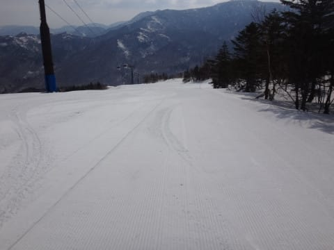

# 4月15日土曜日の志賀高原は…晴れのち昼前から雨，午後2時から曇り～晴れと目まぐるしい天気

📅 投稿日時: 2017-04-16 00:13:34

ということで．

本日も志賀高原に来ているわけですが．

今日は，かなり目まぐるしく天気が変わる一日でした…

まず，朝はすっきり晴天！

朝から気温も高く，志賀への登り路も，

全く雪がないドライ路面．

そして．

わがホームゲレンデ，焼額が営業終了してしまっているので（涙）．

本日は奥志賀高原からスタートにしたわけですが…

奥志賀の朝8時の気温は…

うげげげ．

朝イチから+5℃ですか！（涙）

…春ですねぇ…

だもんで．

朝イチのゲレンデは，シマシマではあるものの…

朝イチから，ちょいと緩めの雪．

ざぶざぶと潜ってしまうほど緩くはないけど，

エッジががっつり食い込む感じではなく，

表面がかなりやわらかい感じ…

とはいえ．

人も少なく，フラットで．

天気も良くて．

これはこれで楽しいよ～！！

と，人が少なくて，結構シマシマをキープした

奥志賀ゴンドラをグルグルしていると…

まぁ，9時過ぎにはシマシマが消えてしまいましたが．

板が潜ってしまうほどのザブ雪にはならず．

いや～．

天気がいい春スキーにしては，結構いいなぁ！

…と，喜んでいたのもつかの間．

なぜか，10時ごろには雲が増えてきて…

あれ？？

日が差しているけど…

なんだか，空に危険な黒い雲が…

と，思っていたら．

11時過ぎに．

ええ？？

なんだか，ゴンドラの窓に水滴が？

…これは．

空から液体が降って来たのか！！！！？？

降るのは，午後ではなかったのか！？？

と，思っていた11時半ごろ．

降ってきました．

それも，かなり本格的に（涙）

いや，山頂はぎりぎり雪だったんですが…

雪なのは山頂だけ．

あとは，かなり本降りの雨（涙）（涙）（涙）

ゲレンデの雪も，水を吸ったしっとりした雪質に…（泣）．

でも．

意外と水を吸っても雪はざぶざぶにならず．

板が走るので，むしろこっちがいいかも…←と，ポジティブシンキングで乗り切る

雨の中，レインウェアを着て滑ると．

さすが，ゲレンデは誰もいないよ！

ふはははは！

奥志賀ダウンヒルコース，貸し切りだよ！←あくまでポジティブシンキングで乗り切る

と，ほぼ無人のコースを滑り続けていると．

本降りだったのは30分ほど．

降り始めから1時間程度の12時半には，雲も切れはじめ…

時折ぽつぽつとあったものの．

午後2時過ぎには，また晴れ間が顔を出してきました～！

この後の天気は，曇ったり晴れたりを繰り返したけど．

雨が降ったせいで，ゲレンデはほとんど人がいなくて．

ゴンドラもがら空き飛び乗り状態だし…

ゲレンデも，午後になっても全然フラットのまま！

午後になっても，大回り用板でかっ飛ばすことが

できるのですがっ！

昼間雨が降ったおかげで，人が少なく，荒らされてない

フラットバーンが滑れるよ！←意地でポジティブシンキング

…いや．

しかし．

普通なら．

この時期の午後は，荒れ荒れコブコブ凸凹になって

不思議じゃないのに…

かなりのフラットバーンをキープ！

リフトストップに近い時間になると，

さすがにちょっと荒れ気味になっては来たけど．

でも，夕方ラストまで，大回りで飛ばせる

ゲレンデ状況で．

春のゲレンデながら，ガラガラのフラットバーンを

結構楽しめた，今日一日だったのでした…

いやーー．

意外と良かった．

予想以上に楽しめたなぁ…

明日は，朝晴れてくれて，

放射冷却でちょっと冷えてくれるとうれしいんだけどな～．

明日は気温が上がって，暑い一日になりそう…

## 💬 コメント一覧

### 💬 コメント by (Ḡoku)
**タイトル**: 忘れました
**投稿日**: 2017-04-16 11:24:01

昨日はお世話様でした。

今日も奥志賀スタートで滑ってます〜

が、実はスマホ忘れたので、カミさんのを借りてコメントです（笑）

この後、一ノ瀬に移動しま～す。

### 💬 コメント by (Skier_S)
**タイトル**: Gokuさま
**投稿日**: 2017-04-16 11:36:40

一ノ瀬ぐるぐる中です～！

朝はかなりいい感じでしたが、そろそろ緩みはじめてきました…

状況によっては午後奥志賀に行こうかと思ってましたが、奥志賀はどうですか？

