# 2019/12/31大晦日の志賀高原，焼額山スキー場は…朝は晴天！でも，昼から雪になり，午後は吹雪（涙）

📅 投稿日時: 2019-12-31 23:54:07

本日．

なんと．

大晦日じゃないですかっ！！

…いつも通りスキーしてると，

なんだか特別な日という感じが全く

ないのですが…

…しかし．2019年も終わっていきますね…

私にとっては，相変わらずの激動の年でした…

ってなわけで．

大晦日にも関わらず，いつも通りの

志賀高原のレポートです！

えー．

まず．

かねてより，

31日朝，降り始めは雨．

それがゴンドラが止まるほどの吹雪に変わり，

ガチガチ氷の上に雪のバーン状況…

という予想をしていた本日でしたが．

昨日の段階で予想天気図が変わり，

「もしかしたら，雨が降らずにいきなりの雪でスタートか？」

と，昨日に予想を見直して．

…雨にならずに済みそうだけど，

どっちにしろ，吹雪の荒れた天気に

なるだろうなぁ…

と，思っていた本日．

朝，ゲレンデに出ると…

…

…

え？？

えええええ？？？

なんと．

予想を裏切る晴天っ！！

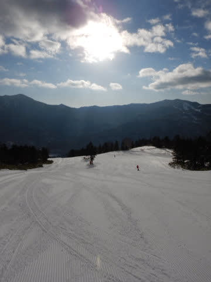

それも，風も穏やかで，

気温も高めの0℃と，

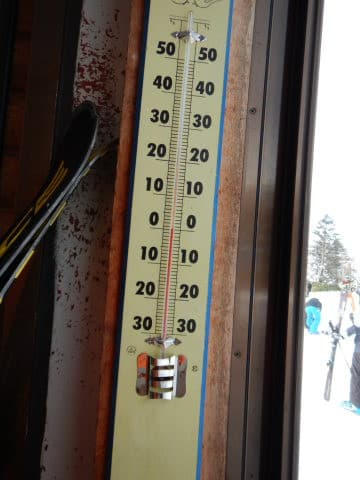

一体どこが吹雪やねんっ！！！！

…と，多くの人に突っ込まれた朝．

いや…久しぶりにここまで見事に

予想を外しました…（激涙）

…でも．

いい方に外したんだから許して…

ってな感じで．

本日朝は，晴天最高なシマシマバーンっ！！

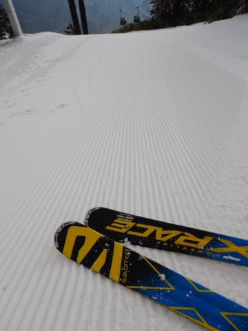

昨日，雨っぽいミゾレで融けたゲレンデ

ですが．

気温が高めってのもあったのか．

硬めのバーンながら，ガチガチにならず，

しっかりエッジが利く，かなり楽しい

高速バーン！！！

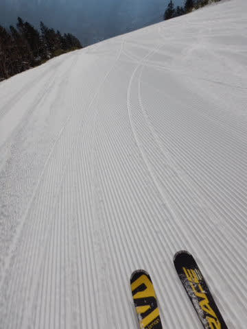

…いや．

しかし．

ライブカメラを見ると，晴れているのは志賀高原

近辺のみ．

激荒れ必至のこの天気図の状況で，

誰が今朝，こんな晴天になると予想しえた

ろうか…？？←予想が外れたのを正当化しようとしている

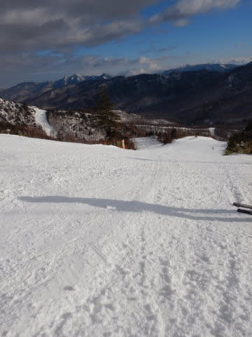

と．

気持ちよく朝イチの晴天を滑っていると…

営業開始後1時間も経たずに曇りだし…

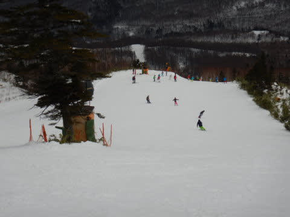

そして，9時半ごろには，ゲレンデの

人口密度もかなり上がってきちゃいました（涙）

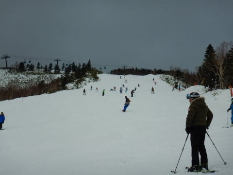

で．

気温が高いのもあり，

雪も湿った重い雪になっていき…

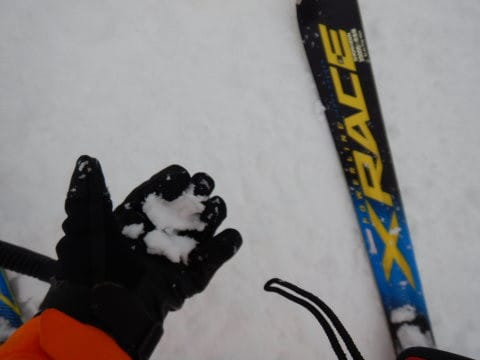

人口密度が高くなったダブルパンチ

だけじゃなく．

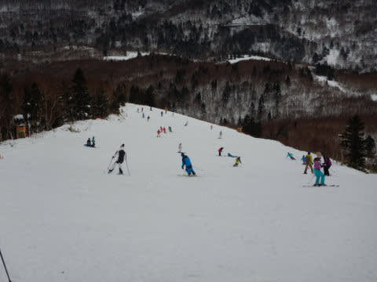

10時半には，雪が降り始め…

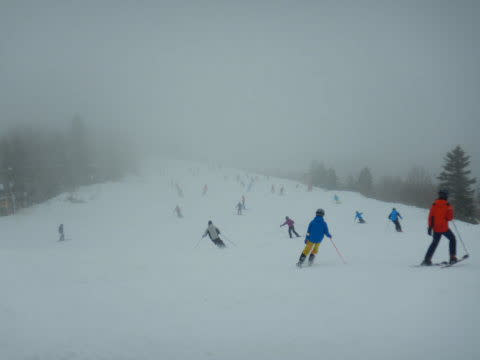

さらに追い打ちをかけるように，

11時ごろにはゴンドラも

5分待ちになってしまったのですが…！（涙）

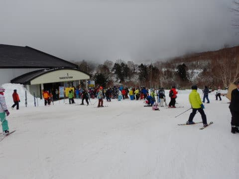

…第2ゴンドラは，20分待ちまで行ったようです…

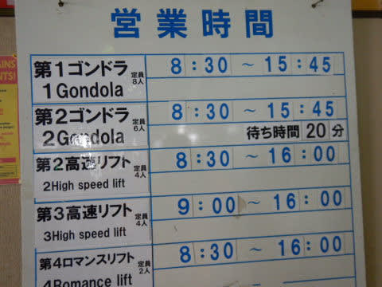

それどころか．

11時過ぎには…

やっぱり予想通り．

気温が下がり，吹雪き始めてきました…（涙）

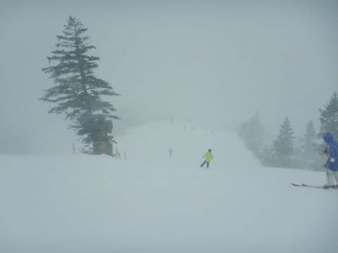

…そして．

昼過ぎには．

前が見えないくらいの吹雪になって

しまったのですが！？？

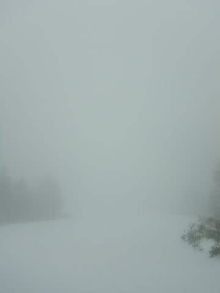

さらに，気温が一気に下がったので．

緩んだゲレンデはカチカチに固まり始め…

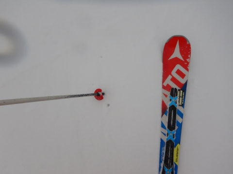

風もかなり強まって来たので…

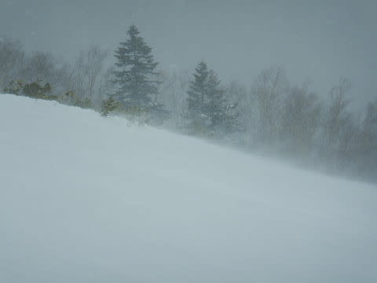

当初の予想通り．

12時過ぎに奥志賀ゴンドラが止まり．

2時ごろには，奥志賀は第1以外の

全リフトが止まっちゃいました…

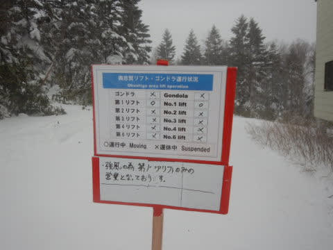

そして．

焼額も第1，第2ゴンドラともに減速運転（涙）

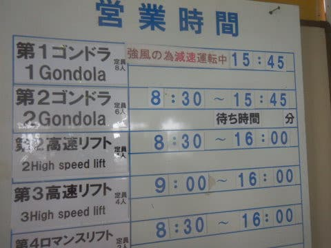

朝は大外れだと思っていた，

奥志賀ゴンドラは運休するかも？

という吹雪予想．

最終的には当たってしまったのか…

ただ．

昼前まで0度近かった気温は，

一気にマイナスに下がり．

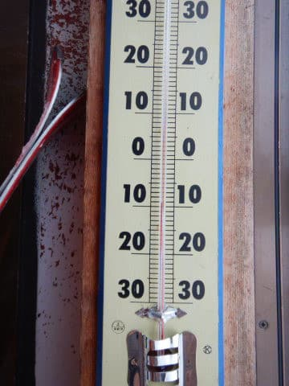

雪もかなりの勢いで吹き付けて

来たので…

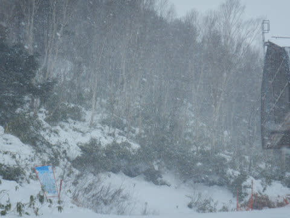

おかげで，いい雪質の雪が

うっすらとゲレンデを覆い始めました…！！

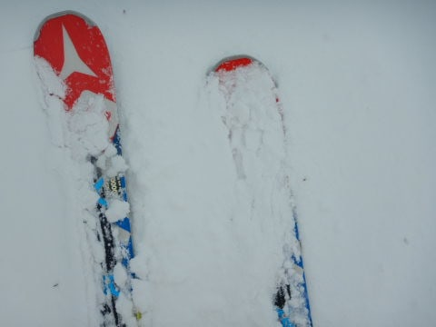

ゲレンデのごく一部で，

午前中の高温で雪が薄くなった

部分がありましたが．

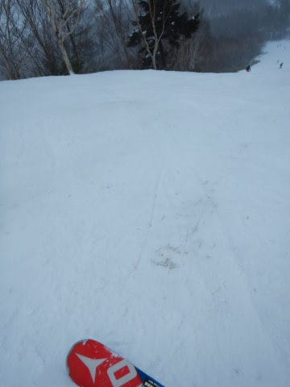

この吹雪，ある意味で救いの雪に

なってくれるかも…

で．

激寒の吹雪になり．

バーンコンディションも予想通りの，

ガチガチに固まった硬い斜面の上に

うっすら新雪…という悪コンディションに

なったので．

午後には，ゴンドラもガラガラに…！！

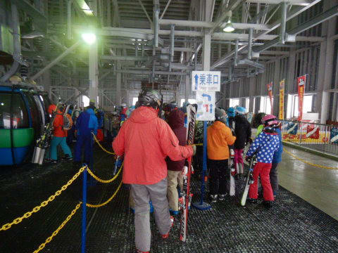

ってな感じで．

本日も，滑る人がほとんどいなくなった

吹雪のゲレンデを，リフト営業終了の

16時まで，ひたすら滑り続けたのでした…

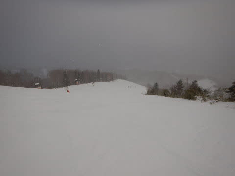

…

…

…そして．夜はナイターゲレンデへ！！

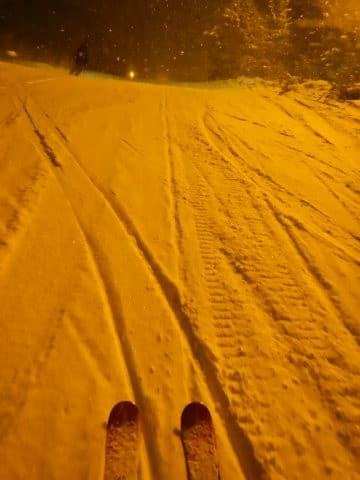

ナイターは最後のちょっとだけの

参戦でしたが．

夜までひたすら雪が降り続く天気で．

冷え冷えのいい感じの雪で滑れましたよ～！

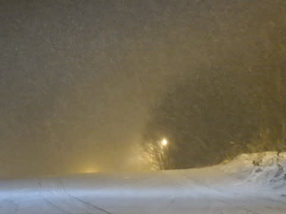

ってな感じで．

2019年の滑り納めも無事終えました…

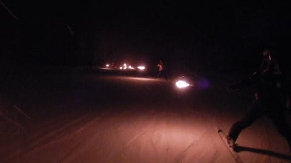

あぁ…

2019年が終わっていく…

とりあえず．

いろいろあった2019年でしたが．

怪我もなく無事過ごすことができたようです．

今年もお世話になりました～！

良いお年を～！！

## 💬 コメント一覧

### 💬 コメント by (ほっぽ)
**タイトル**: 下山に６時間
**投稿日**: 2020-01-01 03:39:41

Ｓさん

既に新年を迎えましたが、2020年もよろしくお願いします。

大晦日、私も16時の２高に乗って終了、

16:30過ぎに２ゴン前を出発しましたが、

下山の事故渋滞で上林に到着したのは22:35、

何と下山に６時間かけてしまいました。

こんなことならヤケビナイター滑ってから

帰宅しても良かったと後悔しています。

結局、新年は車中で迎えることになりました。

1/1の3:15、無事帰宅です。

今回は志賀高原の厳しい部分を体感しました。

### 💬 コメント by (かず)
**タイトル**: Unknown
**投稿日**: 2020-01-01 17:40:46

今年もよろしくお願いします

昨日までの休養で奇跡的に本日なんとか滑れるようになりました

なんか昨日通行止めになったようですけど

本日雪全然でしたね…明日から雪予報ポツポツしてますけど

Sさん最新予測はどうでしょうか？

### 💬 コメント by (新米パパさん)
**タイトル**: Unknown
**投稿日**: 2020-01-01 17:41:06

ご無沙汰しておりました。

娘連れの埼玉のスキー新米パパです(.ハンドルネーム失念？)

下山に6時間とは、、怖くなってきました、志賀高原シーズンデビューをいつにしたものか、、。

あの小学生スキーヤー達はもう滑られているのでしょうか？

### 💬 コメント by (Skier_S)
**タイトル**: 最高の元日でした
**投稿日**: 2020-01-02 05:55:22

＞ほっぽさま

6時間半は大変でしたね…

お疲れさまでした．

事故渋滞はたまらないですよね…

事故らず帰宅できたようで何よりです．

また正月休み後半お会いしましょう！！

＞かずさま

滑れるようになりましたか！

良かったです…

これから1月3日までは，雪がぱらつくものの

ドサドサパウダーはなさそうです．

積もるとすれば，5日ですね．

まだ正確にはわかりませんが，5日朝か6日朝は

パウダーになってる可能性ありです．

＞新米パパさんさま

お久しぶりです！！

志賀高原，道路が事故でひどいことになったのは，昨日の特異現象で．

普段は大丈夫ですよ～！

焼額は雪もいっぱいありますし，楽しめますよ！

…で，あの小学生スキーヤーたちは，12月上旬から毎週のように滑ってます．

ってか，小学校低学年組の女の子2人，めちゃくちゃうまくなりました．

今日のナイター一緒に滑りましたが，私がトップスピードで着いて行っても

おいて行かれるレベルです．

大人でももう着いていけません…

### 💬 コメント by (おり姫なな子)
**タイトル**: Unknown
**投稿日**: 2020-01-02 20:32:36

明けましておめでとうございます❢

いつもたくさんの写真とわかり易いコメント感謝で〜す。

4日に行こうか悩んでいるので、また面白いコメント宜しく❣お願いします(^^)/

### 💬 コメント by (Skier_S)
**タイトル**: ＞おり姫なな子さま
**投稿日**: 2020-01-02 22:34:55

明けましておめでとうございます～！

ご愛読ありがとうございます．

4日は曇り時々雪，午後になると雪の降りが強くなってきそうな感じで，

結構気温が冷える一日です．

5日の朝は，新雪が積もってそうな雪降りの一日です．

雪はちょっと薄くなりかけているので，そろそろ一降りほしいところ…

とはいえ．

悩んでいるようでしたら．

ぜひ志賀高原，それもなるべく焼額へお越しください（笑）

