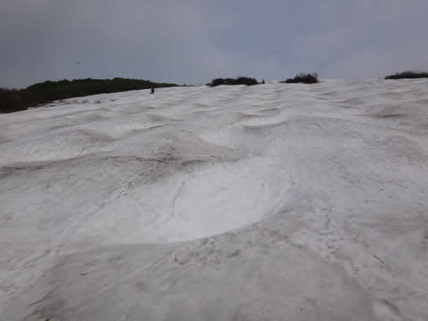
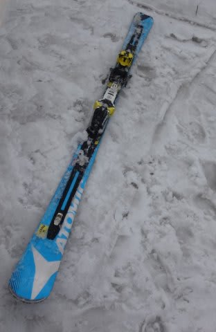

# 今シーズン最終日…ラストのラストで，ついにこぶ斜面で転倒かっ！！？？？

📅 投稿日時: 2015-06-17 01:25:22

ということで．

この日曜日をもってして，私の2015シーズンは終了したわけですが．

…

…終了したんですが．

…まだ，シーズンが終わったということを，体が受け入れてない

感じではありますが．

…終わったんです．

そう，終わったんです…←自分に必死に言い聞かせてる

ということで．

シーズン最終日となる，日曜日．

「ああ．滑走日数68日間の長きに渡ったシーズンも，今日で終わりか…

　今シーズンは，[一回激突されて転んだ](e512fc0184ef7d107c578b303b88749a0.md)けど．

　まぁ，自損転倒は0回だったなぁ…」

と思いつつ，大斜面のコブを気持ちよく滑っていたところ．

「ふ，ふがぁっ！？？？」

こぶ斜面を滑っている途中．右足の板のビンディングが

「ぱこーーーん」と．

外れた感触がっ！

「ふげぇぇぇっ！！」

…と，思いつつも．

外れたのは，切換え直後．

板が外れた右足から，ちょうど左足に荷重するタイミングだったので．

そのまま，左足で必死にブレーキっ！！！

コブの頭に手は着いたけど．

膝や腰を雪面につけることなく，無事停止っ！！

ぐはーーーっ！

ヤバかったっ！！！

ヤバかった．

ここまで，68日間．

自損転倒完全0で来たのに．

最後の最後でコケるってのは，ちょっと

締まらないよな…

って感じで，振り返ると．

斜面には，外れた板が鎮座ましましてました…

いやーー．

最後にぎりぎり，ちょっとヤバかったけど．

とりあえず．

今シーズン．

滑走日数68日にして，自損転倒回数0回！！

という記録を樹立したのでした…（ぱちぱちぱち）←自慢

…ぶつけられて，1回転んでるけど…（涙）

惜しい．実に，惜しかった…
