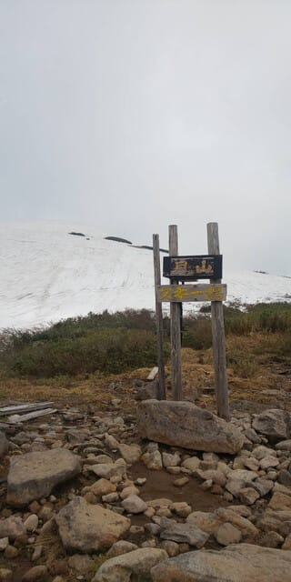
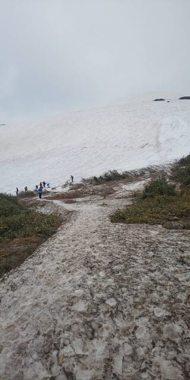
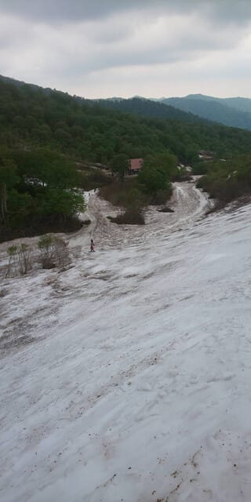
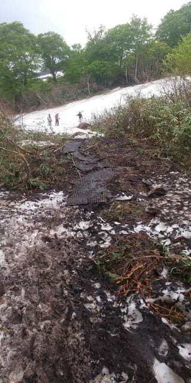
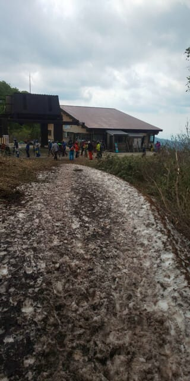
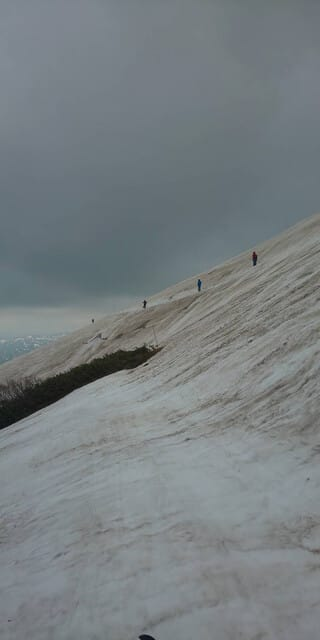
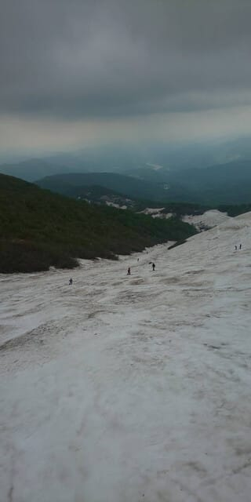
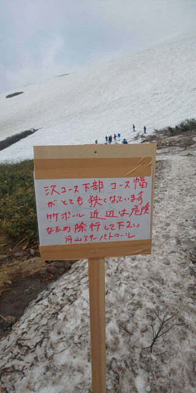
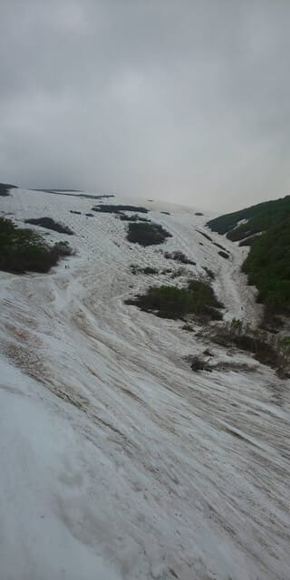

# 5月24日(金)の月山スキー場，特派員情報！…板を履いてのリフト乗り降り不可，乗り場付近まで滑り込め，降り場から登らなくてもゲレンデには出られるよ．沢コースはそろそろやばい

📅 投稿日時: 2024-05-25 00:28:49

🏷️ カテゴリ: [日記](cc4b5682fb7b8b144980957a978653fb0.md)

ということで．

明日…というか，あと2時間後に月山に

出発するわけですが．

本日日帰りで月山に行ったらしい，

根性のある特派員から月山情報が

送られてきました～！！

まず，月山リフトですが．

もう，板を履いての乗り降りができず，

板を持っての乗車となるようです…

ただ，リフト降り場から延々岩場を

昇らずとも，横に向かって直接ゲレンデに

出る道はまだ生き残っているみたい

ですが…

でも，もう板を履いて滑っていくのは

不可能っぽいですね（涙）

リフト乗り場に向かうところは，まだ

雪があるように見えますが…

でも，リフト乗り場まで雪が続いて

おらず，途中で途切れちゃってて．

こういうドロドロみちを数m歩かないと

このリフト乗り場にたどり着けないように

なっちゃったみたいです（泣）

うーん．

ここ，藪が立たなければいいんだけど．

雪解けがもっと進んで藪が立ち始めると，

ここを通るのが不可能になり，かなり

下からエンヤコラと登ってこなくては

ならなくなるので…

何とか日曜まで，この道が歩けると

いいな…

コース自体は，大斜面へのトラバースも

まだ大丈夫そうですし．

沢コースに向かって落ちていくコブ斜面も

まだまだ滑れるみたいですが…

沢コース自体は，一番下がそろそろ

途切れかけそうになっているみたいで．

沢コースも5月中に終わってしまい

そうな勢いですね…（泣）

いやー．

しかし．

この全景写真を見ると…

もう沢コースも結構狭くなってるし．

大斜面に早くもかなりの藪が立ってるし…

これ，5月の月山じゃないよね（涙）

いつもの6月中旬くらいの雪の

量ですね（泣）

という感じで，

いつもより早く終わりそうな月山．

早めに滑りに行かないと…！！

ってなことで．

明日月山滑ってきます～！！！

あと2時間ちょいで出発…

…今日は2時間寝られないな（涙）

## 💬 コメント一覧

### 💬 コメント by (ひろき)
**タイトル**: Unknown
**投稿日**: 2024-05-25 01:22:49

お疲れ様です  

月山を滑るのであれば、肩の小屋口までバスで上がれる(今年のアルピコのスキーバス運行ダイヤは確認してませんが)乗鞍は選択肢になりませんか？ 近いし

### 💬 コメント by (エイコ)
**タイトル**: Unknown
**投稿日**: 2024-05-25 16:00:02

ぜひ　ぜひ

おじゃまします

### 💬 コメント by (Skier_S)
**タイトル**: 2時間睡眠で月山にきたのに，今晩も6時間ちょいしか寝れない…
**投稿日**: 2024-05-26 00:15:18

＞ひろきさま

うーん．

月山はリフトぐるぐるできますが…乗鞍はリフトでぐるぐるできないので…

やっぱり月山のほうが効率が良いと思ってしまいます(笑)．

＞えいこさま

月山にいらっしゃるんですか？

明日も月山滑ってます～！

