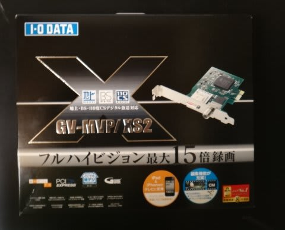
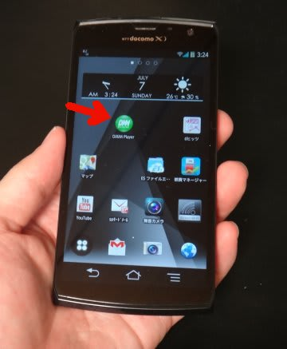
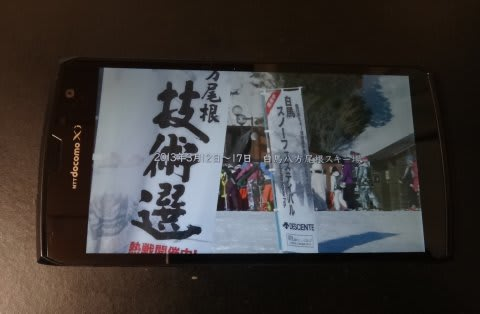
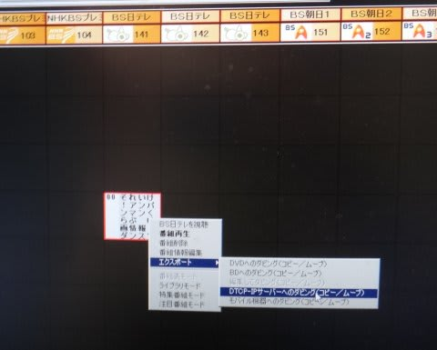
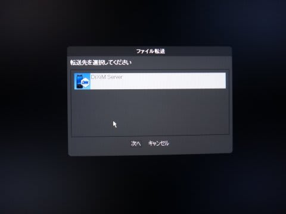
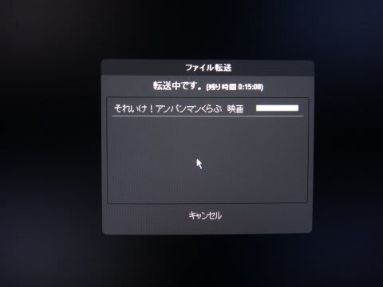
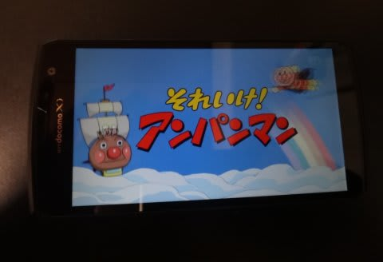

# スマホで地デジ＆BS録画番組を持ち出してみる

📅 投稿日時: 2013-07-07 04:17:21

えー．

TV放送がデジタル放送になってから．

コピー管理やらなにやらが厳しくなり．

録画番組をコピーして持ち出すことが，

大変たいへんややこしくなってきたわけですが．

…やっぱり，録画したTV番組を持ち出して，いろんなところで

見れれば便利なわけで．

で．

いろいろ業界の縛りがあるのか，大々的に宣伝はされてないけど．

SONYのHDDレコーダとExperiaや，PanasonicのDIGAとELUGAの組み合わせなど．

自社のHDDレコーダとスマホの組み合わせで実現できる方法があるわけだけど．

…そのためにHDDレコーダを買い換えるのもナンなので．

今回，[我が家にあるI-Oデータの地デジチューナーカード](ef9258fd52590d69c018a737426ea6cda.md)，

GV-MVP/XS2.

…いまは，[GV-MVP/XS3](http://www.iodata.jp/product/av/tidegi/gv-mvpxs3/)が後継機みたいですが．

こいつを生かせる方法を，実践してみました…

で．

この地デジチューナーカード．

DTCP-IPサーバとして，DIXIM Serverとやらが添付されています．

んで．

FujitsuのArrowsシリーズやNEC製のMEDIASシリーズのスマホにも，

DTCP-IPサーバ＆クライアントとして，DIXIM Playerがプリインストールされてます…

＃ライセンス管理の問題から，スマホ用DIXIM Playerはプリインストール版

＃しかなく，他機種のスマホに後でインストールはできないようです．

ってことで．

私のスマホ，F-02E Arrows X.

DIXIM Playerがインストールされてます…．

このDIXIM Player．

Wi-FiでPCやHDDレコーダーなど，DTCP-IPサーバーとつなげば，

とりためた番組を，スマホでストリーム視聴することもできるのだ．

防水スマホなので，撮りためた番組をお風呂場で見る…

ということもできちゃいます．

…ただし．

Wi-Fiで同じネットワークにつながないと

ストリーム視聴できないのが，ちょいと残念．

残念ですが，屋外から，携帯のネットワーク経由で

視聴はできないんですね～．

しかーし．

この，スマホ用DIXIM playerはプレイヤーだけではなく，

DTCP-IPサーバ機能も持っているので．

DIXIM ServerをインストールしたPCからであれば，

スマホへ，録画番組のコピーが可能なんですね～！

これで，屋外で見ることもできます！

＃2014年6月追記：このDIXIM Server，Win8までで

＃Win8.1以降は今後も対応予定なしってことで．

＃Win8.1以降のPCでは，残念ながら地デジコピーできません…

こんな感じで…

PCの録画番組一覧から，DTCP-IPサーバへのコピーを選ぶと…

Wi-Fiでつながっていれば，スマホのDIXIMサーバが見えるので…

番組をコピーできます．

HR-12(12倍)くらいの圧縮率で録画した番組のコピーに，

1時間番組で15分程度かかるのが問題ですが…

んで．

コピーが終われば．

こんな感じで．

PCで撮りためておいた番組を，いつでもどこでも

スマホで見ることができるようになるのだ…

これで，[旅行時にポータブルDVDやDVDディスクを持ち歩く](e13766a60247be8ea799d4a61b7432958.md)

必要もなくなりますね～．

当然，HDMIケーブルをつなげば，大きなテレビにつないで

見ることもできるんですね～．

フルハイビジョン画質だから，DVDより画質はずっと良くて，

感動！

…と，ここまで来たところで．

なぜ，カーナビを選ぶ際に．

[HDMIつきにこだわった](e09e2ec6505c6a1935719a3fdc95d554d.md)かの謎がとけたかと…
