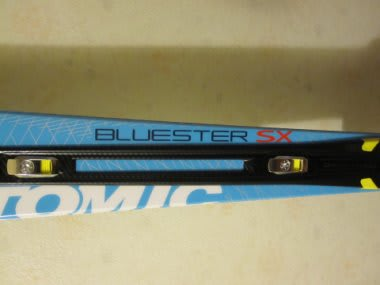

# ’13　ATOMIC BLUESTER DEMO SXのインプレッション

📅 投稿日時: 2012-12-13 00:18:58

で．

一日遅れましたが．

今シーズンの私の新しいお友達，ATOMIC BLUESTER DEMO SX のインプレッションをば…

以前，[試乗で乗っている](eeea1d5e73c2df261178519bab7793bd8.md)んですけど．

…前回の試乗バーンは雪が荒れていてしっかり足場をつくりにくかったので，

実はこの板のフルパフォーマンス出せてなかった？？？って感じですね～．

とりあえず．

しっかりした張り，

強いエッジグリップ．

トップからテールまでのエッジの線に乗って，かなり切れ切れの

シャープなターンができます．

ずらそうなんて思わないほうがいいです．

ずらしても面白くありません．

ひたすらこの板のサイドカーブ＆たわみが作り出す，

官能のターンの世界に身を任せて快楽をむさぼる板です．

ある程度のレベルの人が履けば，笑ってしまうほど過激で楽しい板です．

完全脳内麻薬系の板ですね～．

(ニュアンス伝わるかな…？）

なんにしろ安定度が抜群で，小回り板なのに，かなりの高速までいけますね～．

さらに，D2構造のおかげなのか，スピードを出したときの振動吸収性が良く，

足元のぱたぱた感は全くなく．

雪が荒れていても，荒れをあまり感じさせないでスピードレンジを上げていけます．

んで．

エッジグリップが強いから，板なりにしか滑れないのでは？

って思うかもしれませんが．

板の傾きと板に仕掛ける量で，かなり自由に旋回半径を制御できます．

小回りスペシャルかと思ったけど．

全く問題なくロングターンまで引っ張れます．

SALOMON 24hours LMよりロングが引っ張れますね～．

そして．

単にサイドカーブでするする回ることもできるけど．

しっかり圧をためて，たまった圧を開放すると，一気に板が走る！

びよよよ～んって感じで吹っ飛んでいきます．

かなーり元気な板です．

あー．でも．

しっかりたわませるためには，体重と脚力が必要です…

かなりの体力を必要とする板，ともいえるかも…

あ，でも．

板のスイートスポットは広いので，難しい板ではないです．

とりあえず．

私のような単純快楽系高速大好きレジャースキーヤーの

ハートのど真ん中にジャストミートする，笑っちゃうくらい楽しい板で，

「買ってよかった～っ！！」

と，心の底から思えるマシンなのでした…

## 💬 コメント一覧

### 💬 コメント by (ひろりん)
**タイトル**: Unknown
**投稿日**: 2012-12-13 11:25:37

そう！たわむんですよね！！「うにん」て感じでたわんで「びよん」て感じ？正直初めて履いた時は頼りない感じを受けたんですが、全然そんなことなくて、強烈なエッジグリップでも乗り易いですよね！オガサカより疲れないというか・・・

で、ロングも行けるという・・・

何でもできる板だと思います。

コブ入ったら気をつけないと発射するかもだけど・・・

＞完全脳内麻薬系

誰が上手い事を言えとｗ

が・・・

高い・・・高いよ・・・（TT)

買ったらスキーに行けなくなりますわ・・・orz

### 💬 コメント by (Skier_S)
**タイトル**: お久しぶりで
**投稿日**: 2012-12-14 00:02:49

お久しぶりのコメントですね…

今シーズンはもう滑りましたか？？？

とりあえず，この板．

強烈なのに，何でもできるという不思議な板ですよね…

でも，「脳内麻薬系」が通じたようで…

履いた人には分かってもらえる表現でしょうか(笑)

いい板だけど，定価13万6000円ってどうよ？？

まだ在庫があった6月ごろ，どこに聞いても

「最大15％オフまで．11万6000円です」

…て感じで，自分は買えない板だと思ってましたが．

今回はラッキーなことにたまたま安くGetできました…

しかし．

やっぱり．

この板．

買ってよかったですよ～！！！

