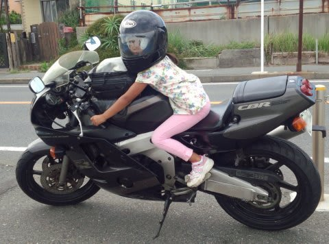
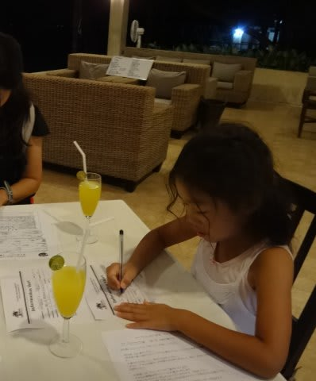
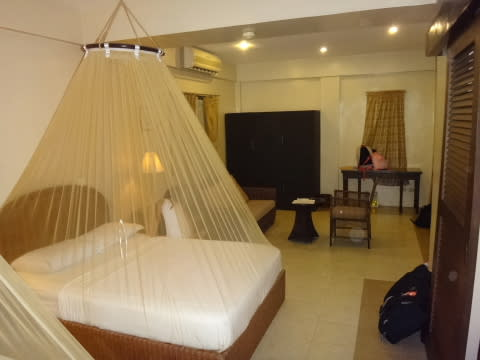
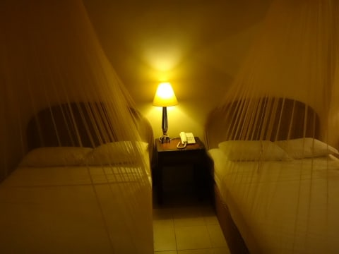
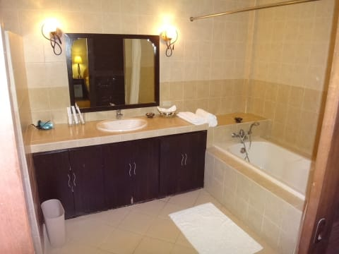
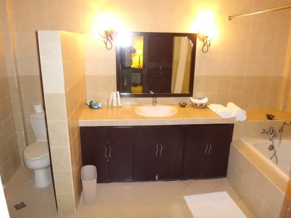
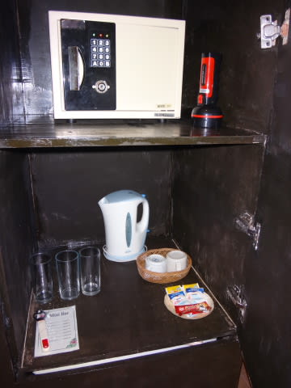
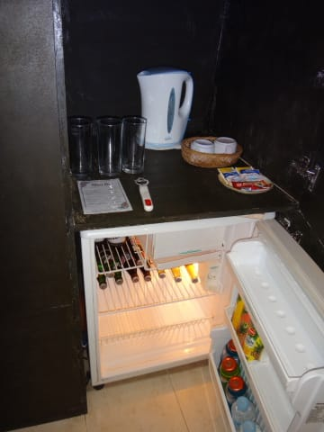
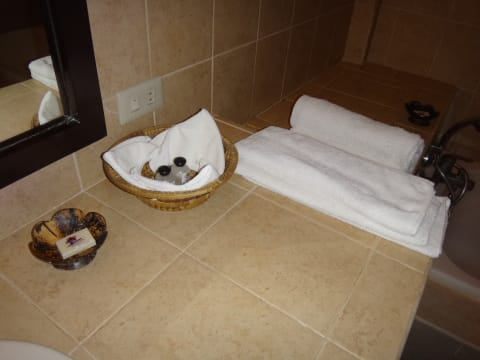
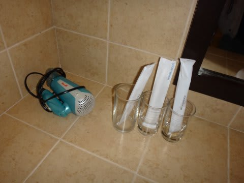

# 2014年8月　オスロブagain…再び，子連れでジンベエザメと泳ぐぞ！　その3

📅 投稿日時: 2014-09-03 01:53:07

そういえば，日曜日．

WRXの試乗をしてきただけでなく，

娘の

「バイクに乗りたい～っ！」

ってリクエストに応え．

娘をバイクの後ろに乗せて，いろいろ

走ってきたわけなんですけど．

1時間近く走り続けたので，ちょっと後ろの

娘を気遣う私．

私「…大丈夫，疲れてない？」

娘「風がきもちいい～っ！！」

…ってことで．

うちの娘．

父親譲りは，スキーと海だけじゃなく．

バイクに関しても，何か危険な血が流れている気配…

とりあえず．

高速を走っても怖がらなかったので．

…これは，かなりやばいかも．

と，余談はこの程度にして．

本題の，ダイビング日記へ，Go!

---

で．

夜10時ごろにホテルに到着したわけですが．

レストランでウェルカムドリンクを飲みながら，

必要書類を記載したあと．

ようやく部屋へ…

今回泊まったのは，前回とは違う部屋ですが．

ゲストルームの造りは，前回と完全に同じですね～．

娘大好きな，オサレなネット付きベッド．

そして，大きなバスタブのある，広いバスルーム！

水回りも，十分きれいで．

セキュリティボックスと，電気ポット．

冷蔵庫もちゃんとあります．

あー．

そうそう．

蚊取り線香も備え付けてあるので，

特に日本から持っていく必要はありません．

…そして．

シャンプーと石鹸，歯ブラシや，ドライヤーもあるけど．

髭剃りやコンディショナーはありませんので，

ご注意を．

で．

前の写真の，シャンプーとかの後ろに写っているので

分かるかと思いますが．

コンセントは100V.

日本と同じ形のものが使えますよ～！

変換アダプタは不要です．

あと．

インターネットも，すべての部屋で無線LANがつながります．

フロントでパスワードを教えてもらえば，日本とそれほど

変わらない快適さでネットが使えます．

うーむ．便利！

って感じで．

10時半到着と，夜も遅く．

明日の朝は早いので．

長い一日だったこの日は，早々にシャワーを浴びて，

すぐにコテンと寝たのでした…

## 💬 コメント一覧

### 💬 コメント by (KENKEN)
**タイトル**: うちの娘も公道デビューしましたが・・・
**投稿日**: 2014-09-03 22:00:19

最近２回ほど公道でバイクに乗せました。

１回目 １時間程度乗せると全然平気だったので、２回目は30分程距離のあるプールにバイクで連れていくと、帰りに遊び疲れて後ろで眠りそうに。

ちょっと調子に乗りすぎました。

嫁に怒られましたので娘のバイクは当面禁止です。

西表からも無事帰ってきました。

今回は天気＆海況に恵まれ、毎日ベタ凪でした。

いつもダイブワンロードさんも利用したのですが、子供乗船ＯＫとのことで別ショップの“トネリコ”さんも利用しました。

トネリコさんがある西表島 西エリアは北エリア以上に素晴しい珊瑚が広がっていました。

今年 座間味と西表島に行きましたが、西表島で潜ると台風８号の影響が色濃く残る座間味が霞んでしまいました。

Sさんも7月のリベンジでいつか西表島に行けるといいですね。

(隣の石垣の珊瑚はオニヒトデで今も厳しいようです）

“オスロブagain"楽しんで拝読してますので執筆頑張って下さい。

### 💬 コメント by (Skier_S)
**タイトル**: KENKENさま
**投稿日**: 2014-09-03 23:55:47

ついに公道デビュー，しちゃいましたか！

そうなんですよね～．

子供，後ろで寝そうになるんですよ．

どこかに行って遊びまくった帰りとか，

結構危険かも…

私も西表，西～南のエリアが結構好きかも．

鹿の川中ノ瀬でのサンゴの元気さが印象的…

舟浮集落も味わい深くて，上陸するのが楽しみだったり．

座間味は去年もそうだったんですが，

台風で結構やられちゃうんですよね…

今年もダメでしたか．

石垣も，まだ厳しいんですね…

実はこの9月の3連休，石垣が

抑えられたので，来週は石垣の

予定です…

さすが3日で西表はきついので（涙）．

西表，行きたいな～

とりあえず，オスロブ旅行記，必死に書いてますので．

応援ありがとうございます！！

