# 2017年8月，小学生の子連れで座間味でダイビングその14…ダイビング3日目スタート！

📅 投稿日時: 2018-07-27 04:32:41

えー．

ホントは本日は．

昨日のリアカメラ取り付けネタの続きを

書きたかったのですが…

…今日はちょいとご無体時間の帰宅だったため．

書きためておいた，座間味旅行記をお送りします．

…聞こえる．

聞こえるっ！！

ダイビング旅行記はいいから，

早くナビ取り付けレポートの続きを書け！

という読者の声が聞こえるっ！

…いや，気になりますよね．

昨日の続きが…

どうやって解決したか，気になって眠れない人が

50万8000人ほどいるかと思いますが．←いないから．そんなに

明日までお待ちを…（懇願）

…どうでもいいんですが．

ここ2回ほどのリアカメラ取り付け編の記事．

図面が多かったりして，書くのに2時間くらい

かかってるんですよ…（涙）

だもんで，今日はすみません．

書きためてあったダイビング旅行記へ，Go！

---

というわけで．

早くもダイビング3日目…

今日がダイビング最終日になります．

早い…早すぎる．

なぜに旅行に来ると，こんなに時間が早く

過ぎ去っていくのか…（涙）

とりあえず．

いつも通り朝7時から，朝ごはんタイム！

…今日は洋食ですね．

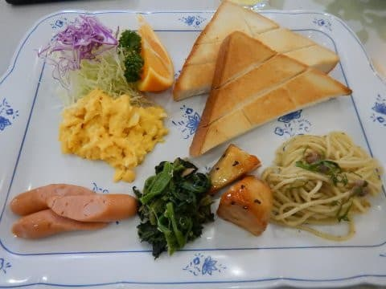

お皿が大きいので量が少なく見えますが．

トーストもかなり分厚く．

かなりお腹いっぱいになる朝ごはんです…

で．

朝ごはんを食べたら，ダイビングの準備をして，

いつも通り港へ向かいます．

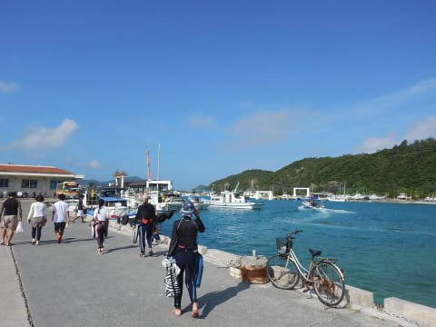

うむ．

今日は昨日と違って，

朝からいい天気ですね！

そしていつも通り，ティンガーラ号に乗船！

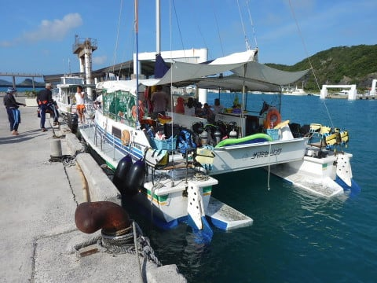

今日はお客さんが少なめですね…

…ってか，子供は他に乗ってないようで…

娘はちょっと寂しそう．

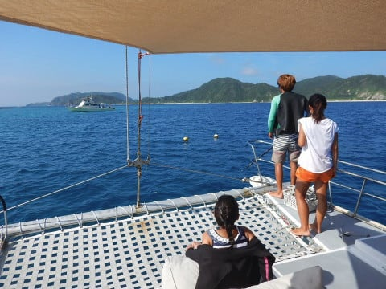

ただ，今日は午前中に2本のパターンで．

1本目と2本目の間に一旦港に戻り，

追加のお客さんを乗せるようで．

その時にまた子供たちが乗ってくるようです…

港を後にした船は，10分ほど走り…

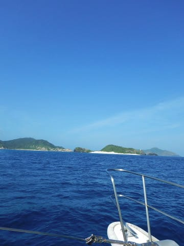

座間味港のすぐ目の前，安慶名敷島の

そばに止まりました…

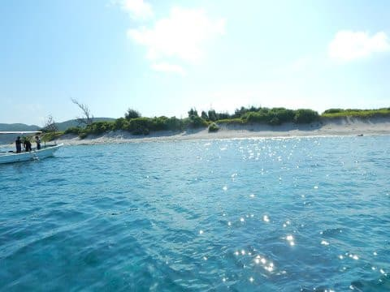

今日は午前中で2本潜り，

さらに1本目と2本目の間に港に戻らねば

ならないので，結構時間的にタイトです．

だもんで，この1本目は，港からそう遠くない，

このポイントで潜るようです…

それでは，エントリーしましょうか…

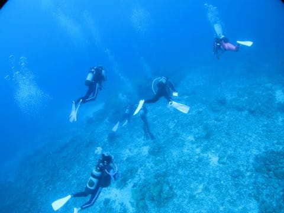

ふむ．

透明度は良さそうですね…！

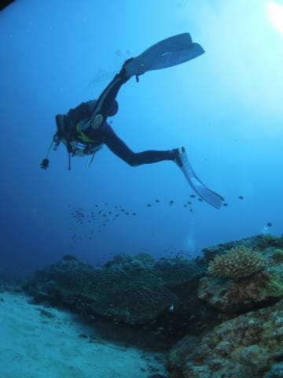

ここも砂地に根がぽつぽつとある感じの

ポイントで…

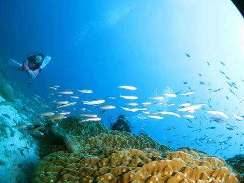

根の上には定番のお魚さんたちが群れています…

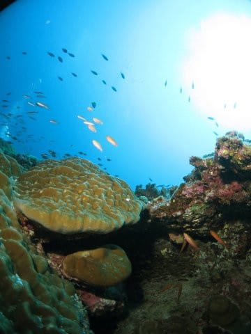

…この根も，キンメモドキがいっぱい

ついてますね…

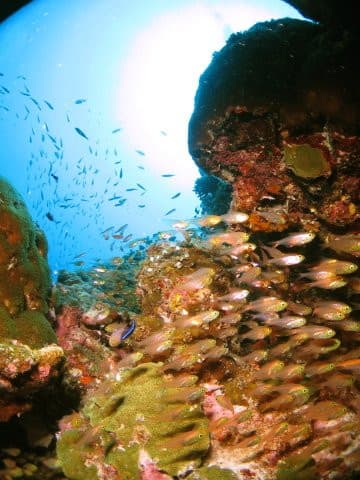

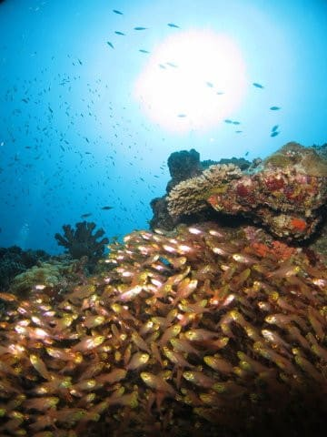

キンメモドキの合間に，

こんなハダカハオコゼもじっとしてたり…

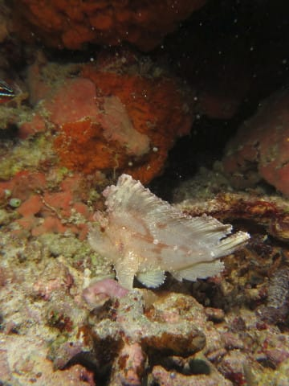

ミノカサゴが

「写真撮って」

と言わんばかりにじっとしてたりしてましたが…

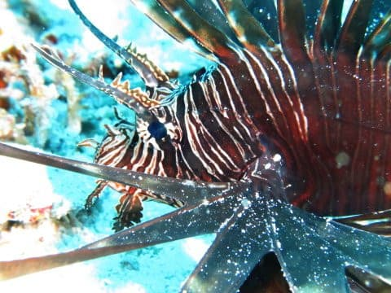

…うむ．

今回はちょっと．

キンメモドキポイントには飽きてきたかな（笑）．

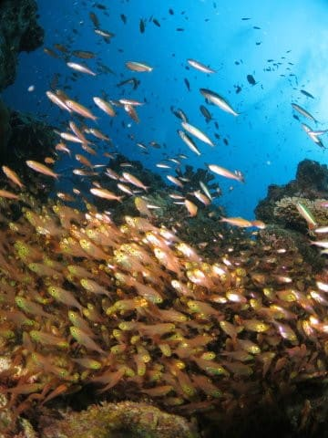

ってことで．

いくつかの根をめぐりますが…

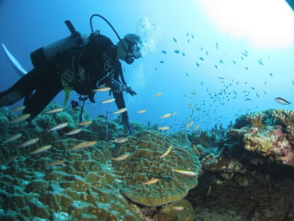

今日は天気がいいから，光がきれいに

入った写真になりますね～．

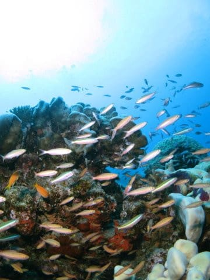

太陽がまだ低めの午前早めの時間は．

フィッシュアイが活かせる，きれいな

逆光ポジションに入れますね…

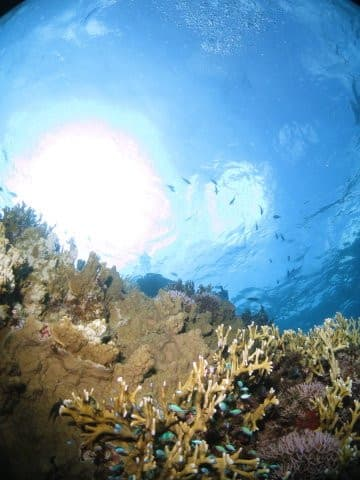

ってな感じで．

ダイブタイム48分でエグジット！

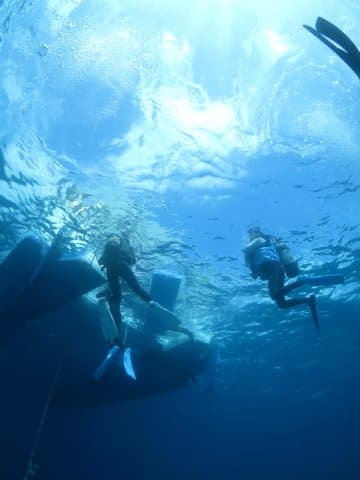

いやー．

ゆったりした1本でした…
