# 4月29日，3連休最終日の志賀高原は…うむ．奇跡は昨日でおしまいか…(涙)．

📅 投稿日時: 2013-04-29 22:24:31

🏷️ カテゴリ: [2013スキー滑走日記](c91dbe557f9a69230b1600e48622fdd61.md)

えー．

この3連休．

前半2日間は，奇跡が続いたんですが．

が．

…どうやら．

奇跡は3日目まで続かなかったようで(涙)．

今日も朝7時の早朝営業開始に間に合うように出かけますが…

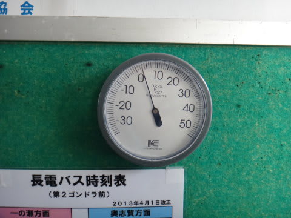

…どうしたというのだ．

朝7時というのに，山頂の気温はプラスなんですが…

…なんだか．

昨日までの冷え込みと，えらい違うんですが…(悲）．

でも．

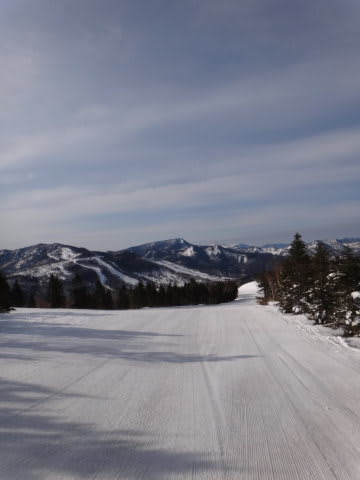

朝は，ゲレンデはシマシマ！

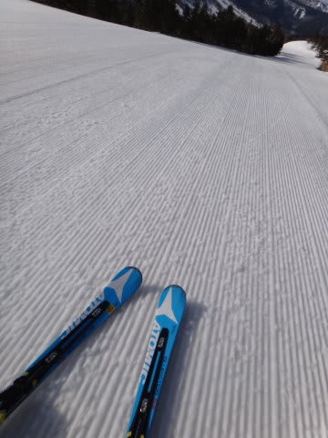

気温はプラスだけど，がっちり固まったアイスバーンで…

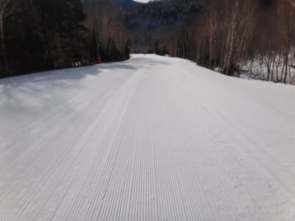

硬い斜面好きにはたまらない感じっ！

＃硬い斜面が嫌いな人にはダメな感じ…(汗)

でも，気温も高く，晴天で日差しも強いので…

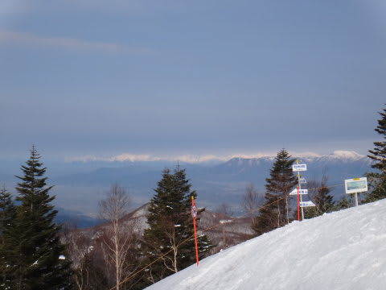

スタートから1時間，8時になってくると，いい感じで表面がやわらかくなり…

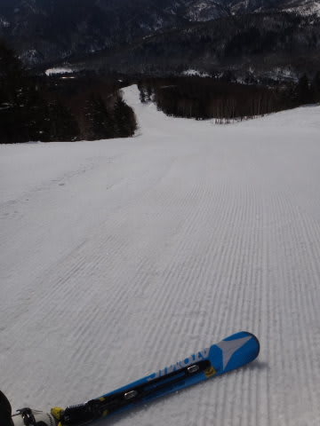

硬い雪の表面にエッジが気持く食い込む，快適大回りバーンに！

9時半ごろまでは，かなり快適なフラットコンディション！

いやーーー．

やっぱり，この時期は早朝に限りますな～．

…と，思っていたところ．

ぐんぐん気温が上がったので．

10時前にはかなり雪がやわらかくなり始め…

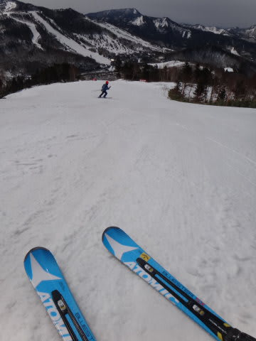

10時を過ぎると，一気に，ホントに一気に雪が緩み，張り付く雪に変わって

しまいました…(涙)．

昼前には，気温はプラス10度になっちゃったんですが…(悲）．

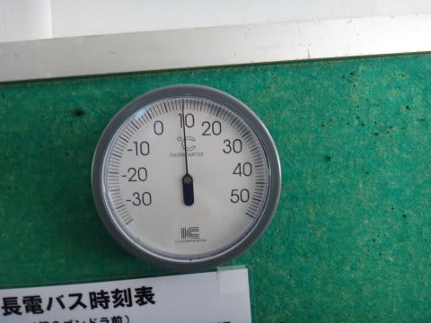

…あづいよ～！

…

…そうですね．昨日までが，奇跡だったんですね．

今日のこの気温が，平年並みなんですよね…

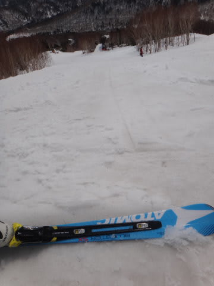

この気温で，ゲレンデの雪は…

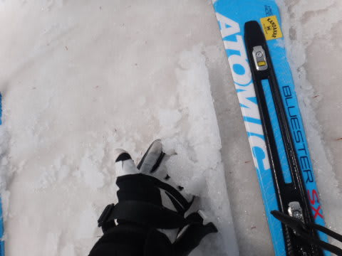

こーゆー水を吸った雪になっちゃってます…(泣）．

板が張り付いて滑らない…(涙)．

ああ．

昨日までが良すぎた…

ということで．

天気も良く，暑いくらいの日差しの一日でしたが．

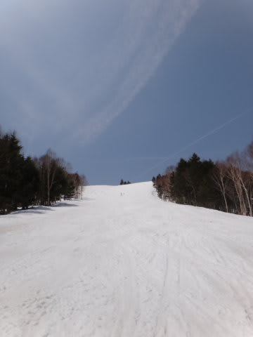

まぁ，3日間滑ったし．

今日も朝7時から3時間は，結構いい感じのハイスピードバーンを楽しめたし．

張り付く雪になっちゃった今日は，まぁこの程度にしておいてやるか…

という感じで．

3連休最終日の渋滞を避けるために，私にしては珍しく

昼ごろに切り上げたのでした…

＃珍しいこともあるもんだ←自己突っ込み

しかし…

この奇跡のGWの積雪で．

志賀高原は，平年並の雪の量に復活しましたね～．

## 💬 コメント一覧

### 💬 コメント by (gokuraku skier)
**タイトル**: Unknown
**投稿日**: 2013-04-29 22:57:18

思った以上に朝一はイイ感じですね～。

私も硬ーい朝イチバーン滑りたかったです。

ＧＷ後半、もう一度奇跡が起こらないですかね。

### 💬 コメント by (Skier_S)
**タイトル**: gokuraku skierさま
**投稿日**: 2013-04-29 23:37:33

朝の3時間はいい感じでしたね～．

もう一度といわず，2度3度と奇跡が起こってくれないか

祈っているところです(笑)．

