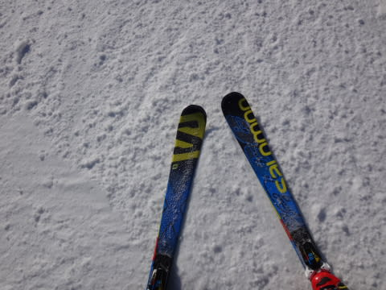

# 3月29日の志賀高原，速報モード…晴れのち曇りのち…山頂は雪？？

📅 投稿日時: 2015-03-29 23:40:34

🏷️ カテゴリ: [2015スキー滑走日記](c09ea645cfc085f86dfcd80f49599dd89.md)

本日も．

帰宅が夜11時を過ぎてしまった…（涙）．

ってことで，本日も帰宅が遅かったので．

速報モードで…

えーと．

本日は…

あれ？

なぜ？

なぜ，早朝営業の写真が？

ってことで．

朝6:30からの，焼額の早朝営業．

…天気はそこそこ良く．

やはり早朝は，固くしまった，いい感じの斜面！

ちょっと氷のコロコロが多かったのが，残念だったけど…

で．天気は．

午前中は雲がかかるものの．

おおむね晴天で．

いやー．

気持ちいいね～！！！

だけど．

気温は高く．

やっぱり午前中に，かなり重い春の雪に…（涙）．

とはいえ．

昼前から雲が増え，日差しも弱まってきたせいか．

雪は先週ほどザブザブにならず．

午後まで比較的フラットで，滑りやすい感じだなぁ…

と，思っていたら．

午後3時ごろに．

…来ました．

降ってきました…

…あり？？

雪？

雨じゃなく，雪なの？？

雪だ～！よかった！

と喜びつつ，滑り降りていくと…

コース途中から雨に変わり．

麓では雨…（涙）．

でも．

雨が降ったのは，午後3時から30分くらいで済み．

それ以外は，天気がもってくれた感じで…

結局．

それほどひどい降りにならなかったし．

山頂付近では，雨じゃなく雪だったし．

これはやはり，あれですね．

昨日書いた通り．

私の日ごろの行いが…（サクッ）←読者からのヒットマンに殺られた音
