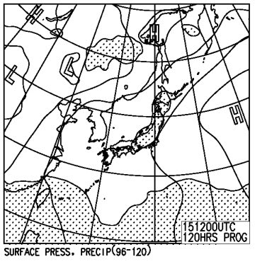
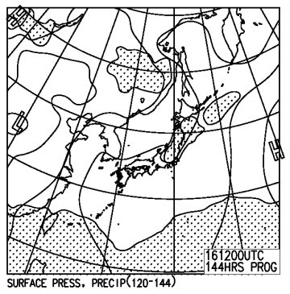
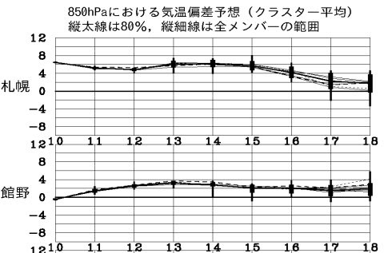
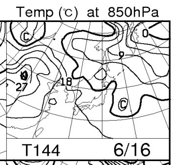

# スキー天気予想番外編！今週末の月山の天気は…？

📅 投稿日時: 2013-06-12 01:33:37

🏷️ カテゴリ: [スキー天気予想](c6554f5c3c106093b511a8daae23757e8.md)

えー．

プロジェクトXがらみのばたばたした週末が，やっとひと段落着いたので．

今週末は月山に行くんですね～．

…気になるのは，月山の天気．

5月末をもって終了したはずの天気予想．

番外編，行ってみますか…

えー．

…

…

分からん．

はっきり言って，私は夏の天気図は苦手とするところ…

さらに．普段のデータを持っていない東北地方ですから…

…

天気図見ても，あんまり良く分かりません(汗）．

とりあえず，15日(土）と16日(日)の地上天気図を見てみると…

…どっちも，雨の降る網掛けが見事東北をすっぽり覆ってるので．

…狙ったかのように，月山は雨でしょう．

あ，雨じゃなくても．

湿った空気が入りそうなので，このままだと

ガスが出るんじゃないかな～．

よく言う，「ガス山」状態かも…

まぁ，まだどうなるか分かりませんが，

少なくともスカッと晴れた天気にはならなさそう．

気温も…

この一週間は高めに推移するし，雨も降り続くので．

おそらく，この一週間で雪が結構解けて，先週から

かなり状況は悪化しそう…

しかし．

この時期．

上空の850hpa気温図は…

こんな感じで．

なんだか，15度ラインとか，18度ラインが日本にかかってますね～．

0度以下の空気が日本を覆う真冬とは，えらい違いですね～．

そろそろ，スキーシーズンが終わりに近づいてるかな？って

感じですね～←普通もうとっくに終わってるから(お約束の自己突っ込み)

まぁ，月山でも20度くらいには上がるでしょう．

日が差せば暑い一日だけど…

太陽は照らない感じなので，ちょっと肌寒く感じるかも．

まぁ，Tシャツじゃ厳しいかな～，って程度の寒さですけど．

ということで．

この土日，

E型レガシィにて，月山へ出没予定です．
