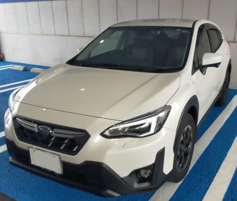
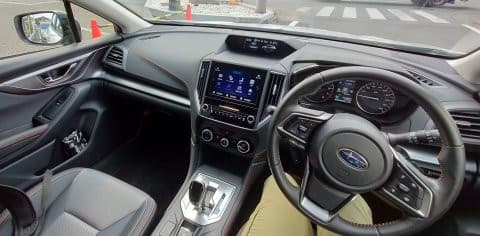
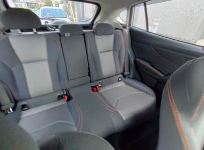
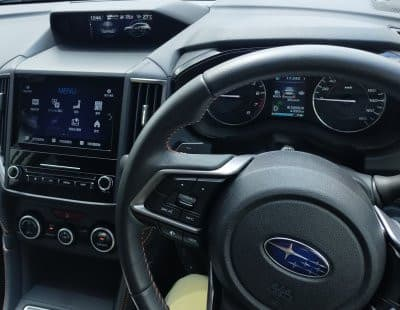

# スバルXV 1.6i-L Eyesight E型に試乗してみた

📅 投稿日時: 2021-09-24 06:07:00

🏷️ カテゴリ: [車試乗](c07dec5709d34bd74e1f6cb9c8291061b.md)

えー．

本日は，ちょっと古いネタになりますが．

先日，[我がVMG LEVORG君がリコールの
燃料ポンプ交換作業](ea7d5a789798785c98723e2004147cdc0.md)を受けている間．

E型のXV 1.6Lが代車でやってきたので．

今回は，こいつの試乗レポートです！

…いや．

以前，[D型のXV 1.6Lに試乗している](ec2d104bb152bf6ac5f27a7cd1462edcc.md)んですが．

E型と乗り比べて，予想以上に変わっていた

のにちょっとびっくりしたので記事にして

みました…

いろんな記事やら情報を調べても，

XVの情報は2Lのe-BOXER仕様の情報に

偏っていて，1.6Lの情報ってあんまり

無いんですよね…

ってなことで．

外装は，バンパー周りとホイールが変わった

ようですが．

まぁ，誤差ですね．

内装を見てみますが…

内装自体はインパネとシートにもオレンジの

ステッチが入り，1.6L車でも2L車に負けない

高級感が出ましたね．

リヤシートの広さは変わってませんが．

相変わらず，外から見るより広い

リアシート．

リアシートにもオレンジステッチが！

メーター部分の仕様は，特に変わって

ないかな．

ってなことで．

走り出してみると…

あら？

サスのセッティング，全然違う！？？

D型よりも，上物がすごい落ち着いてる！！

D型は，段差乗り越えはマイルドで，

衝撃はしっかり受け止められる

ボディ剛性と足の動きはあり，この

クラスとしては上出来かな？と

思いつつも．

ゆったりした路面の揺らぎとかには

ボディがそのままゆすられる感じを受け，

ロール収束も遅めなため，ちょっと

上物がゆらゆらした感じを受けたのが

わずかに惜しかったのですが…

このE型，この惜しかったゆらゆら感が

全く消えた！

前のXVは2.0に合わせこんでいて，

1.6の細かなチューニングに手が回って

ないんじゃないか？

とか思ってたけど．

E型の1.6L，かなり良くできてる…！！

コーナーを攻めたりしてないので，

強い横Gがかかった時の動きは分からない

けど．

スピードを上げていってもビシッと

安定しているし．

ロールもすっと収束するし．

これ…先代LEVORG GT-Sに迫る足かも…？？

ステアリングフィールも結構いい！

でも，これは気づく人がかすかに気づく

レベルかと思うけど…

ステアリング系のちょっといろんなところの

剛性不足があるのか，あるいは電動パワステの

プログラミングか…

指1本切った時，遊び領域みたいな不感領域が

あって，その不感領域を超えたところから

くっとステアリングゲインが出ます．

惜しい．

ステアリングに返ってくる反力もいいし．

一旦ゲインが出始めると，かなりクイックに

車が反応するので．

車自体の応答周波数の上限は高そう

だけど…

ニュートラルから切り始めるステア

リング系に，ごく一瞬のラグを

感じるのが惜しい．

…まぁ，これに気づく領域で車を走らせる

人はほとんどいないと思うけど…

でも，ステアリングのこのラグに気づくのは．

足回りが良くなって車の応答が早くなった

からだと思う．

これに気づいたのは，

足回りが良くなりすぎた

ということの裏返しで．

足の動きは，いろんな動きのお釣りがわずかに

残る感じがあるD型と違って，スパッと収まる

いい足になってます！

そして．

もっと大きく変わったのは，1.6Lエンジン＆

リニアトロニックの制御．

ここは，「別物か？」と思うくらい変わり

ましたね…！

D型に乗った瞬間に感じたアンダーパワー

感が無かったので．

「これ，2.0Lだよね？」と最初は勘違い

してしまったくらい，パワー感が増しました！

（最初乗ってしばらく，1.6と思ってなかった）

最初，エンジンのトルク上げてきたのかな？

と思ったけど．

FB16エンジンの仕様は変わってない

ようなので，

制御だけ変えて，かなりの完成度に仕上げて

きたようです…

具体的には，以前はアクセルを踏んだ時，

ぐっと回転数が上昇して，それから加速が

ついてくるような感じでしたが…

E型では，エンジン回転数をそれほど上げず

加速するような制御に変わってます！

だもんで，エンジン回転数が上がる前に

にスルスルスピードが乗っていくので，

かなりトルクがあるように感じる…！

車軸のデマンドトルクを出すのに，まず

ハイギアード（低回転）のまま思いっきり

電制スロットルを開けて行って．

それでもトルクが足りなければ，

リニアトロニックを車軸必要トルクに

なるまでローギアード側にじりじり

動かしていく…という感じの制御に

なったようです．

アクセルをがばっと開けると，リニア

トロニックは思いっきりローギアードに

落ちますが．

普通の街乗りでは，かなりエンジン回転が

低回転のまま走ることができます…

そして．40km定常走行時のエンジン回転数，

1300RPM以下．

これ…LEVORG2.0より低回転で走ってるん

ですけど！？？？

全体的に，かなりエンジン回転数を

落としてます．

普通の2L車より低いエンジン回転数で

走るので，トルクがある車のように

感じます…！

普通の街中の走りなら，こっちの方が

絶対いい．

D型で感じたアンダーパワー感を全く

感じません．

いや．最初からこの制御にすればよかった

のに…！！

ただ，急な登り坂を登ってないので．

登り坂でのパワー感はちょっと分からない

けど．

街乗りでは，全くアンダーパワー感が

無くなりました！

で．このXV．D型からお値段上がって

ないの？？

…これ，D型の1.6Lを買った人は，かなり

悔しい思いをするほど完成度上がってます…

これでアイサイトツーリングアシストが

ついてて，完全停止までステアリング補助

付きで走ってくれるし．

リアシートも広いし，荷物も結構詰めるし…

燃費はハイブリッド車と比べると良くないけど．

ガソリンフルタンクが大きくて

63L入るので，

高速エコランすれば1000km無給油で

走れそうだし．

そして，X-mode付きの4WDで，

この車が230万円ってのは…

むちゃくちゃバーゲンプライスじゃ

なかろうか？？

## 💬 コメント一覧

### 💬 コメント by (アリス)
**タイトル**: 代車いいですね
**投稿日**: 2021-09-24 21:40:26

S様

リコール対応お疲れ様です♪

実は私の愛車も数か月前にリコールで燃料ポンプ交換しました。

作業終了後、ディーラーからガソリンスタンドに直行し燃料を満タンに補給したと同時に車両下部よりガソリンが「ジャジャ漏れ」が発生しました・・・

すぐさまディーラーへ連絡し、車両運搬車で搬入後再点検・・・

結果＝燃料pump吸入側のガスケット（Oリング）取り付け不良による変形・漏洩

ディーラーでもこういう事があるんですね・・・

再整備後は、自宅へ納車で店長、工場長、営業で来てケーキ持参で謝罪して燃料満タン料金も払って帰って行きました。

### 💬 コメント by (Skier_S)
**タイトル**: ＞アリスさま
**投稿日**: 2021-09-24 23:13:19

あら．

燃料ポンプ取り付け不良ですか！

大ごとにならなくて良かったですね…

私はさすがにディーラーさんが菓子折りとかケーキもって

やってくるほどの事件に出くわしたことは無いので，

アリスさんもいろいろ引きが強い方なんですね…多分(笑)．

