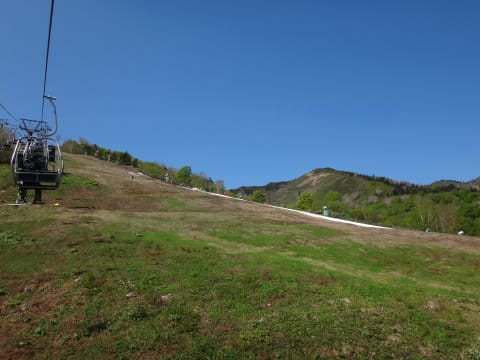
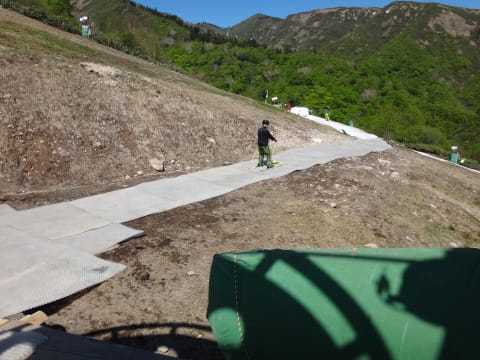
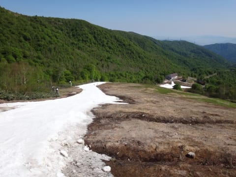
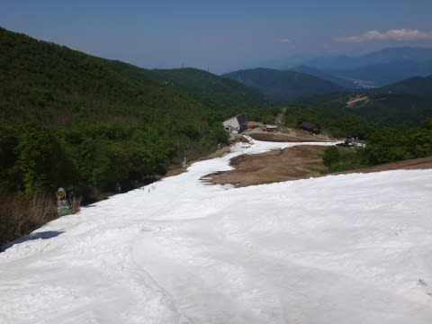
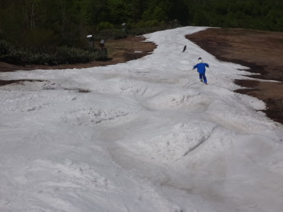
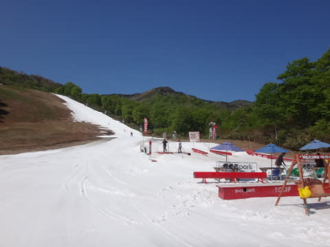

# 5月22日，かぐらスキー場ファイナル速報…良く今日までコンディション維持したものだ！

📅 投稿日時: 2016-05-23 02:54:12

🏷️ カテゴリ: [2016スキー滑走日記](c70c67ed5248e9432b899dcd5747048bb.md)

えー．

本日，行ってしまいました．

ええ．そうですとも．

行ってしまいましたよ．

皆さんの想定通り．

クワッドは滑れず，ペアリフト1本のみ．

それも，コースも途切れ途切れの可能性もあるし．

混むかもしれないし…

…そこに，高い交通費と時間をかけて行くか？？

と，前日まで悩んでましたが．

…当日朝，無意識のうちにスキーに板を積み込んでいる

自分がいました←終わってる…

ということで．

本日，かぐらに行ってきたのですが．

とりあえず，日曜定番の速報モードにて…

すっきり晴天，Tシャツでも汗ばむくらいの

「夏か？」

と思わせる妖気陽気の本日．

かぐらスキー場，今シーズンの営業最終日となりました～！

…で，唯一営業しているペアリフトに乗っても，

雪，見当たらないんですけど…

…ってか，はるか遠くに一本廊下が…

リフトを降りてからゲレンデまで，

雪がなくピスラボになってます…

で，コースへ出ると…

うむ．

廊下状態とはいえ，しっかり雪寄せされて，

先週より雪の厚みがある気が…

コース最後の落ち込みも，

狭くなったとはいえ，雪の厚みも確保されていて

そこそこの広さがあって…

うむ．

よく今週まで，滑れる状態で維持したものだ！！

さすがに午後になると，コースは結構荒れてきたものの…

人も少なく，リフト待ちも0で．

融雪でコースが切れかけることもなく．

コース幅が狭いことをのぞけば，

先週や，昨シーズンのファイナルよりも

良かったかも…？？

ということで．

ゲレンデ状況は，気持ちいい大回り！

…ってわけにはいかなかったけど．

異常なほどの小雪だった今シーズン．

まさか，5月の第3週まで滑れただけでも，

十分満足だったSkier_Sだったのでした…

詳細レポートは，また明日っ！
