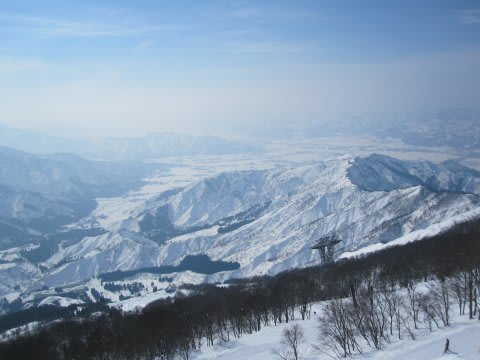
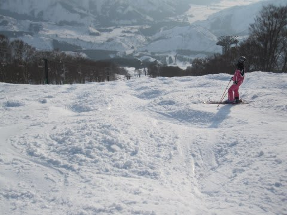

# 八海山は…春スキー？？？

📅 投稿日時: 2011-02-07 00:39:11

🏷️ カテゴリ: [2011スキー滑走日記](ca488c98cfb9169941c3e73770dcefb56.md)

今日の八海山は．

すごい晴天で．

あったかかったです…

春スキーか？

ってくらい．

朝は固めの斜面でしたが，

昼前には，3月並のやわらかい雪になり，

コブ斜面はすべりやすくてよかったです．

うーーん．でも，この後冷えたらカリカリになりそう…

詳細は後日レポートします．
