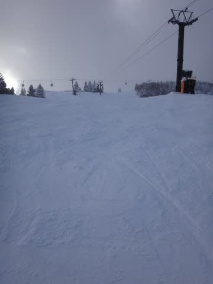

# 2月7日，志賀高原・焼額山詳細レポート…晴れの予想が外れたけど，積もらず．ちょっと固めのバーン．

📅 投稿日時: 2016-02-09 00:49:01

えー．

本題に行く前に．

[この日の記事](e0da6507b6f2c05b90f486279e94fcead.md)の冒頭で予告した通り．

…覚悟してください．

来ます．

やってきます．

異常高温が…

な，な，な，何だこりゃーっ！！！！

グラフを突き抜ける，平年比+12℃レベルの高温が，

2日間も続くって？？？

ど，どゆこと？？？？？

そして，850hpa気温図を見ると．

金曜12日は．

0℃線が東北地方に上がってしまい．

…志賀高原に，+3℃線が…

これは．

2月中旬に，志賀高原がプラス気温になるってこと？？？？

あ，ありえないんですけど！？？

…で．

それより恐ろしい，13日土曜日だ…

おー，まい，がーーーーっ！！！！！

なに？？？

志賀高原に水色で示した+9℃線が！？？？

これは，志賀高原でも，昼間は+10℃くらいになっちゃうって

言ってますか？？？

普通，5月くらいにならないとそんなこと起きないでしょ？？

ちょっと待て．

2月中旬ですよ？？

そんなバカな…っ！！！

そして．

13日の地上天気図は…

爆死．

…降水域の網掛けが，日本全域に…

スキーヤーの皆様．

…この天気図のままだと．

今週土曜は．

わがスキー人生で，2月としてここまでひどい天気になったことはない

…というレベルの天気です．

ありえない超高温になった上に，雨です．

終日，雨です（抑えられない涙）．

溶けます．ただでさえ少ない雪が…！！（とめどない涙）

せめてもの救いは．

こんな感じで，2月13日の予想のスプレッドが

0.63と比較的大きな値なので．

…まだこれから，予想は大きく変わる可能性がある，

ということです…っ！！

＃でも，5700m特定高度線のクラスタ間ばらつきが小さいのが気になる…

そうです．

1月30日の，あの奇跡を再び起こすのです．

平年比+12度の予想を，平年比+2度までに抑え込んだ，

スキーヤーの願いを集結した，あの奇跡をっ！！

…そう．

これから，この週末にかけて．

毎日．

昼も夜も，止まることなく．

踊るのです．

超パワーアップ版ハイパー冷え冷え踊りを

踊り続けるのですっ！！！←いったい，どんな風にパワーアップするんだ？？

それしか，救われる道はありませんっ！！！

…という．

これだけで普通の本文より長くなってしまった前フリのあとは．←だから，こっちが本題なのでは？

昨日速報モードをお届けした，この日曜の志賀高原．

詳細レポートです…

前日．

「あんまり雪が降らないかも…」

という，悲しい予想修正をする羽目になった日曜の朝．

…朝，外に出て，

積雪を見てみると…

うーむ．

やはり，パウダーにならず…（涙）．

少ない．積雪が，少ないよ！（泣）

そして，ゴンドラ山頂へ出ると…

気温は-12℃ですか．

予想の-15℃ほどまでは冷えなかったけど，

結構冷えてますね～！

朝のゲレンデは，

「朝のうちは雲が残る」

という予想がぴったり，曇り空で始まります．

そして…

バーン状況もほぼ予想通り．

しっかり締まった圧雪に，冷え冷え新雪がうっすら5cmほど乗った，

すごく滑りやすいコンディション！

うはーーー！

パフパフパウダーにはならなかったけど．

これはこれで，かなり楽しいっ！

そして，ここも予想通り，9時過ぎには日も射し始め…

いやーーー！

最高っ！

朝10時近くまで．

日が射して，人の少ないピカピカバーンを，

限界スピード大回りっ！

いやー，気持ちいいっ！

…と，思ってたら．

10時過ぎには，ちょいとゲレンデの人口密度が

上がり気味…

うーん．残念．

トップスピード大回りタイムは終了か…

でも．

ゲレンデ人口密度は上がってきたけど，

ゴンドラ待ちは最大でもこの程度だし．

ぜんぜん問題なしっ！

でも．

昨晩からの積雪はほとんどなく．

人も増えてきたので．

上の柔らかい雪の層ははがれはじめ…

あり？

ちょっと固い下地が…（残念）．

もう少し積雪が欲しい…

オリンピックコースへも行ってみたけど．

急斜面のこっちは，コースのほとんどが固い下地に

覆われちゃった感じで．

こ，これは…かなり手ごわいバーン…（涙）．

で．

この日の天気は．

予想では，ほぼ一日晴れの予想だったけど．

実態は…

ありゃ？曇り？

そして，昼頃には．

時折雪が強く降ったり．

午後には，時折ガスでバーン状況が

見にくくなったり…（泣）．

うむ…

今日の天気予想．ちょっと外したみたい…（涙）．

けど．

午後にも時折日が射すタイミングもあったし．

午後のコース状況は，日曜午後の定番の

貸し切り状態だったし．

（無人のコースを滑りたい放題）

当然，ゴンドラも待ちはほぼ0だし．

夕方のゲレンデはさすが多少荒れたものの．

でも，人が少なかったからか．

ひどいギャップになるほどではなかったので．

まぁ，

ちょっとガスが出て見にくいタイミングがあったり，

下地が硬かったりしたのが惜しいけど．

朝イチは最高だったし，

午後は貸し切りバーン状態で，

結構楽しめた一日だったな～，

と，いつも通りの

最終リフトまで滑り倒したのでした…

…しかし．

今週末は．

こーゆー冷え冷え雪で滑れないのかも…？？

とりあえず．

明日また，11日（祭日）＆週末の

天気予想をやります…

…みなさんの踊りの効果や，いかにっ！？？
