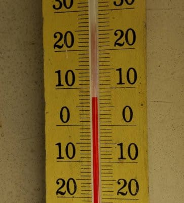
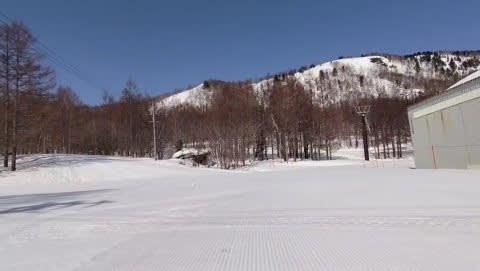
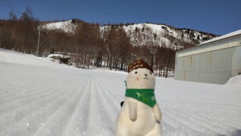
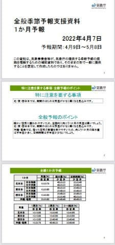
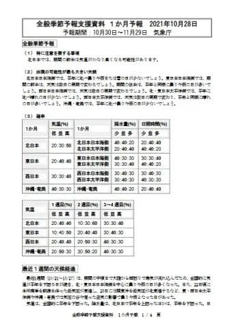
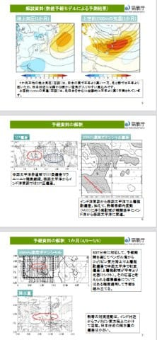
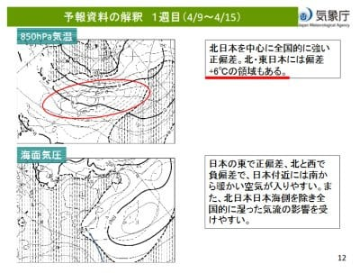
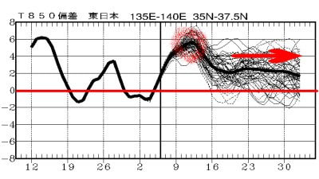

# 木曜は気象庁の1か月予想発表日だけど…え？FCXX92が全然変わって，見やすく分かりやすくなってる！！

📅 投稿日時: 2022-04-08 02:04:37

ってなことで．

今週末もホントに土日休めるのか

微妙な感じですが…

おそらく徹夜してでもスキーに

行くだろう，Skier_Sです．

ヤバい…

ホントにヤバい…

これまで土日は何とか意地でも予定を

あけてたけど．

そろそろ土日にも予定を突っ込まれそう…

もう週末にスキーに行くのは無理に

なってくるかも？？

実は去年も週末に休めない危機があったけど．

ちょうどコロナの緊急事態宣言と重なって，

どっちにしろスキーに行けないから

結果オーライだったんだけど←全然オーライじゃないから

今シーズン，まだ焼額が営業していて，

かつ緊急事態宣言も出ていないのに…

これでスキーに行けないと死ぬ…

なんとか今週末は土日で行けるかな？？

ってなことで．

本日の志賀高原．

いつものおこみん特派員からの写真によると，

朝から気温は+5℃以上(涙)

そして，見事な晴天の強い日差しで…

一見シマシマで良さそうに見えるんですが，

営業開始時間から，ユルユルの雪

だったようです(泣)

ってなことで．

昼間は晴れていた志賀高原．

　夕方~夜に湿った雪が降り始める．

という予想通り，現在雪がぱらついているようです…

今，1-2cmくらい積もってるのかな？

明日の朝イチは，この新雪が被って

いいコンディションになるかな…

と思ったけど．

意外と朝から晴れちゃいそうで．

その場合は，朝から日差しで雪が融け，

板に貼りつく雪になっちゃいます…(涙)

明日の金曜は，ストップ雪を覚悟！

ってなことで，本題へ．

今日は木曜なので，気象庁の1か月予想が

発表になる日ですが…

当然いつもの如く[FCXX92](https://www.sunny-spot.net/chart/FCXX92.pdf)を見てみるわけですが．

…うむ？？？

FCXX92の見た目が全く変わっている！！

パワーポイントのプレゼン資料スタイルに

なってる！！！

いや．

前回まで，FCXX92って，

こんな文書と表だけの味気ない

資料だったのに…

いつの間にかこんなにカラフルな図入りの，

分かりやすい資料になってる！！

…以前のFCXX92だと，他のFCVX12とか

FCVX15とかの資料を突き合わせつつ，

文字の説明を読むだけだったのに…

他の資料とつき合わせなくても

これだけで済むようになってるよ！！

いや．

分かりやすくていいなぁ…

と，感動しながら読んでみたけど．

…けど．

読み進めていくと…

辛い．

書いてある内容は，かなり辛い…

この，4月9日から15日の850hpa気温，

1週間平均で平年比+6℃ってなにごと！？？

1週間平均が平年比+6℃って…

週平均+3℃を超えると異常高温の

警告が出るレベルなのに．

それをはるかに超えてます(涙)

季節が2か月進むレベル．

6月並みだよ？？これ？？

そして，赤丸で示した平年比+6℃の

4月9日以降も…

赤矢印で示したように，4月の最後の

GWに入るころまで，平年比+2度以上が

続きそう…(激涙)

これ…GWまで雪がもつのか？？？

激烈に心配なレベルなんですが！？？

あぁ…

ホントに今年は1，2月は良かったのに…

まさか4月がここまでダメダメになるとは…っ！！

…でも．

わずかな期待が．

気象庁の1か月予想，外れることが多いんだよね

今回も予想が完全に外れて．

これから1か月，平年より低い温度が

続くことを願いましょう…

いや．そんな他力本願ではいけない．

1億3000万人のこのBlog読者の皆さんに

おかれましては．

気象庁の予想を外すために，

久しぶりに休まず止まらずに

全力で冷え冷え踊りを踊り続けて

くださいますよう，

よろしくお願い申し上げます…

## 💬 コメント一覧

### 💬 コメント by (レインボー74)
**タイトル**: Unknown
**投稿日**: 2022-04-08 13:43:17

金曜日の志賀高原情報

朝の上林+4℃　蓮池0℃。上の方では道路に雪が。晴れ渡って不吉な予感。

ゲレンデにはエス様のお告げの通り、2~3センチの滑らない雪。

並んでいると、パトロールが超大回りで下りてくる。しかも頂上からずっと。ヤケビではあり得ない光景にみんなが絶句。

まずはGS。誰も踏んでない。私なんかでさえ、後ろの人のために左端を細々と滑るのに。

GS３本。もう荒れ荒れ。緩斜面では妖怪が邪魔する。

パノラマ回りをしたらさらにすごい。連絡路はずくっと止まりかける。怖いのなんの。

パノラマに懲りて再びGSへ。見るとGSサイドが手つかず。気持ちいいのなんの。完走1号になれました。

その後もGS回し。でも、人の通らない緩斜面では急ブレーキが。

それでも何とか昼食まで持ちこたえたご褒美は？

そうです。東館のステーキ。こんな贅沢はこれまでしてこなかったのに。

明日はエス様が暖気を連れて志賀入りされるとか。FTを待つうちにズクズクにならねばいいけど。

### 💬 コメント by (Skier_S)
**タイトル**: ＞レインボー74さま
**投稿日**: 2022-04-08 23:26:11

今日は貼りつき雪でしたが，明日はザラメになるので

板自体は滑ると思います…

でも，気温が高くザブザブのユルユル雪ですが…（涙）

