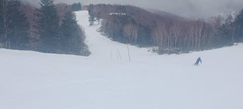

# 本日の志賀高原は一日パラパラ雨，山頂付近はぼた雪が降り続けたようだけど…夜になると雪になってるよ！

📅 投稿日時: 2021-12-08 01:23:50

ということで．

本日7日は，

　明日の7日の方が天気はヤバいです．

　降ります．

　かなり強く，長い間降り続けます…

と予想したように．

あさイチからひたすら雨だったようです…（涙）

ただ．

それほどザーザー降りではなかったらしく．

ゴンドラの窓にパラパラとしずくがつく

程度の雨だったようなので．

まぁ，どしゃ降りになるより良かったのかな．

で，

　標高1600m以下はたぶんアウト．

　志賀はギリギリ雨と雪の境目かな…

と予想した通り，ゴンドラ乗り場付近は

雨だったものの．

焼額の山頂は雨じゃなく雪だったようです．

…でも．

雨にやられて，コースの雪は融けて行き…

パノラマコースも，ブッシュ危険場所を示す

竹竿が何本か立てられるほどに雪が薄く

なっちゃったようです（涙）

あぁ…残念…

…と，思っていたら．

深夜になって，蓮池のライブカメラでも雪に

なっているようです！！！！

志賀高原全山雪になっています！

（[北信建設事務所道路状況カメラ](http://hokushin.pref-nagano-roadcamera.jp/)より）

以前の予想天気図だと，8日も気温が

高い予想だったので．

これ，明日になったらまた気温が上がって

雨になるのかな…

と思っていたら．

最新の天気図を見ると…

をを！！

なんだか，志賀高原を見事に覆うように，

赤い0℃線が飛び出しています！

そして，降水域も志賀高原にかかって

いるので…

これは，終日雪が降って，積もりそう！！

8日朝までに10～20cmほど，

8日の昼間も10cmくらい積もってくれるかも？？

あー．

でも．

積もっても，ものすごい重い雪です．

軽いパウダーではないので，そのあたり

誤解無きよう…

で．9日は微妙に志賀に0℃線がかかるか

どうかぎりぎり…という感じ．

昼間に気温がプラスに上がって，

雪が緩みそうな感じ…

でも，雨が降らなさそうなので，

壊滅的に融けたりしないかな．

10日は…ダメだ．

赤い0℃線は北海道より北（涙）

でも，水色の+3℃線は志賀より南なので．

志賀高原の山頂では，0℃をわずかに上回る

くらいまでしか気温が上がらないかな．

ちなみに，この日は晴れそうです…

ってな感じで．

8日いっぱいは，重い雪にながらも，

志賀高原では雪が積もってくれそう

なんだけど．

そのあとは人工雪を打つには厳しい

気温に上がっちゃうし．

（朝の気温が低い間はギリギリ行けるかも…）

天然雪も降らないので…

うーん．

今日の雨でやられたゲレンデ．

8日の雪でどこまで回復してくれるのかが，

今週末のゲレンデ状況を決めそう…

## 💬 コメント一覧

### 💬 コメント by (レインボー74)
**タイトル**: Unknown
**投稿日**: 2021-12-08 14:33:55

水曜日の志賀高原情報

湯田中は朝から雨で5℃。蓮池1℃。100mで0.6℃下がると言われているけど、今日はそんな感じ。1650mの高天で0℃。

ニゴンではさらさらと細かい雪が歓迎してくれている。

一本目、さらさら新雪8cmくらい。気持ちいい！パノラマの壁のポールも取り払われている。ただ、雨降って地かたまる。かたい底付きはするけど、表面は意外と軽い。

明日からしばらくは、こんなマシュマロの絨毯を満喫できなくなるのかなあ。私は不幸だ(ごめんなさいね。利己主義なもんで)。

10時を過ぎると、降る雪がウエアにへばり着くようになってくる。

三時間弱で12本楽しませてもらって終了。昼は湯田中の関英ドライブインでモツ煮定食。

今日からゆきやまアプリに参加。ヤケビの中での最速順位や滑走順位が、毎日みられるし、通年で競うこともできる。誤差もかなりありそうだけど、まあ遊びだから。

だんだん降る雪が重くなってきて、帰路(真昼)は標高1200m辺りでは完全な雨になりました。

### 💬 コメント by (アリス)
**タイトル**: Unknown
**投稿日**: 2021-12-08 16:27:08

S様

こんにちは☺️

本日から志賀高原参戦しました☺️

10時過ぎから、2ゴンで8ケ月ぶりのスキーを一気滑り楽しみました🎵

5本目過ぎてから、膝が笑い10本過ぎたあたりから外足への踏ん張りが不可となりました😅

雪質は湿気混じりですが、私には全然問題なしの最高品質です🎵

明日は、朝一の2ゴンとヤケビのシマシマをいただくつもりです。

教えてください😅

アマズフィットが時間表示しかしません😅

運動記録が出来ないのですが、故障の可能性ありますか⁉️

### 💬 コメント by (Skier_S)
**タイトル**: これから週末まで，雪は降らなさそう…
**投稿日**: 2021-12-09 01:50:58

＞レインボー74さま

意外と新雪は軽かったんですね！

かなり重い雪だと思ってました…

でも，昼間の雪はやはりウエアにへばりつく雪になったんですね．

このあとは，今週末まで積雪はなさそうです（涙）

＞アリスさま

志賀高原復活おめでとうございます＆お帰りなさい！！

シーズン初日で，重い雪のロングコースは疲れたかと…

で，Amazfit Pace ですが…

時間表示しかしないって，メッセージ画面も出なければ，

左右スワイプしても何も反応がない感じですか？

ボタンが死んでて，時計表示のみのスリープモードから

操作可能なモードにならないとかでしょうか…？

ちょっと細かく減少を見てみないと分からないですが，

PaceにはGTRにある画面ロックは無いはずだし…

よく分からないです．すみません．

