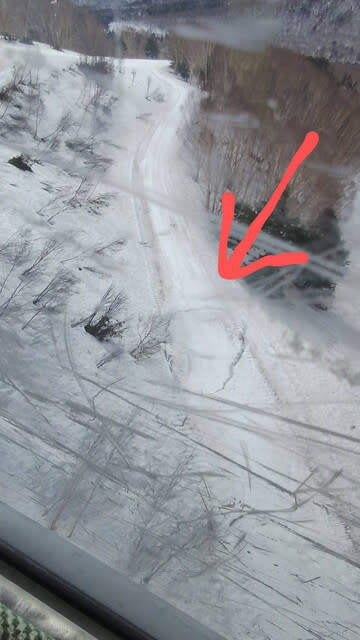
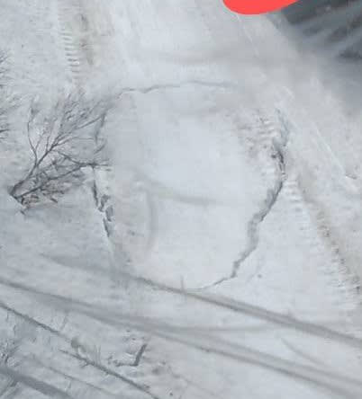

# GW前半，4月26～29日の志賀高原スキー場の天気は…26＆27日はいい天気，28＆29日は曇りでまぁ冷える

📅 投稿日時: 2025-04-26 04:10:00

🏷️ カテゴリ: [日記](cc4b5682fb7b8b144980957a978653fb0.md)

ということで．

いつもの志賀高原特派員によると…

今日は朝は曇り空．

でも朝から気温が高めで，早朝の時間から

雪はちょっと柔らかめだったようですが…

この日は昼間は晴れたり曇ったり．

気温が上がったので，一部雪は

滑りが悪かったんじゃないかと

思いつつ．

ちょいと残念なニュースとして，

なんということか．本日でSGSとイースト

コースが終わったようです…（泣）

…まだ，雪は問題なく滑れるくらいいっぱい

あるのに．

雪は十分あるというのに．

SGSコースのコブが終わってからイースト

コースまでつながる細い通路上のところに

クラックが入っていたらしく．

こいつがコースクローズの原因じゃないかと…

拡大すると，確かに雪面にクラックが

入ってますね…

あぁ…

GWまでイーストコースが滑れると

楽しみにしていたのに…

雪がまだたっぷりあるだけ惜しい（泣）

ってなことで．

明日からGWに突入！！！

おそらく，恵まれたホワイト職場の方は，

28日も休んで26～29日まで休みの方も

いると思うので…

今日は，4月26～29日までの志賀高原の

天気予想です！

…でも．

今日も夜遅くてゆっくり記事を書く時間が

無いので，天気図の解説は無しでまとめだけ

書くと…

26日(土)：終日晴れ！！

　朝はこの時期としてはまぁまぁ冷えて

　早朝はマイナス気温でスタート！

　バーンはかなり硬め．

　気温は一日低めで，雪はなかなか

　緩まない．日差しの悪いところは

　昼くらいまで硬いまま持つかも？

　昼間も山頂では+3℃程度と低めなので，

　昼近くまでは雪もそこまで緩まず割と

　フラットでいてくれる．

　午後はやっぱり雪は緩んで荒れるけど，

　そこまでひどいストップ雪にはならず，

　冷え気味で割といいコンディション．

27日(日)：この日も終日晴れ！

　早朝のころは+3℃程度．

　土曜と比べると気温は上がる．

　朝イチのバーンはそこそこ硬め．

　日差しがあるので，通常営業開始の

　頃には雪が緩み始める．

　昼間は10℃を越え暑さを感じるほど．

　昼には雪はザブザブになり

　午後はかなり荒れていく．

　緩斜面は板の滑りが悪くなりそう．

28日(月)：朝から気温は高め．

　朝イチで+7℃近く，朝から雪は

　柔らかめ．

　ただ，朝から曇ったり晴れたりで，

　日差しが弱いので雪の緩みは遅め．

　でも，昼前には雪は完全に緩む．

　日差しが無ければ雪が緩んだ中でも

　まぁまぁ板は滑るけど，気温が

　高いので午後はやっぱり雪が荒れて

　行く．

29日(火・祝)：夜のうちに雨か雪か

　微妙なものがぱらつく．

　早朝開始時は0℃近くまで冷え，

　早朝の雪はしっかり硬そう．

　曇り時々晴れ程度で，日差しが

　そこまで強くないので，雪が

　緩むのは遅そう．

　でも，午前中には緩み始め，

　午後はやっぱり荒れたバーンに．

　

という感じでしょうか…

気温はそんなに冷えないものの，

まぁ例年並み程度でいてくれて，

27日はぽかぽか陽気の春スキーに

なりそうだけど，それ以外は先週みたいな

高温にはならなさそうだし．

ひどい雨にもならなければ，暴風も

なさそうだし…

まぁ，いい4日間になりそうかな．

だけど．

だのに．

このBlogの読者の皆さんは，私がまた

26日から志賀高原に滑りに行くと

お思いでしょうが…

でも残念ながら，家庭の都合で滑りに

行けません…（泣）

あぁ…明日は天気も雪も，この時期と

しては冷え気味で良さそうだから，

滑りに行きたかった…（涙）

滑りたかったよ…

土日は久しぶりに（泣きながら）家で過ごします．

晴れの予想を裏切って，志賀高原に

雨やみそ汁やコーンスープが降ったら，

それは私が滑りに行けなかった怨念が

志賀高原に届いたと思ってください…
