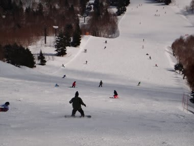

# 3月3日の志賀高原　焼額スキー場の状況…天気予想は当たったのか？？

📅 投稿日時: 2012-03-03 22:30:17

ということで．

WNIに挑戦状をたたきつけた（？）私の天気予想ですが．

本日の天気

天気：朝のうち小雪，昼前から晴れ．時々うす曇．

気温：焼額山頂の朝の気温ー11℃，最高気温-1℃

という感じで．

…昨日修正しなかったら私の天気予想が完全あたりでしたね…

山の上だけ，昼過ぎまで雪雲が残りそうかなぁ…

と弱気になって修正しちゃったのがちょいと後悔．

まぁ，気温は朝はー11℃，最高も-1度と，

低いっちゃぁひくいけど，昼間は

「冷えます」ってほどじゃなかったなぁ．

ここはWNIに負けたかも…

でも．

雪質はカリカリの上に薄い積雪という，バーンコンディションは

ぴったり予想通り

こんなところはあたらなくてもいいのに…（涙）

急斜面部分はアイスバーンになってましたね…

昼過ぎは，南斜面はちょいと緩んできましたが，

基本的にはマイナスだったので，焼額はカリカリバーンが

一日中緩みませんでした…

一の瀬，東館山なんかは全面ジャガイモ畑だったようです．

ジャガイモ大の氷のころころがコース全面に…

それに比べれば，焼額のコンディションはまだましかな．

あー．

雪はいまイチだったけど，天気が良かったからか．人はちょっと多かったですね～

第2ゴンドラ15分待ちまで行ったようです．

第1ゴンドラは最長3分待ち程度でしたが…

とりあえず．

朝のうちは予想通り，雪が残ったものの…

10時過ぎくらいから，雲が去ってゆき

昼からは快晴！

暑すぎない適度なコンディションで滑れました．

あとは．

どかっと積雪が来て，カリカリバーンを隠してくれれば

完璧なんですが…

今晩からの積雪も期待できないので．

明日もカリカリバーンかな．
