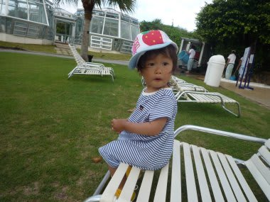
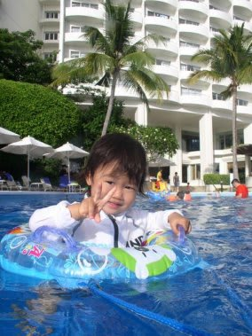
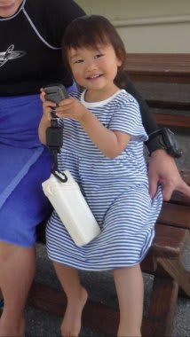
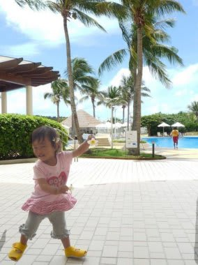

# 初の子連れダイビング旅行記＠2009年　その4　母親ダイビング中は…

📅 投稿日時: 2012-07-15 00:37:00

母親に置いていかれて，いきなり泣き出した娘！

このまま母親が戻ってくるまで1時間以上，ひたすら

泣き続けられたら困るっ！

とりあえず泣いている娘の気を引こうと，プールサイドまで抱っこして

歩いて行き，持ってきたおもちゃで気を引くと…

予想外にあっという間に泣き止んで．

ご機嫌で遊び始めました．

機嫌も直ったようなので，二人して一緒にプールで

遊んでました．

というより，娘の指令のまま，

「あっちへ連れてけ」と指差すままに水中を引っ張って連れて行ったり，

プールサイドに座らせろ，という指令のまま座らせると

「ばしゃばしゃ～」とご機嫌で足をばたばたさせて水を飛ばして

遊んでます．

…結局，たっぷり1時間，プールでご機嫌で水遊びしていらっしゃいました．

わがお姫様は．

そろそろ母親が戻ってくる時間だから桟橋にお迎えに行こうよ，といっても

「いや．バシャバシャ！！」

といって，プールから出ようとしません．

…母親に置いてかれたときのあの激泣きはなんだったんだ．

プールから出るのを嫌がる娘をかっさらうように，脇に抱えて

桟橋まで走ると，ちょうど船が接岸するタイミング．

妻「ただいまーっ！」

私「…お帰り」

妻「娘，私に置いてかれて泣いてなかった？私が帰ってくるの

　待ちわびてなかった？」

私「最初一瞬泣いたけど，その後ご機嫌でプールで遊んで，

　今もプールから出てくるのを嫌がってたのを強引に連れてきたところ」

妻「……そう…私よりプールがいいのね…」

これまで，あまり長時間娘と離れたことがなかった妻．

母親と離れた娘が寂しがってるんじゃないか…と心配

だったようですが，まったくこれっぽっちも寂しがっておらず，

母親の出迎えよりもプールを選んだ娘に，安心したというより

ちょっと落胆の様子．

…娘が置いていかれても大丈夫だったことに，素直に良かったと

思えない，複雑な母親心境ですな．

でも，これで娘を置いていっても大丈夫であることがわかり，

心置きなくダイビングができると思うのですが…

母親としては，ちょっとくらいは寂しがって欲しかったようで．

こんな会話をしている間も，母親よりもほかのダイビング客に

愛想を振りまいている娘．

とりあえず，妻も3年ぶりのダイビングで心気ともにリフレッシュでき

すごく喜んでるし，

母親が数時間いなくてもぜんぜん大丈夫であることがわかったので，

最悪シナリオの

「妻がずーーっと娘の面倒を見て，ほかの人だけがダイビングを

楽しむ」

という状況はなくなり，今後はみんなで順番に娘の面倒を見て，

安心して交代でダイビングに行けることが明らかになったのでした…

