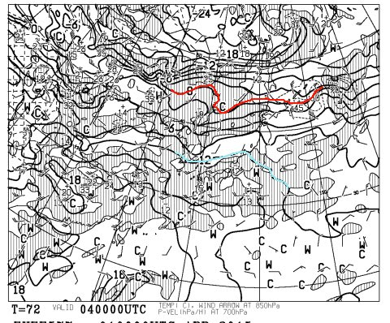
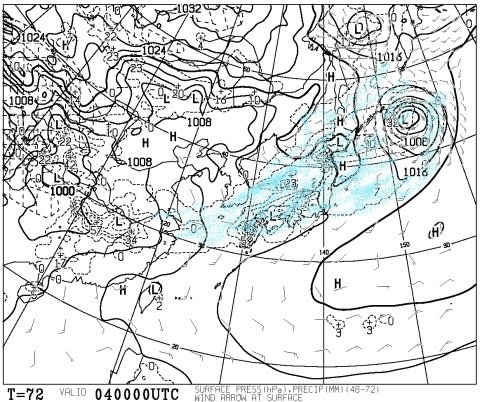
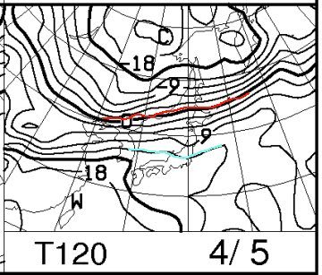
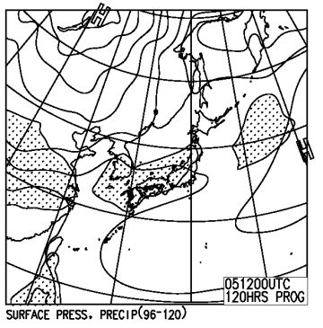
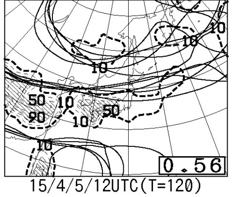
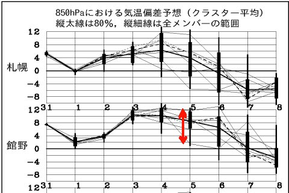

# 定番！この週末の志賀高原は…5月～6月並みの気温で，雨！？？（涙）

📅 投稿日時: 2015-04-02 00:07:50

なんだか．

[スキーダイエット](edd0452732278bcfc87b9419cd5bf3f1e.md)の効果が効きすぎているのか．

体重がベスト体重より4kgほど落ちてしまったSkier_Sです．

＃食べても食べても体重が増えない…

ってことで．

昨日すでに，悲しいお知らせをしたところですが．

この週末．

激烈な高温＆雨に祟られそうな感じ

です…（涙）．

とりあえず，

4日の土曜日の850hpa図を見てみると，だ．

なんだ～！これはっ！！

赤で記した0℃線が，はるか北にあるどころか…

なんと．

水色で塗った，プラス12度の線．

これが，志賀高原にかかっているんですが…っ！！

…

これは．

土曜の志賀高原．

朝9時ごろには，もうプラス10℃近い気温になって．

…昼頃には，プラス15度近くまで上がりかねない勢いなんですけど…

志賀高原でプラス15度って…

GWより気温が高いよ（泣）．

ありえないくらい，気温が上がりそうなんですけど…

で．

気温が上がるだけなら，まだいい．

土曜の地上天気図を見ると…

水色で塗った，降水域．

見事に日本全国を覆ってます…（激烈な涙）

これは…

梅雨か？？？

って感じの天気図なんですけど．

少なくとも，4月の天気図と思えない…

ってことなので．

土曜は．

ありえないほど気温が上がって，雨が降って．

ものすごい勢いで雪が解けていくでしょう（滝のような涙）．

そして，日曜は…

やっぱりこんな感じで，850hpa図では，12度線が志賀高原に

かかるくらいの勢いなので．

…この日も，気温は朝からプラス．

昼間は，プラス10℃を軽く超える勢いでしょう…

で．

地上天気図もこんな感じで．

降水域が予想される網掛けは，志賀高原にかかっているので．

…ダメだ．

日曜も，雨っぽい…

…だけど．

日曜の予想のクラスタ間ばらつきを見ると．

こんな感じで，特定高度線のばらつきが大きく…

スプレッドも0.56と大きめの値．

なので．

5日の850hpa予想気温もこんな感じで，

予想ばらつきが，かなり大きいです．

…だもんで．

まだ，日曜の予想は，大きく変わる可能性が高いですね～．

とりあえず．

まとめると．

土曜：早朝からすでに気温はプラス．午前早いうちに，プラス10℃近くまで上がりそう．

　　前日からずっと雨．しとしと雨．終日雨（涙）．

　　雪はものすごい勢いで溶けて．

　　水を吸ったザブザブ雪になるでしょう…

　　この日は．

　　滑らないと死ぬとか，滑らないと地球が滅びるとか

　　滑らないと宇宙が崩壊するとか，そういうよっぽどの

　　理由がある人以外，滑りに行かない方がいい感じかも…

日曜：この日も朝から気温は高く．

　　雨が降ったりやんだり．土曜ほどひどい雨にならないかな…

って感じですが．

まだ，日曜は予想が大きく変わる可能性が高く．

今の段階ではどうなるかわからないので．

また直前に詳細予報します…

## 💬 コメント一覧

### 💬 コメント by (komu)
**タイトル**: 滑るぞ
**投稿日**: 2015-04-02 01:17:54

それでも滑るぞ

滑らないと死んじゃうぞ

って、終わってますか？

### 💬 コメント by (Goku)
**タイトル**: 人間なので
**投稿日**: 2015-04-02 11:08:27

一応、私はヒトなので、今週はおやすみかなぁ？

でも、今週でイチゴン最終だから行きたい気持ち半分。

### 💬 コメント by (はなげ親分)
**タイトル**: でも、すいてますよね!?
**投稿日**: 2015-04-02 17:06:12

宿も予約してあるし、行くしかないので、カッパ持参で早朝から滑ります。

そんな天気だったらゲレンデは、ガラガラですよね？

でも、日曜日は朝から雨だったら、そのまま帰っちゃうかも。

おかしいなァ～。

ずっといい人してるのに!!

### 💬 コメント by (Skier_S)
**タイトル**: この週末は，降らないかも？？
**投稿日**: 2015-04-03 00:27:02

>komuさま

…それは，間違いなく，終わってますよ（断言）．

とりあえず，お久しぶりですが…

そろそろ，志賀高原へやってくるシーズンでしょうか？？

>Gokuさま

なんだか，今日の天気図だと…

土曜は雨が降らなさそう！？？

何にしろスプレッドが大きく，予想天気図が

ころころ変わる領域なので…

意外と週末，天気よくなるかも？？

気温が上がるのは間違いないのですが．

晴れれば，ラスト1ゴンを楽しめるかもです～！！

＞はなげ親分さま

いや，ずっといい人していたおかげか．

土日の予想，良くなってきましたよ…

土日晴れる可能性もっ！！

まだ，土日の予想がコロコロ変わる

状態なので，まだどうなるかわかりませんが…

意外と良くなるかもです！！

