# 2019/12/8(日)の志賀高原，焼額山スキー場の詳細レポート！…冷え冷えなれど積雪なし．午前中は混んだけど午後はガラガラ！

📅 投稿日時: 2019-12-10 01:11:46

🏷️ カテゴリ: [2020スキー滑走日記](c282e9230de179e245c7334eabeb0a3b3.md)

えー．

昨日の記事の末尾に書きましたが．

どうやら．

11日に志賀高原で雨が降る危機

は回避されそうです…っ！！

最新の11日の850hpa気温図では．

赤く印した0℃線は，日本海のはるか北，

津軽海峡近辺まで北上してしまって

いるので，

降れば確実に雨

だったのですが…

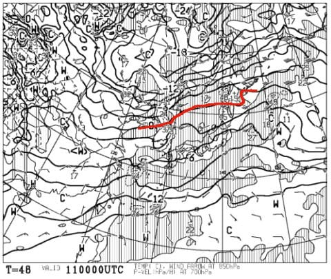

なんと！

私の必死の願いのおかげで．

低気圧が当初予想よりかなり

北にずれてくれたので，

降水域が日本にかからなくなりました！

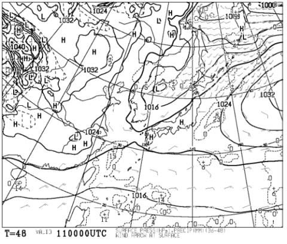

…11日，気温は上がるけど，

雨は降らなさそうです…っ！！

で．

12日はすごい冷えて，

日本海側では雪になりそう

なのですが．

西風なので，志賀には積もらなさそう…（涙）

その後．

少なくとも16日までは，

全くちっともこれっぽっちも

雪が降らなさそうな天気図です（泣）

…あぁ…

今週末も，人工雪オンリーになりそうな

気配…（激泣）．

また明日以降も，最新の天気情報を

書いていきますが．

とりあえず．

今後，予想がガラッと変わって．

これから週末まで，スキー場には

毎日1mのドカ雪が積もるよう，

祈りたいところ．←火曜から金曜まで1mずつって…

積雪4mでリフトも埋もれて営業できなくなるから

…てなことで．

本題へ．

この日曜の志賀高原，焼額山のスキー場レポート，

詳細モードです！

えー．

まず．

日曜の朝．

「もしかすると，昨晩から10cmくらい

　積もってるかも…？？」

と期待して起きたわけですが．

わずかに積雪2cm（涙）

…ってことなので．

今日もゲレンデはほぼ人工雪（泣）．

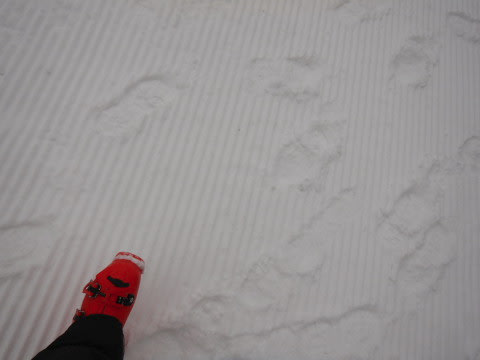

当然，昨日から滑れるコースは増える

訳もなく，

焼額は昨日と同じ，第4ロマンスのサウス

コースのみが滑れます．

まぁ，それでも．

人工雪が打てて，

ちょっとずつ雪が増えているだけ，

高温で12月に入ってから雪が

解けていった昨シーズンより，

まだマシかも…（と，ポジティブ思考で自分を慰める）

そして．

今日も朝イチのオープン待ちでリフトに

並んでいるのはせいぜいこの程度で．

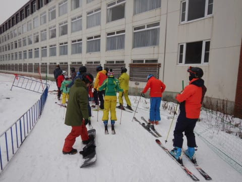

うむ．

今日もそれほど混まなさそうだなぁ…

と，この時は思っていたわけですが．

相変わらず積雪量が少ないゲレンデを

眺めつつ，リフトで山頂に登ると…

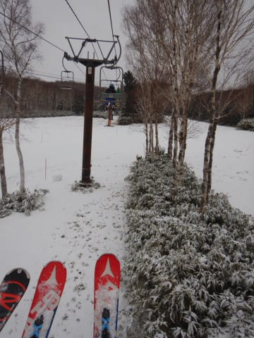

あたりまえですが，昨日から

劇的にゲレンデ状況が改善されている

訳がなく…

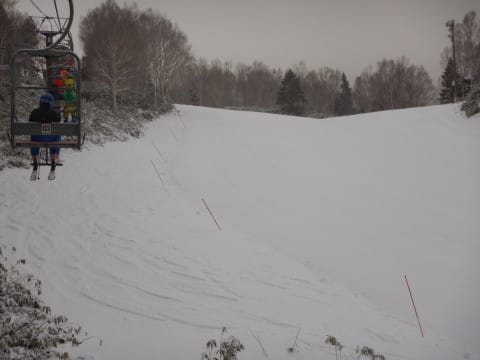

とはいえ．

ゲレンデに出てみると．

新たに人工降雪が乗せられた後に

圧雪された，見事な締まった

シマシマバーンがお出迎え！

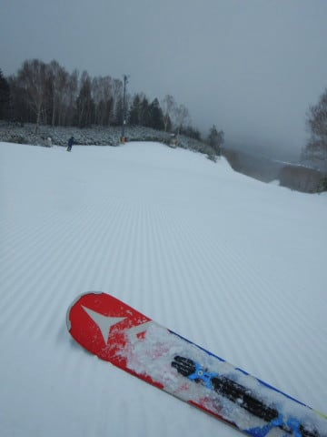

あさイチの特権，ピカピカシマシマ

バーンをいただきま～す！！

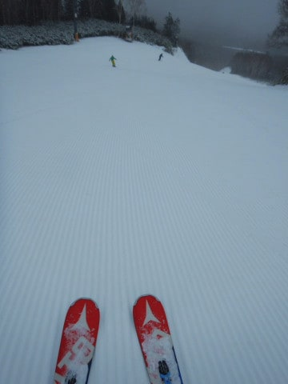

一応，コース幅いっぱいに雪が着いていて

大回りできる幅は十分あり，

あさイチは人も少ないのもあって．

気持ちよくライン取り放題で大回り可能！

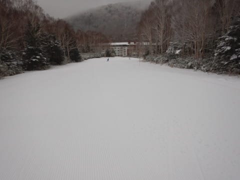

…雪が少ないけど．

気温はしっかり冷えていて．

あさイチでちゃんとコース幅いっぱいの

締まった雪のシマシマを堪能できて．

あぁ…

あさイチはいい…

シアワセ…

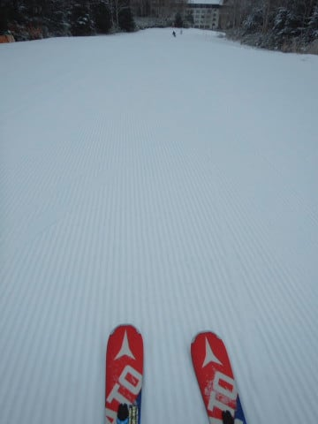

…と，思っていたのもつかの間．

リフト数本も滑ると，シマシマが

崩れてきて．

あうーーん．

ちょっとゲレンデにコロコロが

出現し始めてきました…（涙）

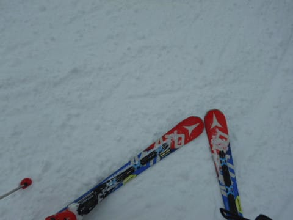

完全な氷ではなく，ちょっと固めの

雪玉って感じなので，

殺人コロコロというほどではないですが．

私の表現でいうところの，

半殺しコロコロ

が，急斜面部分に散在するように

なってきました…（泣）．

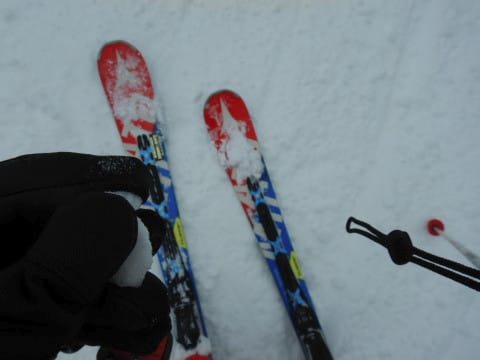

それだけならまだしも．

…営業開始から1時間ほどたった

9時半ごろから，昨日は全く無かった

リフト待ちが，なぜか今日は長く

なりはじめ…

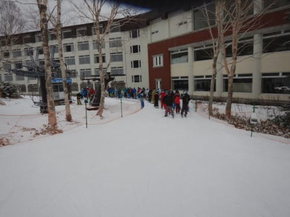

うぎゃーーー！！

10時過ぎには，なんだか

10分近い待ち時間になってきました(泣）

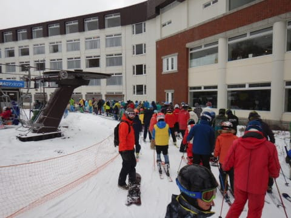

…とはいえ．

せいぜいペアリフトの運送力なので．

リフトが混んでも，ゲレンデはそれほど

混まず…

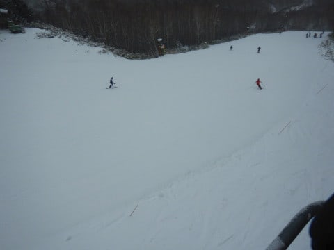

ゲレンデの人口密度は

大体この程度．

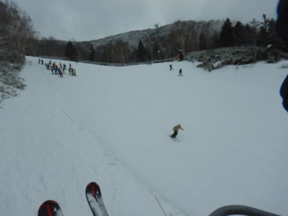

そして，リフト待ちがあったのも

2時間弱で，12時前になるともう

リフトも飛び乗り状態に復帰！

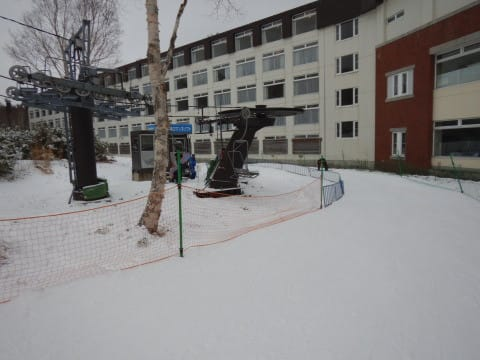

ゲレンデ人口密度も，寂しい

感じになっていきました…

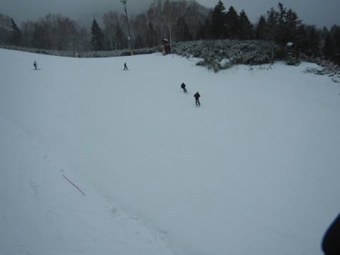

ただ，午後になっていくと．

コースのコロコロもさることながら…

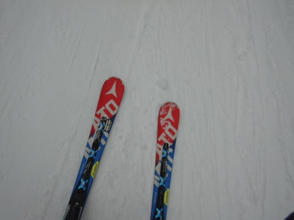

写真では分かりにくいけど．

スキーヤーで削られたバーンは，

ところどころツルツルになっていき．

緩斜面部分は大丈夫ですが．

みんながエッジを立てる急斜面部分は，

しっかりエッジを立てていないと

ちょいと手ごわいバーンになって

行きました…（ちょい涙）

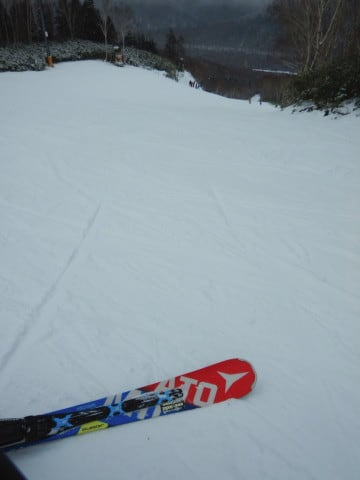

基本的に，天気は終日曇り空で．

朝のうちと，午後の一瞬だけ

雪がぱらつくタイミングもありましたが．

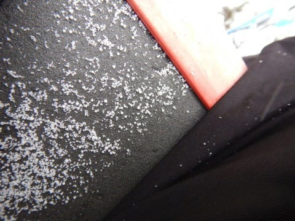

当然，全く積もるほどの雪では

ありませんでした（涙）

あぁ…これがドサドサ積もって

くれたなら…

ってな感じで．

午後はガラガラながらも…

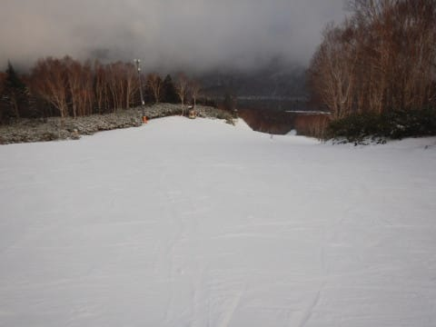

ツルツルになってきた

バーンをひたすら滑り続けて

いたところ．

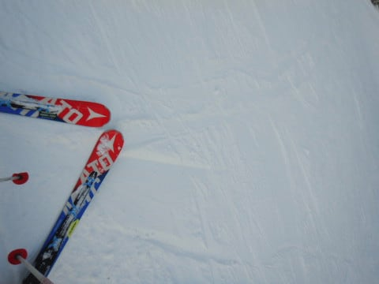

営業終了直前の夕方になって，やっと

「午後になると，雲の隙間から日が射すかも」

という予想が当たり，

青空が顔をのぞかせてきました…

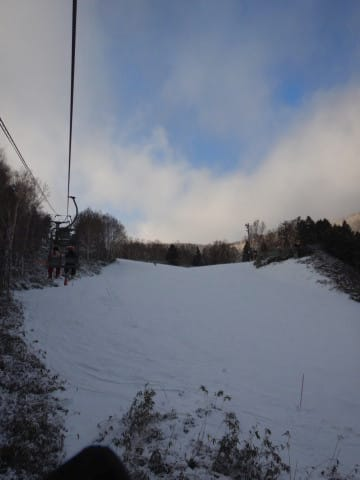

ってなことで．

日が暮れかける，営業終了の16時まで．

今日もひたすら4ロマのみを

グルグル滑り続けたのでした…

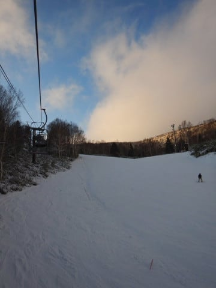

うーむ．

まだ，去年の焼額オープンの週に比べると，

幅いっぱいに滑れて，人工雪の厚みも

十分あるだけ，かなりマシとはいえ…

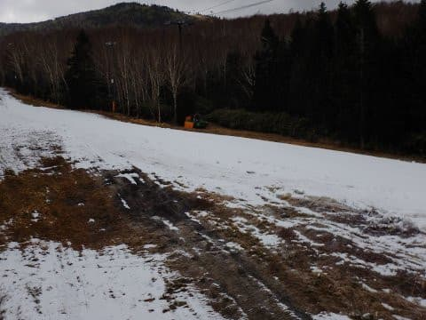

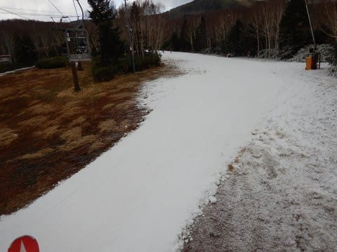

（昨年12/1,2の週の焼額)

来週は，12月も中旬だし．

そろそろ天然雪で滑りたい

と切に願う，Skier_Sなのでした…

## 💬 コメント一覧

### 💬 コメント by (若杉勲72)
**タイトル**: Unknown
**投稿日**: 2019-12-10 18:19:57

熊の湯のあと、ゆみりんにつられて初ヤケビ。駐車場でＫ藤ご夫妻に遭遇。

さすがのさすがのヤケビですね。一の瀬と斜面の向きは変わらないのに、す、素晴らしすぎる。

初めてレインボーまで粘ってしまいました。

熊の湯の人も一生懸命やってくださっているけれど、やけびの仕事がすごすぎます。ありがとうヤケビ。

### 💬 コメント by (Skier_S)
**タイトル**: Unknown
**投稿日**: 2019-12-11 08:57:38

>若杉さま

やっぱり焼額はいいですよ。

圧雪のクオリティは素晴らしいので、朝イチは最高ですよ！

### 💬 コメント by (若杉勲72)
**タイトル**: Unknown
**投稿日**: 2019-12-11 11:21:34

当然今日もヤケビです。明日も然り。

そうそう、2ゴン試運転してましたよ。パトロールを運んだだけかもしれませんが。

### 💬 コメント by (Skier_S)
**タイトル**: ＞若杉さま
**投稿日**: 2019-12-12 00:22:37

2ゴン，多分まだまだ滑れるほど積もらないと

思います…（涙）

一体ゴンドラが滑れるのは，いつになることやら…

