# 5月17日のかぐら速報…ぐはぁ．外したっ！天気予想外したよっ…！！！（涙）

📅 投稿日時: 2014-05-17 23:03:12

えー．

…本日，ですね．

日帰りで，かぐらに行ってきたわけですが．

朝，駐車場に着いた時点で雨で．

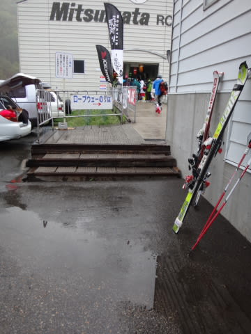

まぁ，ここまでは．

昨日．

リフトスタートまでには雨は上がっているはず．

…と書いたように．

ある程度予想の範囲内で．

私の予想通りなら，ゲレンデに出るころには，やむはずだよね…

と，思っていたのですが．

…ゲレンデに出ても降りやまず…（涙）

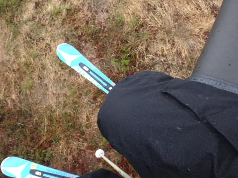

ウェアはびしょ濡れに（大粒の涙）

そして．

ゲレンデは，北風が強く，寒いよっ！

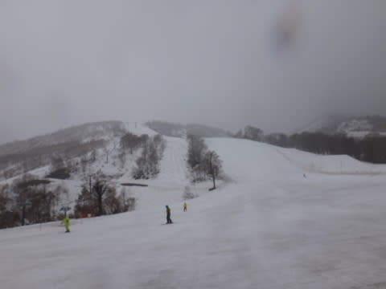

風もあるので．ちと寒めに感じるかも．

って予想は，当たってくれたようで．

…それも．

よろしくない過剰な当たり方をしたらしく．

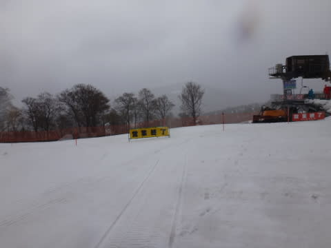

…なぬっ？

かぐら第1高速，強風で運休っ！？？？？？？

ぐはぁっ（死）．追い打ちっ！（したたり落ちる涙）

…ペアリフトは動いていたので．

びしょ濡れになりながら，しかたなくペアリフトに並びます（あふれ落ちる涙）．

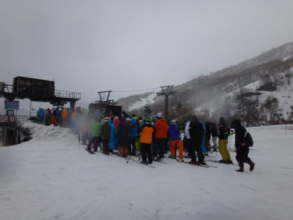

幸い，朝9時半には，クワッドが動き出しましたが…

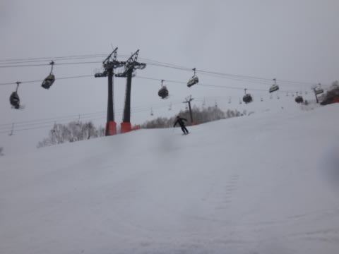

…でも．

雨は11時過ぎまで降り続けました…（流れ出る涙）

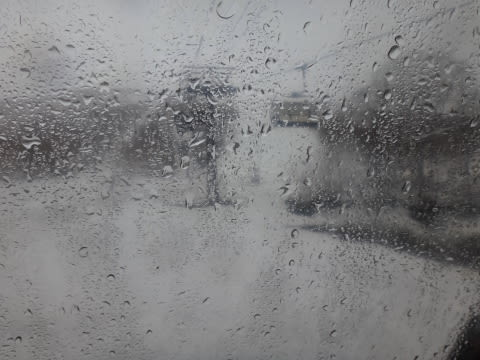

11時ごろには上がったけど，今度はガスが（とめどない涙）．

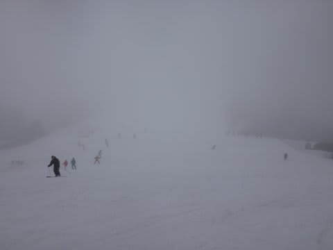

…まぁ，天気がひどかったおかげで，ゲレンデは混まず．

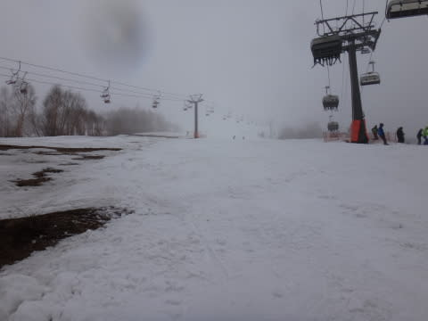

午前中はリフト待ちほぼ0で．

午後2時ごろの最大待ち時間のときでも，

この程度だったのが救いと言えば救いですか．

うーむ．

でも．

そろそろテクニカルコース，土が出てきましたね～

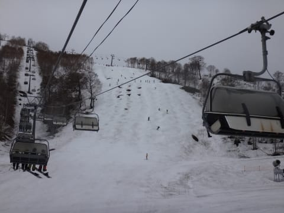

ジャイアントコースも，コブ溝はところどころやばいところが．

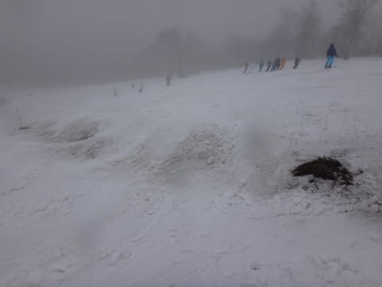

午後2時すぎになって，ガスも晴れてきましたが…

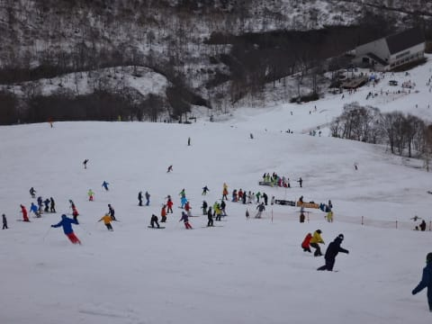

そのかわり．

今度は，人がちょいと増えて来ちゃったよ…（悲）．

…でも，いつもよりはましですけど．

ってことで．

外しました．

ええ．外しましたとも．

天気予想．

土曜日：朝のうちちょっと雲が残るかもしれないけど，晴れ．　

なんて書いてたのは，誰だっ！！←お前だ

でも．

朝9時の雨雲レーダを見ると．

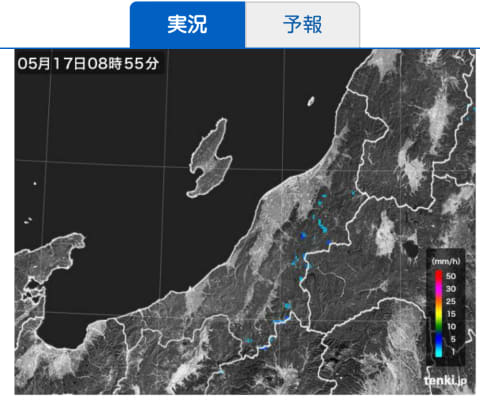

…こんな感じで，朝9時にはもうすでに，

雨雲が全く無い，と言ってもいいくらいの

状況だったのだ．

ホントにドンピシャ，

かぐらスキー場だけを狙ったように降っていたのだ．

…こんなもの，当てられないよ～！！

…たぶん．

この日は，かぐらスキー場に．

空前絶後，前人未到に日ごろの行いが悪い人がいたに

違いないのだっ！！！！！

そんなトンデモナイ，予想天気図にも雨雲レーダーにも

出てこないような，強烈に局所的な雨をひきつけるほどの

悪人がいたのだから．

天気予想，外しても仕方がない…←かなり無理な言い訳

PS．Komuさま，きょうは一緒に滑ってくれてありがとうございました～っ！

## 💬 コメント一覧

### 💬 コメント by (komu)
**タイトル**: こちらこそありがとうございました
**投稿日**: 2014-05-17 23:15:13

かぐら、やはり良いですね…

来週も行ってしまうかも…

お会いしたら来季の板ネタで盛り上がりましょう。

### 💬 コメント by (Skier_S)
**タイトル**: コメント，早っ！
**投稿日**: 2014-05-17 23:24:39

＞Komuさま

かぐら，よかったでしょ～．

こうしてだんだん，暗黒の世界へ

堕ちていくんですよ（笑）．

また来週お会いできるようなら，

来期の板ネタ（私は買わないはずだけど）で

盛り上がりましょう！

### 💬 コメント by (ひろちやん)
**タイトル**: コブのワンポイントありがとう
**投稿日**: 2014-05-17 23:45:26

レジャースキーヤーもつたない、スキーやーSは、プロナミ、的確なコブの壺アドバイスありがとうございました。来週学習しないとです（≧∇≦）

### 💬 コメント by (Skier_S)
**タイトル**: ひろちゃんさま
**投稿日**: 2014-05-17 23:53:22

今日は「レジャースキーヤー」の私と

一緒に滑ってくれてありがとうございます～．

楽しかったです～．

かぐら，よかったでしょう？

また来週も，滑りたくな～る，すべりたくな～る…

…暗示をかけましたので，来週来ないと

我慢できなくなっているはずです（笑）．

ってか，もう完全に来週学習するモードですね（＾＾；

### 💬 コメント by (いか)
**タイトル**: Unknown
**投稿日**: 2014-05-18 01:44:59

東京はあんなにきれいに晴れていたのに…。

コブ滑りたくなってきました（笑）

### 💬 コメント by (Skier_S)
**タイトル**: いかさま
**投稿日**: 2014-05-18 22:32:13

いやー．

ホントに，かぐらの近辺だけ

降ってた感じです…

何かを狙ったかのように（涙）．

この時期のコブは，滑りやすくて

練習には最適ですよ！

