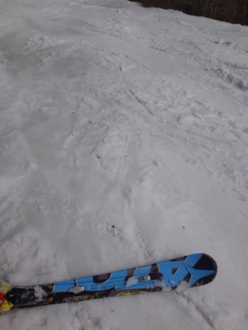
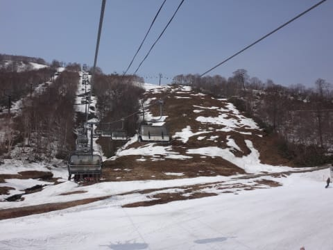

# 5月2日，GW谷間の平日のかぐらスキー場のゲレンデ状況…雪の状態，混雑状況は？

📅 投稿日時: 2016-05-02 23:48:37

えー．

八方も，明日で営業終了になるらしく．

だんだんと滑れるスキー場が減っている今日この頃，

皆様いかがお過ごしでしょうか．

＃これから滑れるスキー場が増えていくような状況になったら，

＃それはそれでいろいろ怖い気がするが…

で．

実は明日からの3連休．

関西某所に車で行くことになってしまい．

…明日も朝3時半起きのような気がするので．

今日も写真たっぷりコメント短めモードで…

＃GWに入ってから，5日中3日が朝3時過ぎに起きてる

＃気がするのだが？

＃GWで睡眠不足が解消するどころか，さらに悪化している気がするのだが…？？

ということで．

本日．田代の駐車場に車を止め．

田代ゴンドラスタートにしたのですが…

＃泥だらけで汚れる…というウワサのPislabを滑りたくなかったのが理由

平日というのもあって，朝8時の段階では，

みつまた駐車場も，田代駐車場も，半分も埋まってませんでしたね～．

で．

田代ロープウェーを降りると…

ふが．

こ，ここを滑るのか…

まぁ，とりつき部分はすごかったけど．

こーゆーところを滑って…

田代第2ロマンス乗り場へ．

田代第2リフト沿いは…

やはり，紐ゲレンデか…

いや，しかし．

すごいな，これ…

でも．

朝イチはちゃんとシマシマになっているのが，

プリンス系ゲレンデクオリティかなっ！

をを！

朝イチ，意外と気持ちいいよ！

なんだ，朝イチなら田代でもまーまー

楽しめるじゃないかっ！！

…と思っていたのもつかの間．

1時間も経つと…

あらら．

そろそろかぐらへ行こうかな…

と思ったものの．

かぐらに移動するために乗らねばならぬ，

第8ロマンスが9:30まで動かないのね（涙）

ってことで，

9時半過ぎに，列に並んで第8ロマンスに乗って…

こんな通路を通って…

パノラマコース脇のかぐら4ロマで，

かぐらに上がります．

が…パノラマコースは雪がないのね（涙）．

で．やってきました，かぐらメインゲレンデ！

すでに時間は10時近かったけど…

まだ，割とフラットかな．

いや，幅も広いし．

パーク部分，ゴンドラ降り場へ向かっての

最後の落ち込みも，雪が十分！

和田小屋から第1高速へのところも，

たっぷり雪があるじゃないですかっ！！！

…断言しましょう．

今，日本で一番まともに滑れるゲレンデは．

この，かぐらメインゲレンデに違いない…っ！！

…ただし．

すごい混みますが（涙）．

なんてったって，午前中のリフト待ちは…

こんな感じで，ピークは10分を超えました（涙）．

並行してかかっているペアリフトが故障で動かなかったので．

午前中は1時間3本滑れるかどうか…という混雑（泣）．

あー．

でも．

12時になると．

雪がかなり荒れ始め…

こんな感じになってくるので…

一気に人が減って，リフト待ちは

こんな感じに！！

もう，午後からはリフトグルグルです．

…でも．

当然，午後2時ごろになると…

そうです．

コブ祭り開催です．

全面あげてのコブフェスティバルです！

いやー．

すごいよ…

でも，春のコブで滑りやすいので，

楽しいよっ！！

当然，このころにはリフト待ちは0です．

ひたすらリフトぐるぐる．

体力の限界までぐるぐる！

あー．

そうそう．

エキスパートと…

ジャイアントは，

こんな感じで，もう終わってます．

第1高速リフトで滑れるのは，メインバーンのみなので．

さらにコブの成長が加速している気が…

そして．

田代連絡コースの閉鎖時間，15;30になったので．

田代に戻りますか…

と，やってきた田代連絡コース．

…って，これ…

すごいことになってませんか！？？

係のおねーさんが

「ここから50mほど歩きになります～！」

と，呼びかけてますが…

50mほど，完全に切れてます（涙）

その後も，かなりエキサイティングなコースを通り…

田代ロープウェーへ戻っていきますが…

うーむ．

ところどころすごいところがあるなぁ…

まぁ．

ひどいところ以外はこんな感じで．

先々週の一の瀬に比べれば，まだマシかな～．

ってことで．

無事，田代ゴンドラ手前の，田代第1リフトまで戻って

きました～．

こんな状態のため．

5月3日（明日）以降，田代はロープウェーから

田代第1高速までしか滑れなくなり．

かぐらとの連絡が切れるようです…

という感じで．

GWの谷間の田代・かぐらですが．

とりあえず．

かぐらのメインバーン．

異常に混みますけど，

ゲレンデ状態は，想像より良かったです．

いやー．

久しぶりに，幅のあるコースを滑った気がする…

でも．

連休の谷間の平日でこれだから．

3連休は死ぬほど混むんだろうなぁ…

## 💬 コメント一覧

### 💬 コメント by (山さん)
**タイトル**: 気をつけて行ってらっしゃい。
**投稿日**: 2016-05-03 06:12:36

神楽も五竜も大変そうですね。連休が、飛び飛びだと、くに～さんのように月までは行けそうにありません。今日も、仕事です。睡眠不足が解消していないようなので、関西には運転気をつけて行ってらっしゃい。

### 💬 コメント by (まいる)
**タイトル**: 既にシーズン終わりですが
**投稿日**: 2016-05-03 16:05:03

Sさん、お疲れ様です。

かぐら、田代すごい状態ですね。

数年前は、こんなじゃなかったのに。

先日、いつもメンテに出しているお店から手紙がきました。

ということで、そろそろ私は、板をメンテに出します。

### 💬 コメント by (Goku)
**タイトル**: Unknown
**投稿日**: 2016-05-03 17:10:31

Sさんと入れ替わりで、K県S市に５日まで滞在中です。

しかし、GW にSさんがスキーしないなんて、槍でも降らなければいいのですが(笑)

### 💬 コメント by (Skier_S)
**タイトル**: スキーしないGW3連休なんて…
**投稿日**: 2016-05-03 18:24:24

＞山さん

かぐらは結構よかったですよ！

無事関西某所に着きました…

深夜3時から7時間運転して死にそうでした(笑)

明日は一日ゆっくりします…

＞まいるさま

かぐらは（コブが嫌いじゃなければ）楽しかったですよ！

田代はすごかったですが…

かぐらも例年はこうじゃないんですが，

今年は異常に少なすぎです（涙）

＞Gokuさま

あらら．

私とちょうど入れ替わりですね…

私は5日に戻ります．

しかし…せっかくの10連休．

たっぷりスキーするつもりでいたのに…

予定が大きく変わって残念です…

