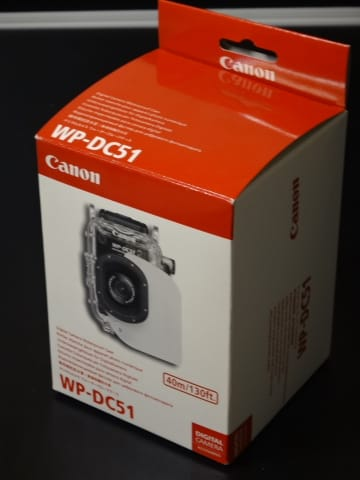

# 水中カメラ買い替え計画，Canon Powershot S120の中古を購入しちゃった…のだが．

📅 投稿日時: 2015-08-05 02:38:00

えー．

水中カメラ買い替え計画．

なんだか．

実際の購入と並行して書き進めているので，

予想以上の大作になりつつあります（笑）．

…今日は時間がないので短めですが．

本日もカメラ買い替え計画ネタへ，Go!

----

と，いうことで．

すごく安い値段のハウジングを見つけたため．

「新品カメラ買うより2万以上安くあがるよ！」と，

急遽，中古のS120を購入することに計画変更し．

喜び勇んで投げ売りハウジングと…

中古のS120を購入っ！！

いやーーー．

安く上がった！

当初予想より，かなり安く上がったよ．

S120なら，私が今使っているS90とバッテリーが共通だから．

予備バッテリーを新規に買う必要もないし．

予備バッテリー分の予算も浮いた！

それでいて，かつてから欲しかった，S120がGetできるとはっ！！

満足，満足…

…

…

…でも．

ちょっと待て．

今回，水没させた妻用のカメラを購入，って目的だから．

このカメラ，妻に使わせるのか…！？

…

…ISO感度も上がり，動画性能も上がり，

レンズもF2.0からF1.8に明るくなるなど．

S90より高性能になった，S120．

妻は，このカメラの性能を引き出せないに違いない．

というか，おそらく無理．

…このS120，私が使いたいんだけど…

と，そこから．

概ね予想通りのオチに向かって突き進んでいくのだった…

（まだまだ続く）
