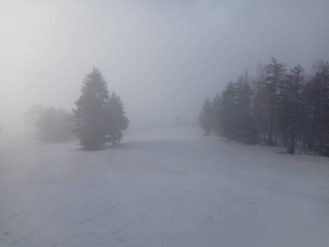
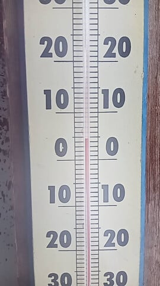
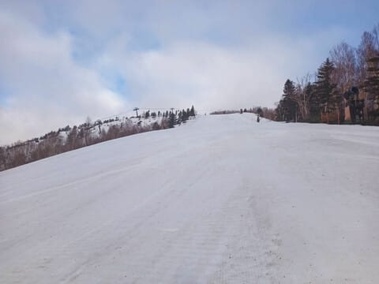
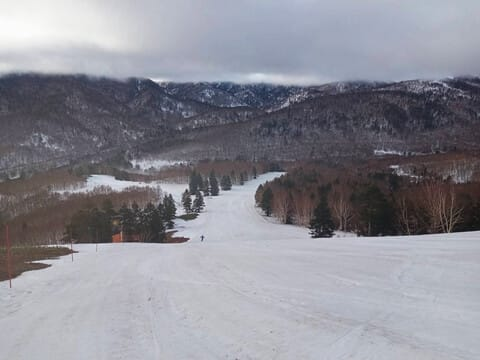
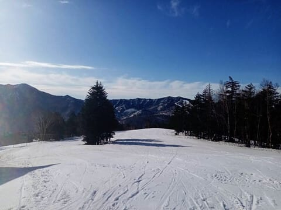
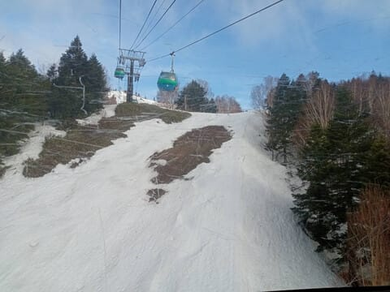
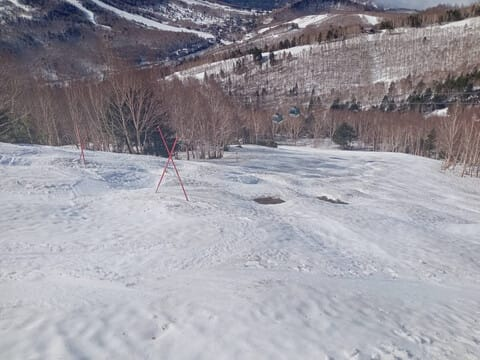
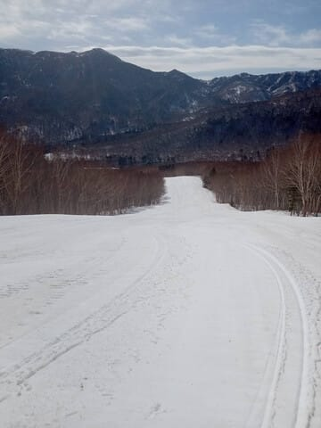
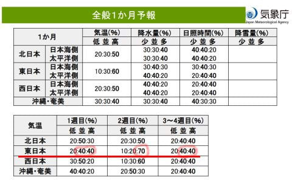
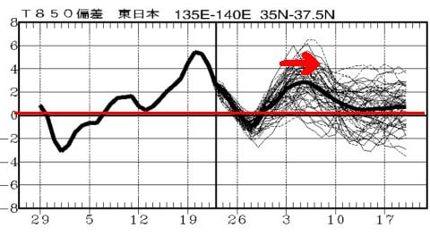

# 1か月予報を見ると，GW後半はスキー場でもかなりの高温？？…そして4月24日の志賀高原特派員情報

📅 投稿日時: 2025-04-25 09:08:32

🏷️ カテゴリ: [日記](cc4b5682fb7b8b144980957a978653fb0.md)

えー．

昨日も気づいたら床で寝てました（泣）

だもんで，朝更新…

昨日も，志賀高原特派員からのレポートが

送られてきましたが…

うむ．予想通り，早朝の時間帯は曇り空で

スタート！

早朝の時間帯から気温は高く…

ここも予想通り，早朝から+5℃に

近いところまで気温が上がってますね（泣）

昨晩の雨と高温で，朝イチから雪は

ちょい緩めだったようですが…

まぁ，相変わらず人が誰も滑ってない

ゲレンデです…！

このあたりもたっぷり雪がありますが，

でも，左側の方，結構土が出てきたな…

そして．これも予想通り，天気は

8時前には晴れはじめたようです…！

ただ．

晴れた分，雪も日差しで一気に緩み．

さらに雪解けも進んでいったようで…

先週末にクローズになった，GSコース下部の

ゴンドラをくぐるあたり．

結構土の面積が増えてきましたね…（涙）

そして，SGSコースのコブ斜面も，

もうそろそろコブ溝に土が出始めて

北みたいです…

うーん．

これだと，SGSコースとイーストコースが

滑れるのは，今週末くらいで終わるかも…（泣）

SGSコースを通り過ぎた先のイーストコース．

昼には雪が緩んだものの，ほとんど人が

滑ってないので，雪が緩んでると思えない

フラット具合ですね…

…ってな感じで，予想通り曇り～晴れだった

ものの，ここも予想通り気温がかなり上がって，

緩斜面では板の滑りが悪くなってたみたい

ですが（ちょい涙）

でも，写真を見てると分かるように，今シーズンは

雪が多いですよ～！！

で．

昨日は木曜日なので，気象庁の1か月予想が出たわけで．

…ただ．

これから1か月後，5月下旬までのスキー場の

天気が気になるのは，ごく一部のスキーバカ

スキーにすべてをささげる人たちだけかと

思いますが，とりあえず1か月予想を

見てみるとtね

うーん．

第1週は平年よりわずかに気温が高め，

2週目にはまた異常高温になり，

3-4週目はまた平年よりわずかに高い程度と

予想されており．

…GWに冷えて雪が降る要素がほとんどない

状態ですね…（涙）

ただ…

850hPa…だいたい高度1500mにあたるところの

気温グラフを見ると．

27，28あたりはまだ平年並みかそれより

わずかに冷えるので．

GW前半，1週目は地上は平年よりわずかに

気温が上がりそうだけど．

標高が高い山の上は，わずかに平年より

冷えるかな？？

でも，赤矢印で示したように，

GW後半，2日以降，4連休が終わるまでは…

平年比+2℃から3℃くらい気温が上がり，

暖かい4連休になりそう…

うーん．

できれば1日くらいは激冷えの日が

あってもよさそうだけど．

GW中はそんな日はなさそうです（泣）

でもまぁ，GW前半は平年並みでおさまって

くれれば，志賀高原はGWラストまで雪は

十分持つかな～…

まぁ，天気もそんなに崩れなさそうだし．

気温が高いけど，そこまで悪いGWじゃ

無いと思いますよ～！！
