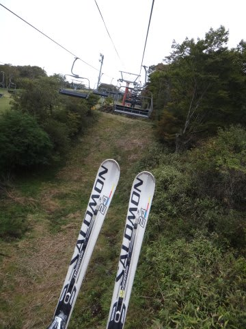

# 古いスキー板，'11 SALOMON 24hours LMを売りに行ってみた

📅 投稿日時: 2014-08-16 00:02:15

えー．

ダイビングネタが続くと．

「徒然スキーヤー日記」としての．

存在意義を問われるので．

スキーヤーブログとしての自意識を発揮すべく，

久しぶりに，スキーネタを行くわけですが．

えー．

[以前書いたように](e6302c5755708c26ad01f9cd7b82c90ae.md)．

剥離しながらも，老体に鞭打ちつつ，

'14シーズンインのイエティまで使っていた，

'11モデルの，SALOMONの24hours LMですが．

さすがに私が4シーズンも使った板ですから．

それはもう，もう，なかなかのヘタリ具合で．

もう，さすがに今シーズンは[死亡宣言](eac44d3489fac6d8fad65c7bfbb7a8575.md)ということで，

引退と相成ったわけですが．

…とはいえ．

一応，まだ4シーズン前のモデルなわけで．

もしかしたら…

いや，ありえないけど．

もしかしたら，お値段，つくかな？

と思って．

近所の，大手リサイクルショップへもっていってみたわけですね．

…かなりヘタった板とはいえ．

こまめなワクシングとエッジ手入れは欠かしておらず．

滑走面やエッジはぴかぴかなので．

…もしかしたら，いい値段がつくかも…

と思って，見積もりを待つこと数分．

出ました．

お値段がっ！！！

な，

なんとっ！！！

10円！！！！！

じゅ，10円か～っ！！！！！！！

わずか，10円…

…定価，11万近い板なのに，

4シーズン使ったら．

チロルチョコすら買えないお値段に

なってしまうとは…（涙）

…まぁ，

私が使いまくって，熟成の極みにまで達した板ですから，

しかたがないとはいえ…

うーん．

ほとんど使ってない状態でも，10円だったんだろうか…？？

とりあえず．

かなりがっくりした出来事だったのでした．

## 💬 コメント一覧

### 💬 コメント by (マルハバ)
**タイトル**: 10円・・・
**投稿日**: 2014-08-16 10:35:09

昨年、近所にある超大型リサイクルショップ

「○○バザール」で

LMよりも古いDemo-X2やX3が

3～4万円代で売られていたのを見つけて

いくら位で買取ってくれるのか？

と思っていましたが

こんなモンだったんですか・・

イイ商売していますね(汗）

やっぱりオークションに出すのが賢明かも・・

ビンディングだけでも数千円にはなるでしょうに・・・

### 💬 コメント by (Skier_S)
**タイトル**: マルハバさま
**投稿日**: 2014-08-17 21:33:13

え？？

3～4万円って…

ぼったくりですな．

3シーズン前くらいのエキスパート板の

新品が，スキー屋さんの在庫で

あるような気が…

その板は，もしかすると2-3年前に

買い取って今まで残ったのかも…

オークションが良かったかなぁ，と

思っていますが，いろいろあってめんどくさそうな

オークションはやったことがないので…

うーん．

やっぱり，オークションかなぁ．

### 💬 コメント by (マルハバ)
**タイトル**: ヒマ潰しに・・・
**投稿日**: 2014-08-19 10:58:58

件のリサイクルショップ

（業界最大手の巨大店舗）

へ久々に行ってみたところ・・

まだありましたよ～

'08モデルのDemo-X2（黒いヤツです）

しっかり￥39,900の値札が付いてましたよ

完璧な中古品でした（笑）

更に驚いたのは・・

SさんのLMと同年式のS5が

な、な、なんと￥50,800！！などという

信じられない値段で売りに出されてました

神田に行けば売れ残りの新品が3万円台で

買えるというのに・・

絶句であります(汗）

### 💬 コメント by (Skier_S)
**タイトル**: マルハバさま
**投稿日**: 2014-08-20 03:40:29

えええええ！

'11のS5が，5万円っ！！！

それだけ払えば，2シーズン落ちの

デモモデルの新品が買えますね…

なぜ，中古にそんな値段を…

うーむ．

買う人がいるんでしょうかっ！？？？

