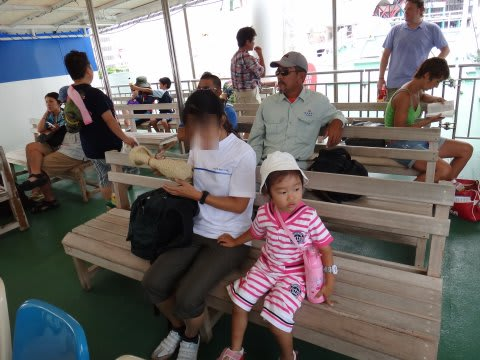
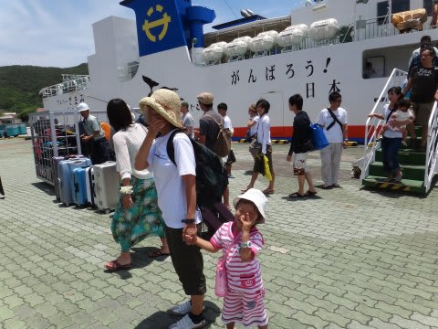

# 子連れで座間味に行ってみた　その２

📅 投稿日時: 2011-08-09 00:09:05

んでもって次の日．

那覇のホテルをチェックアウトし，ホテル目の前の港から，

朝9時発の高速船「クイーン座間味」で座間味島へ移動しようと思ったら…

なんと！台風の余波で高速船クイーン座間味は欠航！（涙)

がががーーーん！！！

…でも．

10時発の座間味行きフェリーは運行とのこと．

とりあえず，座間味にはいけるな…ほっ．

1時間で着く高速船だったら，10時には座間味について，

午前から潜りに行けたんだけど…

まぁ，フェリーでも12時には座間味について，昼から潜れるから，

よしとしましょう．

ということで，フェリーに乗ったわけですが．

でもやっぱり…

おまえは…フェリーに乗っても．速攻で寝るのね．

で…座間味に近づくと．

海の色が，沖縄っぽくなってきますね～．

座間味へ到着～

まずは今回のお宿，「ペンション星砂」へ．

港からすぐ．歩いて3分．

部屋が広い～！

離島のいいところは，安い宿でも，食事がおいしくて

部屋が広いところに泊まれるところですね～．

さらに．

この宿，無線LANでインターネットも使えます．

うーむ．最近は，離島の宿でもインターネットが使えるのが

標準なのね…

とりあえず，部屋でお昼ご飯の後…

午後1時から，ダイビングへGo!

今回利用したダイビングショップは，座間味セーリング．

大型のカタマランスタイルのボートを持っており，

プロローグで書いたように，子連れ乗船OKってことで選んだショップです．

んで．

台風で数日連絡船が来なかった座間味島．

我が家が乗ったフェリーが，台風後の初めての定期船で，

われわれ家族がこのショップの台風後第一号のお客さんになります．

ということで．

他のお客さんがおらず，

なんと我が家族3人で大きなボートを貸切ではあーりませんか．

我が家族3人のために，オーナーとガイド，ヘルプの女性の3人が

スタッフとして乗り込んでくれてます．

うーむ．ゼイタクなことよ…

乗り物大好きな娘は，船に乗って大喜び．

われわれ家族を3人を乗せて，慶良間のブルーの海へ

進んでいきます… 

さーて．

慶良間の海．

これから楽しむぞ～！！
