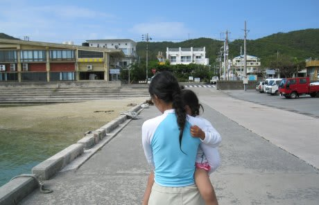
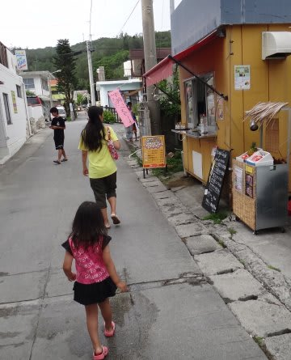
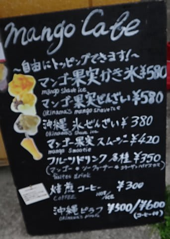
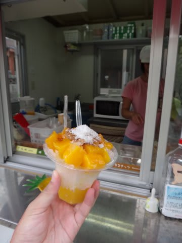
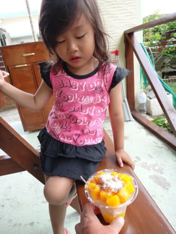
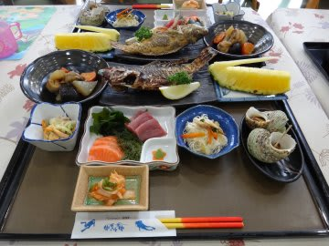
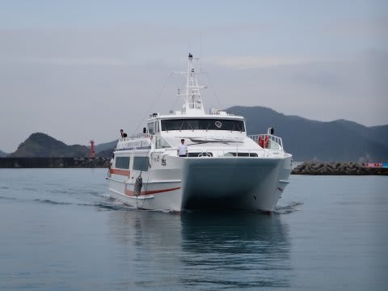
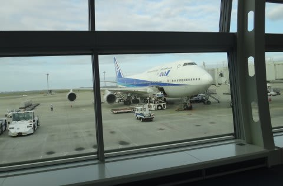
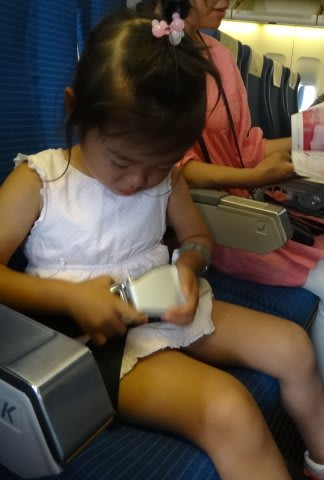

# 子連れで座間味に行ってみた　ファイナル

📅 投稿日時: 2011-08-23 00:05:10

🏷️ カテゴリ: [ダイビング日記](ce3a7a8d424d112fce83ee85c81a0e344.md)

ということで．

座間味の全ダイビングが無事終了！！

港に戻り，

器材を洗うと．

ちょっくらお散歩にでも，ぶらついてみますか～

宿からすぐにある，「マンゴーカフェ」

ここの名物，マンゴーが山盛りに乗ったマンゴーカキ氷を購入．

マンゴー大好きな娘は大喜び～！

で．お散歩が終わったら夕食タイム．

今回泊まった，ペンション星砂ですが．

安いのに，食事がいいですね～

量も多いです．

普通の人は食べきれないくらい．

夕食を腹いっぱい食べたら，ダイビングショップに出かけてログ付け．

一緒に潜った人たちと，島酒片手に夜10時過ぎまで写真談義．

沖縄離島で定番の，ダイビングショップがサービスで泡盛を

がんがん飲ませてくれる，濃厚ログ付けタイムです．

明日ダイビングしない安心感でちょっと飲みすぎたかも…

というわけで．濃厚な座間味のラストナイトが

過ぎていったのでした… 

明けて最終日．

座間味最終日は，特に何もすることなく．

朝ご飯を食べたら，器材をパッキングして．

9時半には宿を出て．

10時のクイーン座間味に乗り込み，

11時半ごろには那覇に戻ってきます．

後はタクシーで空港に移動して，飛行機で羽田へ…

という感じで．夕方には無事帰宅．

このあたりのアクセスのよさが，慶良間のいいところですね．

…で．

とりあえず．これまでの娘．

2歳までは，両親のどちらかが見てないと何もできない感じでしたが．

幼稚園に行くようになり，両親がいなくても大丈夫，という

感じに成長してきました．

今回の慶良間では．

ショップのヘルパーさんに泳がせてもらったり，

無人島に上陸したり．

娘は娘で，楽しい思いをしてきたようで．

那覇ステイでは経験できないですね～．これは．

子連れで慶良間，お勧めです．

今年はもうオムツも持っていかなくても済むし．

とりあえず，だんだん子連れ旅行が楽になっていきますね～

＃ただ，幼児では無料だったものが，3歳以上になると

＃いろいろ有料になっていく… 

さて．次のコモド．娘はお留守番してくれて，

両親が揃って潜りに行けたのか？

乞うご期待！！

＃しつこいようだけど，いったい誰が期待してるんだろう…

## 💬 コメント一覧

### 💬 コメント by (KENKEN)
**タイトル**: Unknown
**投稿日**: 2011-08-23 22:39:37

いつもブログを楽しみに拝見しています。

我が家も3歳の女の子連れでダイビングを楽しんでいます。

座間味報告興味深く読ませて頂きました。

ザマミセーリングさんを今度利用してみようと思います。

コモドのレポートも楽しみにしています。

### 💬 コメント by (Skier_S)
**タイトル**: いらっしゃいませ
**投稿日**: 2011-08-24 00:00:29

コメントありがとうございます．

KENKENさんも，子連れダイバーですか．

3歳の女の子って，うちと全く同じパターンですね．

これまで，どのあたりを潜りに行かれたんでしょうか…

子連れで座間味なら，部屋が広いペンション星砂泊まりで，ザマミセーリング利用をお勧め！

子供の乗船は，一日5000円，半日4000円です（注：税別だった気がする…)

### 💬 コメント by (KENKEN)
**タイトル**: これまでは・・・・
**投稿日**: 2011-08-24 21:46:10

Skier_S様

我が家の子連れでのダイビングは次のショップを利用しました。

１歳；宮古島　南風(パイカジ)さん

２歳；座間味 コナンさん

３歳；西表島 ダイブワンロードさん

１＆２歳時はシッターサービスを利用しましたが、親と離れて子供がかわいそうなのと、親が後ろめたいので今年は一緒に乗船できるショップを探しました。西表での様子(7/11-13)はショップのHPに載っています。こじんまりとしたとても良いショップでしたので機会があればご利用下さい。

幼児を一緒に船に乗せてくれるショップは中々ないので、Skier_Sさんが利用したショップが他にもあれば紹介下さい。

星砂さんは子供が出来る前は何度も利用しました。安くて食事の美味しい宿だったのを覚えています。

### 💬 コメント by (Skier_S)
**タイトル**: うちの娘は…
**投稿日**: 2011-08-25 05:44:03

うちの娘は3歳で幼稚園に入園するまで保育園などに行っておらず，親と離れた経験が無かったんです．

一度，シッターサービスを利用したんですけど，預けられると大泣きしちゃってかわいそうだったんで，これまでは1本ずつ港に潜ってくるパターンのショップを利用し，夫婦交互で潜りに行ってました…

という感じで，子連れでボートに乗ったのは今回が初めてです．

＃クルーズ船には乗ってますが…

西表のダイブワンロードさん，よさそうですね．

今回，マイレージ特典航空券で行ったので，マイレージが足りずに宮古や八重山は対象外だったのですが，来年の遠征地の最有力候補になりそうです．

＃これまで，西表はホットマングローブさんを利用してました

情報ありがとうございました！

