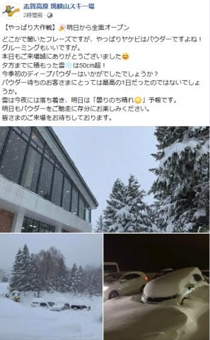
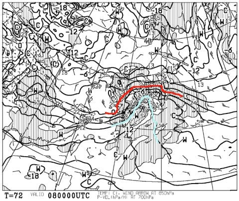
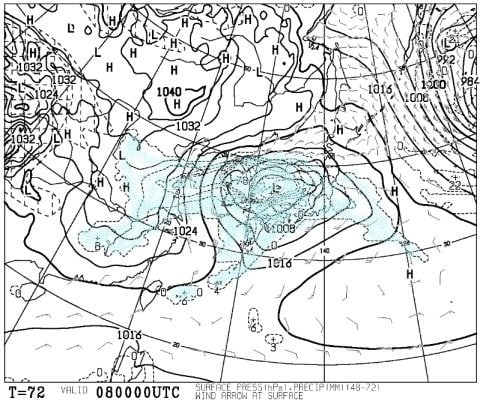
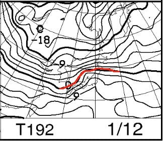
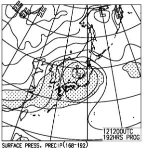

# 志賀高原の8日の天気は，雨！？？それどころか3連休中日の12日も雨？

📅 投稿日時: 2020-01-06 04:58:09

🏷️ カテゴリ: [日記](cc4b5682fb7b8b144980957a978653fb0.md)

えー．

私は本日，志賀高原では滑ってないのですが．

…本日，5日の日曜は，すごい積もったようですね…

焼額では，昨晩からの積雪が50cmですか…

（[焼額山Facebook](https://ja-jp.facebook.com/yakebitaiyama/posts/2627615934000403?__xts__[0]=68.ARAJ2YGaYO0qpwosGM-vcAEIxzovqoqhpCRB-sMbNx3LMmt_E9sz2gI0bt8_s8Pla9a5vhgXt4I3KoCIEZKBLhAQ9EGW5BFT_GH95JcyjWpdYAk4ZOwLRsTHFIusOPmwgeVlfiE9PIkGsNy-VsVuH61gnZgc2F7udX-Qc_QJ4trbDv2AeScUC_8Q85BL9ZNKQhDax7ul-Mpigs0shRTDIxxFGFWWnHR8j8J18kxVWLwVS-GAWvxlOKbrxZmarxh8FmLLeUoI9uIjUdcrAqcIQPDwte5DS0ZDZ7lFLnmgiyIHdOtfzTwN0NpN96OQG8bufNEyFWBHuS6phjKXCCZPaKw3JQ&__tn__=-R)より）

ちょいと重めながら，パフパフだった

ようですね．

良かったですね．

なぜ，私が帰った翌日に，

狙ったようにパウダーが積もるんでしょうね（涙）

あぁ…今週末もパウダーにならないかな？？？

と，天気図を見ると．

数日前に，[某20000mゴールド取得](eb4d26d0deb2842865c1d4ed2fd808df0.md)の方が．

「8日の天気図，ヤバいのでは…？」

と，LINEメッセージを送ってき

てくれていて．

その時は「おそらく，平年並みに近い気温に落ち着くだろうな…」

とたかをくくっていた，8日．

最新の，8日の天気図を見てみたところ…

なんだ，これはっ！？？？

この，850hpaの水色線．

+9℃線なんですけど！？？

1月に，志賀高原で+9℃線って？？？

…これは，ヤバい．

この気温で降水量があると．

泣いても叫んでも転がっても

のたうち回っても．

空から降ってくるものは，

液体

になってしまうのですが…っ！？？

この日は降らないでいてくれ…っ！！

…ちーん．

えー．

皆様に，残念なお知らせを申し上げます．

志賀高原の8日（水）は，雨です．

全山雨です．

かなりの雨です．

覚悟してください…

その翌日，9日は雪が降りそうなので．

まぁ，8日の雨のアイスバーンは，

11日からの3連休までには，隠れて

くれそうかな…

…

…

…って．

え？？

ええええ！？？

3連休の中日，12日も

なんかヤバそうなんですが…！！

…これで，降水量があったり

しないよね…

…

…

ちーん．（2回目）

なんと…

なんということか…っ！！

3連休の中日も，雨！？？

いや．

ダメだ．

これはありえない．

というより，この私が許さない．

志賀高原の1月で，こんなに雨が続いて

いいものか！？？

いや．良いわけが無いのだ！

とりあえず．

雨が降らないように．

全力で祈る！そして踊る！

せっかく，今日降ったドカ雪パウダー．

これが雨でガチガチのダメダメ雪に

ならないよう，読者の皆様も

夜も寝ずに踊り続けてくださいますよう，

よろしくお願い申し上げます…

…で．

今日はバタバタしてましたので．

すみませんが，4日の志賀高原詳細レポートはまた明日．

コメント回答もしばしお待ちください（ゴメンナサイ）

## 💬 コメント一覧

### 💬 コメント by (つーちゃん)
**タイトル**: Unknown
**投稿日**: 2020-01-06 19:19:30

１２日の予報はかなりマイルドになった感じがします

踊って祈ればなんとかなるはずっ！！！

８日は…逆立ちしようが何しようがダメっぽいですね(滝涙

あぁこっそり平日スキーする予定だったんですが。

### 💬 コメント by (なるなる)
**タイトル**: Unknown
**投稿日**: 2020-01-06 20:42:09

正月休みを少しずらして、明日から1泊で志賀高原なのですが、8日は雨ですか…

覚悟していきます(涙)

### 💬 コメント by (Skier_S)
**タイトル**: 8日は壊滅的．リフトも動かないかも？
**投稿日**: 2020-01-07 02:45:32

＞つーちゃんさま

12日はまだ何とかなりそうな感じですね…

まだ予断は許しませんが…

8日の平日スキーは諦めた方が良さそうな感じです．

7日夜から降ります．液体が…

8日はゴンドラが動く感じがしないです（残念）．

＞なるなるさま

え？7，8日で志賀ですか？？

あら…ちょっと残念な2日間になりそうです．

7日夜から降り始め，8日はゴンドラどころか

リフトも動かない可能性があります…

午後遅くから動き出すかもしれませんが，

覚悟した方がいい一日です．

うーむ．

なんとかそれほどひどい天気にならないように

必死に祈り，踊ってます…

