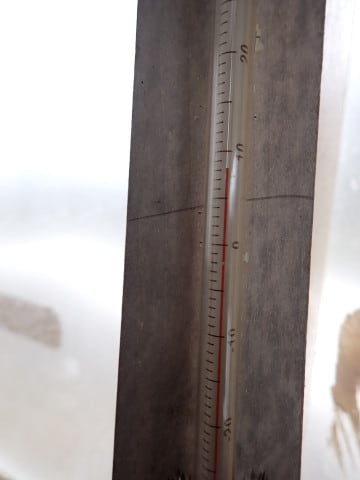

# 2024/4/30(火)，GWの谷間の志賀高原焼額山スキー場は，曇り時々小雨，激烈ガラガラ，午後まで雪は荒れず緩斜面以外板も滑ったよ！

📅 投稿日時: 2024-04-30 22:43:33

🏷️ カテゴリ: [2024スキー滑走日記](c453f687e8a0f05679e95831d0a02cd0c.md)

ってなことで．

GWの谷間の本日も，志賀で滑ってました～！

…さりげなく，今シーズン初の平日スキーでは

ないだろうか…

で．

明け方に雨が降ったらしい志賀高原．

今朝の上り道路はウェットでした…

でも，朝から気温は+10℃近く，凍結の

危険性はまったくなし！

早朝でも，夏タイヤで問題なく突っ切れ

ました…

ただ…

道路から見える高天ヶ原は，もうかなり

雪が薄くなり…

この写真だと，下半分はまともに見えますが．

帰りに見たときは，下半分はもう土だらけで，

残念ながら本日で高天ヶ原も終了した

ようです（泣）

これで，一ノ瀬エリアで滑れるのは

ファミリーの下半分のペアのみになりましたね（泣）

奥志賀も，第3，第4の雪がかなり薄くなって

来たようで…

早朝営業もあきらめたし，そろそろヤバいか…

でも．

わが焼額は，まだゴンドラ2本動いてます！

とはいえ，第1ゴンドラ沿いのGSコースは

今日で終わりの残念な感じなので．

今日は第2ゴンドラスタートとしました～！

そして，今日は早朝6時からスタートですが…

第2ゴンドラの早朝営業に待っていたのは

10人もおらず，超ガラガラ状態．

で，6時営業開始のゴンドラに乗って

山頂に出ると…

朝から+10℃近い気温（泣）

ゴンドラ降り場の雪も減りましたね（涙）

でも．

第2ゴンドラ側のパノラマーサウスコース．

コースの雪はまだたっぷりありますよ！！

とはいえ．

圧雪は夕方圧雪で，その後の未明に雨が降り，さ

らにちょっと風も強かったらしいので．

早朝一番のゲレンデは，ぴかぴかシマシマ

というより，木の枝や汚れが浮いた

ちょいと悲しい状態…（泣）

でも，バーンは荒れておらずフラットで．

雨が降ったので硬くはないものの，下地は

しっかりした感じでエッジが効く

バーン！！

サウスコースも，コース幅いっぱい

雪がついていて，まだ土は出てきてないので…

やっぱり，今の志賀高原で一番バーン状況が

いいのは，3月に死ぬほど人工降雪を

打ちまくった，このバーンかも？？

ただ，人がかなり少ない本日．

普段なら，人が滑るにつれ雪の表面の汚れが

削られていくものだけど．

今日は雪の汚れがあまりとれない

一日でしたね…

逆に言うと，それだけ人が少ない

一日だったわけですが．

朝のうちは，一瞬日が射すタイミングも

ありましたが．

日が射したのはほんの一瞬で，あとは

全く日が射さない一日だったので，

緩斜面は汚れのせいで滑りがあんまり

良くなかったけど…

日差しで雪が解けなかったからか．

今日はこの写真のパノラマの壁や，

サウスコースは板がよく滑って，

結構滑りやすい一日でした～！

ただ…

今日はちょっと風があったので，

ゴンドラの運転速度が遅め（泣）

ガラガラなのに，あんまり本数を

稼げない…

とはいえ．

気温は高いながらも日差しで雪が解ける

ことはなく．

人工雪を打った部分は，ザラメが固まった感じの

硬い下地が緩まず…

サウスコースは，今日は夕方までずっと，

結構締まった感じのフラットバーンで，

さらに誰もいない貸し切り状態なので

バーンもほとんど荒れず．

わが春スキー用愛機，Deaconを履けば

気持ちよく夕方まで大回りできる

コンディションでした～！！

ただ，10:30ごろから11時くらいまで，一瞬

パラパラと雨が落ちてきましたが…

雨が降ったのはその30分くらいだけで．

あとは雨が降らずにいてくれて．

気温は高かったものの，最高気温が

山頂で10℃ほどと，これまでの異常高温

に比べればおとなしく．

さらに日が射さのないので…

この，サウスコースの一番下の平らな部分，

写真では見にくいけどちょっと水たまりが

出てきた以外は．

板もそこそこ滑ったし，土も出てこず．

結構楽しめた一日でした～！！

で．

今日でラストのGSコースものぞきに

行きましたが…

2ゴン側サウスコースから1ゴン側への

連絡通路．

ここもよく今日までもたせたな～…

そして．

2ゴンと同様，誰もいない無人の第1ゴンドラに

乗って．

山頂につくと…

うわー．

昨日から1日でかなり雪が減った！

昨日は土が出てくる気配もなかったこの部分に，

土が出ちゃってるよ…（泣）

この辺りも，かなり土が出てきちゃって

ますね（涙）

でも，この辺りはしっかり雪がつけられて，

昨日ヤバかった部分が補修されてます！！

この辺りも，コースの真ん中に空きかけていた

穴がちゃんと埋められてますね…

この辺りも，写真で見ると幅が広そうですが…

実質は幅5m程度．

昨日より幅が狭くなり，雪は盛られてますが…

でも，ここを見ると

「確かに今日で終わるのも仕方ないかな…」

という感じ．

でもまぁ．

この写真でもわかるように，右側から

雪を寄せたりして，なんとか営業を

伸ばそうという努力の跡が見て取れて…

よくGW3連休までもたせたという感じ…！

GSコースからゴンドラへ戻る，

ゴンドラ連絡コースも…

まぁ，今日で終わりかな…って感じ．

GSコースは終わりげな感じですが．

でも，まだパノラマ～サウスコースは

行けますよ～！

結局，今日は早朝からラストまで，

ほとんどパノラマーサウスをぐるぐる

してました～！

午後は山頂付近はずっとガスが出てたけど．

ふもと付近，4ロマ山頂から下のサウスコースは

視界もよく．

雪も幅いっぱいあり，夕方まで下地はザブザブに

ならず比較的しっかりしたフラットバーンで，

ラストまできもちよく大回り可能！

パノラマコースは午後は荒れてたし．

GSコースも今日で終わりなので．

いい感じで滑れたのは，午後は

サウスコースのみでしたが…

でも，

夕方まで雪も締まって，板も滑って，

ハイスピード大回りができたので

ヨシ！！

ってなことで．

心配していた雨も，昼間に一瞬ぱらつく

程度で済み．

人が少なくバーンも荒れず，午後まで

結構気持ちよく滑れちゃったので…

今日も早朝6時から営業終了の15時半まで，

休みなくひたすらぐるぐる滑り続けたの

でした…

いやー．

意外と楽しかった…←あなたの楽しいの基準値は

普通の人に比べるとずれてるから…普通の人は今日楽しめたのかは微妙

とりあえず．

焼額山は本日でGSコースが終わったので．

第1ゴンドラも営業終了です．

今シーズンも間違いなく一番本数を乗った

わが住処，第1ゴンドラに別れを告げるべく．

本日ラストの第1ゴンドラ乗客…

今シーズン最後の1ゴン乗客になって，

1ゴンにしばしの別れを告げてきました．

また来シーズン～！！

明日から，第2ゴンドラと第4ロマンスの

営業となりますが…

第2ゴンドラは，まだまだ朝6時から

早朝営業が続きます！

明日は午前中は雨が降らず，午後は雨に

なりそうなので…

明日も早朝から午前勝負かな？

明日も焼額で滑ってます～！

## 💬 コメント一覧

### 💬 コメント by (かず)
**タイトル**: Unknown
**投稿日**: 2024-05-01 02:35:19

雨降らなかったですね  けど、ほんとギリギリです笑  昨日疲れと長い車泊が辛くて諦めました  この時期1泊が限界かもしれません…sさんは6日までですか？2ゴン側雪が残ればもう1回狙ってます  天気は大丈夫そう！

### 💬 コメント by (おばちゃんスキーヤー)
**タイトル**: Unknown
**投稿日**: 2024-05-01 07:58:34

S様の情報で　昨日はコース幅の広い第2ゴンドラをぐるぐるしてました。

29日の早朝では　上手な姉妹が先頭に並んでいたのをお見かけし、年末には　すごいスピードで滑っているのを見て尊敬しました。

昨日の焼額で今シーズンの板じまいをして、そして上げ膳据え膳生活を終えて現実世界へ戻ります。

あーS様にお声がけしたかった今シーズンでした。

色々と情報をありがとうございました♫

### 💬 コメント by (Skier_S)
**タイトル**: 明日まで志賀高原！
**投稿日**: 2024-05-01 20:31:43

＞かずさま

雨はほとんど降らなかったですね～．

車中泊は疲れますよね．私は2日でいったん切り上げです．

＞おばちゃんスキーヤーさま

え？昨日滑ってらしたんですか…？

だとすると，私を見かけている可能性が高いかと(笑)．見つけられませんでしたか？

とりあえず，シーズン終了お疲れ様でした！

また来シーズンお会いしましょう～！

