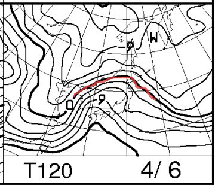
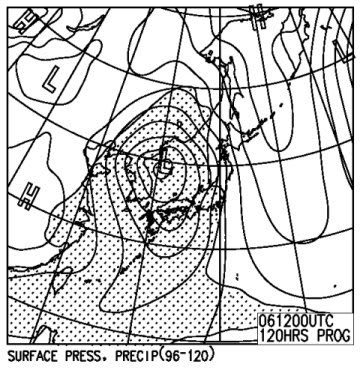
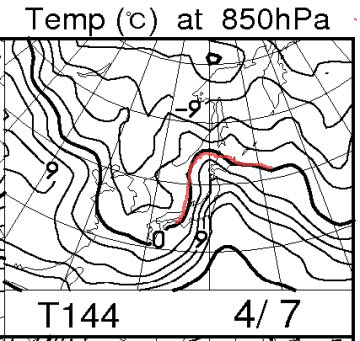
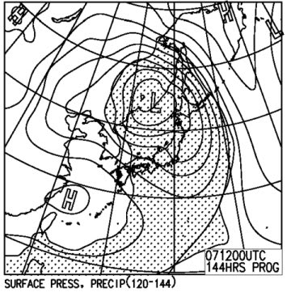

# 定番！今週末の志賀高原の天気は…壊滅的かも(涙)．

📅 投稿日時: 2013-04-03 01:49:05

🏷️ カテゴリ: [スキー天気予想](c6554f5c3c106093b511a8daae23757e8.md)

えー．

いつもの，週末天気予想ですが．

…なんだか．

この週末．

ひどいことになりそうな予感…(涙)．

まぁ，5日(金曜日)から6日(土曜日)の午前にかけては晴れてくれそうなんですけど．

6日夜9時の850hpa面の気温はこんな感じで…

0度線は志賀高原からはーーるか遠く，北海道まで上がってしまっていて．

志賀高原近辺は+9度の線が近づいてますから…

標高1500mでも10度近い気温になりそう…(涙）．

…ってことで．気温はチョー高め．

6日土曜日は，朝からべちょべちょどぼどぼの雪でしょう．

んで．

6日夜9時の予想地上天気図はこんな感じで．

なんだかすごい低気圧がいるんですが…

で．

この天気図の，網掛けの降水量がある部分．

志賀高原にかかってますね…

ってことなので．

6日のいずれかの段階から，雲が多くなり始め．

6日の夕方～夜ごろには，強い南風になり，

結構な雨になりそう…

…ぐはぁ(死）．

雪が…雪が溶けるよ…

そして．7日の日曜は．

…朝から雨ですね(涙)．

それも，激しい南風で，ゴンドラが動かないかも…

こんな感じで，+6度の線が志賀高原近辺にいるので．

この日も高温になります．

ぜったい何があってもどれだけ祈っても泣いても叫んでも，雨．

雪になるわけがない天気図です．

日曜の地上天気図もこんな感じで…

夜9時の天気図で，まだ志賀高原は網掛けされている低気圧の雨の領域にすっぽり覆われているので．

…朝から終日雨ですね(涙)

夕方～夜に，寒冷前線が通過して気温が落ちるけど…

昼間は，雨が雪に変わるほどには冷えないでしょう．

…

…

…

ってことで．

この週末．

滑るなら土曜．

…晴れだけど，気温が高くてべとべと張り付く雪になること間違いなしですが…

そして．

日曜は，終日雨．時折強く降り．

暖かい気温とあいまって，かなりの勢いで雪を溶かしてくれそうな感じです(涙)．

ぐはぁ（屍)．

だ，だめだ～っ！！！

これは，だめだ～っ！！

スキーヤー殺しの週末になりそうです(激泣）．

みんな！

奇跡を信じて祈るのだ！

＃でも，祈ってどうなるレベルでもなさそう…

## 💬 コメント一覧

### 💬 コメント by (ゆうこ)
**タイトル**: 今日は
**投稿日**: 2013-04-03 11:01:19

今日は、志賀高原では雪降ってるみたいですね。

雪がGWまで持ってくれるか心配すぎます。

雪がなかったらGWの4日間志賀高原で何をしたらいいんだと悩みます。

### 💬 コメント by (Skier_S)
**タイトル**: ゆうこさま
**投稿日**: 2013-04-03 23:00:22

今日はちょっとだけ降ったみたいですが…

うーーん．

この4月も，平年並み程度で，むちゃくちゃ冷えたり

しないようです…

GWまでは！GWまではもってほしい！！！

もし，GWに雪がなかったら何をするかというと…

涙に暮れましょう(泣)

### 💬 コメント by (千春)
**タイトル**: Unknown
**投稿日**: 2013-04-04 15:40:58

お久しぶりです、以前コメントさせていただいた千春です。

今週末のお天気が心配で、またブログにお邪魔しました。

【みんな！奇跡を信じて祈るのだ！】

おー!!!!!

って、「奇跡」とか「祈る」レベルの悪天候なんですね・

### 💬 コメント by (Skier_S)
**タイトル**: 千春さま
**投稿日**: 2013-04-05 02:11:23

ををを～！

お久しぶりですぅ～！

えー．

祈りにご協力いただきまして，ありがとうございます．

しかし．

「奇跡」とか，「祈る」とかのレベルではなく．

本文にありますように．

祈ってどうなるレベルでもなさそう…

…ってレベルです(涙)．

でも．

でも．

祈りましょう…

