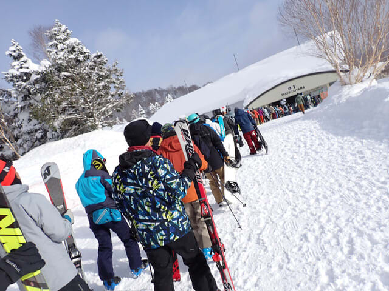
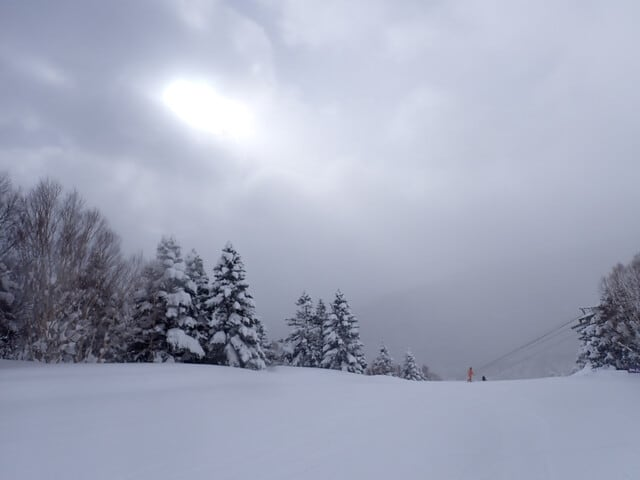
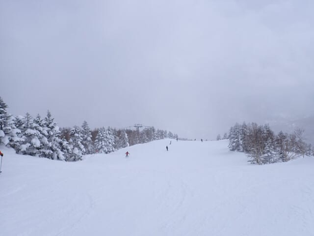
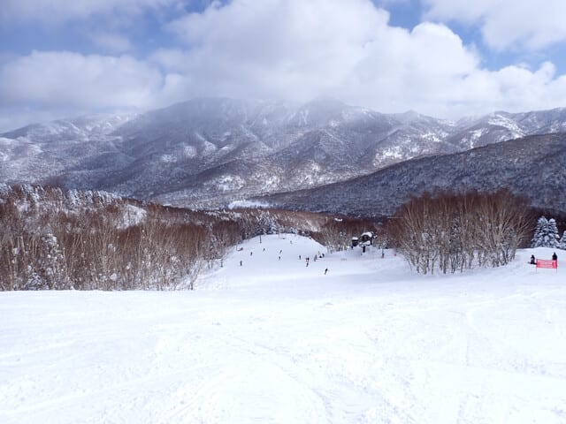
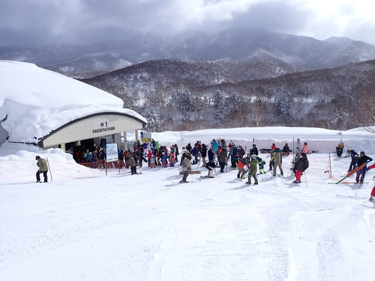
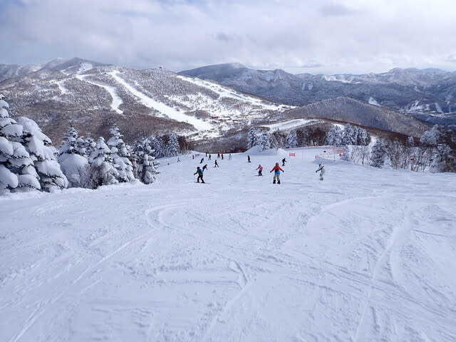
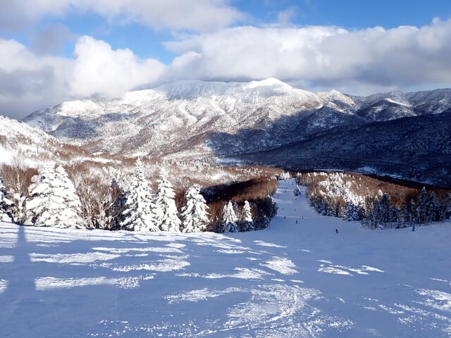

# 2025/2/23(日)の志賀高原スキー場，速報モード！…晴れ～うす曇り，ときおり小雪の予想外に穏やかな天気．ゲレンデの人は多かった．

📅 投稿日時: 2025-02-24 00:47:03

ということで．

本日も志賀高原の焼額をラストまで

滑ってきました～！！

で．

3連休なので最終日の明日まで滑りたい

ところですが．

…というより，

「帰りたくない～！！！」

と，地面を転がってだだをこねたいところ

ですが．

明日仕事をせねばならぬため，今日は

涙を流しながらゲレンデとお別れして，

さっき帰ってきました…

ということなので．

本日は帰宅日恒例，速報モードにて！

…あぁ…帰って来たくなかった…

えー．

まず．

朝はさすが3連休中日．

朝イチの焼額第1ゴンドラの列は，

駐車場近くまで伸びるという，

今シーズンでも1番の列の長さ

でした…！

…3連休ってのもあるけど，今日は

第2高速が故障のため終日運休予定で，

普段なら第2高速に分散する人も

第1ゴンドラに来ちゃって列が長いん

でしょうね…

で．

朝イチの山頂はうっすら日も射す曇り空で，

昨晩の夜のうちに10cm弱降った雪が踏まれた，

ちょい柔らかめの圧雪バーンでスタート！

今日の天気は，

朝から雪．終日強く降ったり

弱くなったり．

という予想部分は外れて，

運が良ければ，プチ高気圧が発生

して，日が射すタイミングもあるかも…

という，運が良い方が当たりでした～！！！

こんな感じで，小雪がわずかに舞う時間も

あったものの，

だいたいは雲が多い晴れで，時々曇る感じ．

こんな感じで日が射す時間が長くて，

やはり私の日頃の行いが良いから，

運が良い方に振り切った天気になった

という感じです！！！←断じて違う

そして．

今日は第2高速リフトが故障で動いてないので，

いつもなら大量に人が流れて来る一ノ瀬方面

から人があまり流れて来ず．

3連休中日ならもっともっと混むはずの

第1ゴンドラ，最大でもこの程度の待ち．

ってか，これだけ待ったのは1回だけ．

あとは長くてもゲートからちょっと

はみ出すくらいの待ち．

ゴンドラ・リフトは3連休中日と思えない

待ち時間の短さでしたよ～！

…でも．

リフトやゴンドラは混んでいないものの…

意外とゲレンデの人口密度は高く．

昼間のゲレンデの快感度はちょっと

低め（涙）

3連休中日で明日も休みなので，

午後になってもゲレンデの人は

そんなに減らなかった感じ…

とはいえ．

晴れたタイミングでも気温は低かったので

終日雪質はかなり良く．

ゲレンデの人は多めだったものの

リフト・ゴンドラ待ちは驚くほど

少なかったので…

かなり恵まれた一日でしたよ～！！

まぁ，雪は柔らかめのうえにゲレンデの人が

多かったので，午後はさすがに予想通りに

バーンが荒れてきちゃいました…（泣）

でも，雪が柔らかい最高雪質だったので，

春の雪みたいにボコボコにやられる

感じじゃなかったですよ～！！

ってなことで．

天気がかなり良く，楽しめた3連休中日

でしたが．

3連休最終日の明日も，ゲレンデにいる人の

日ごろの行いが良ければ，

プチ高気圧が出て今日と同じような天気に

なりそうだし．

日頃の行いが悪ければ，一日雪が降ったり

止んだりの天気になりそうです…

果たしてどっちだ！？？

…どうせ私は滑れないので，

雪が降ろうが晴れようが，槍が降ろうが

ミサイルが降ろうが，私にとっては

どっちでもいいんですが…←ちょっと拗ねてる

## 💬 コメント一覧

### 💬 コメント by (ねも)
**タイトル**: Unknown
**投稿日**: 2025-02-24 06:31:20

良かったですね✌️

普段のＳさんの功徳のおかげでしょう(笑)

### 💬 コメント by (Skier_S)
**タイトル**: ＞ねもさま
**投稿日**: 2025-02-25 02:15:21

この土日，二日ともかなりの吹雪の可能性もあったけど．

かなりの時間晴れてくれて，いい感じの土日でした~！

やっぱり私の日ごろの行いの良さですかね←違うから

