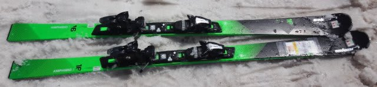
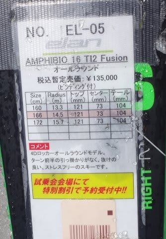
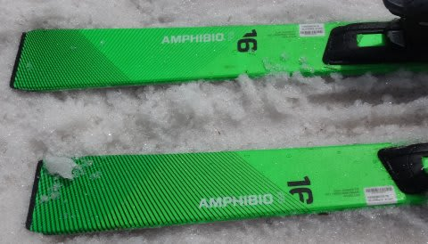
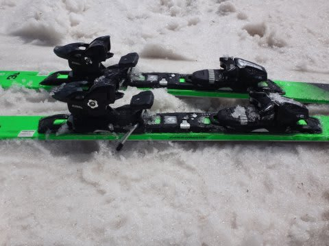

# 2017シーズンモデル，スキー試乗レポート第10回…ELAN編

📅 投稿日時: 2016-05-31 03:06:14

🏷️ カテゴリ: [スキー板試乗](c0bd8048615710cee890e403a36cc9a2b.md)

えー．

今日も，なんて時間に更新しているんだ？

…って感じですが．

でも．

眠い目をこすりつつ，試乗レポート続きます．

本日も一機種のみ．

エラン編です．

では，どうぞ～！

○ELAN AMPHIBIO 16 TI2 Fusion 166cm

基礎オールラウンド．

競技用ではない，一般エキスパート用のAMPHIBIOシリーズ．

このうち，最もハイレベルの『16』です．

もう，みなさんご存知の．

左右の板の形が違う，アンフィビオ形状です．

＃プレートの形が左右違います

履いてみた感じ…

意外と．

しっかり強い．固い板です．

長さ166cm，R=14.5ｍってことで，どちらかというと

良く回る小回り用かな，という印象を受けますが．

サイドカーブは，R14.5mって数字より大きく感じます…

割とロングっぽい感じで，

SLXみたいにクルクル回りません．

しっかり重く，安定感があり，

割とロング目で大きく落ちて行ける板で．

エッジグリップは強めですが，ガチガチの

エッジグリップってわけでは無く，板を

ずらしに行くこともできます．

ただ，比較的重い感じで，動かしやすさというより

エッジの乗っていく安定感が強調されている感じ．

さすがAMPHIBIOシリーズのトップモデルというだけあって．

ゲレンデで軽快に履けるというより，

比較的早めのスピードで滑る人，

板が切れ上がりすぎるのが嫌な人は，

板なりに落としていけるオールラウンドで，

比較的安定感のあるこの板が良いのかも…

でも．

ELANは，小回りをしたいなら，

やっぱりSLXが面白いな！
