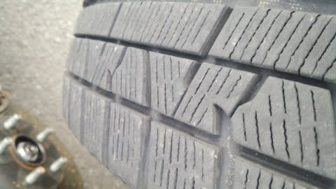

# 2シーズン，35000km走ったスタッドレス…YOKOHAMA IG5 Plusはどのくらい減ったのか…？

📅 投稿日時: 2017-05-31 02:30:17

🏷️ カテゴリ: [車](cba0e8330b3f2ded7c1addfacc75d4547.md)

えー．

ちょいと古いネタになるのですが．

今からさかのぼること約一か月．

GW直前の4月末のこと．

それまで履いていたスタッドレスタイヤ，[YOKOHAMAのiG5 PLUS](ed37f79b998c2bb8649b52639399bb425.md)．

こいつを夏タイヤに替えたんですね～．

…いつもならGWを過ぎてからタイヤを交換する私．

なぜ，今回は急いでGW前に替えたのかというと…

[1シーズン目の昨シーズンに履き終わったあと，](e4735b2914fe7de3888e201d43ec51843.md)

…まぁ，もう1シーズン使ったら終わりかな…

と思っていた，このスタッドレスタイヤ．

2シーズン目も終了というこの4月末に，じっくり見てみると…

あれ？？

まだ，プラットフォームまでかなり残ってる

ように見えるんですけど…？？？？

もう2シーズン，約35000km走ったスタッドレスというのに．

フロント，リヤとも，まだ使えそうな感じですよっ！！！？

これは…

私が使ったスタッドレスとしては驚異的なことに．

3シーズン目までもつんじゃないか？？？

だとすると．

なるべく早く夏タイヤに替えて，

スタッドレスを長持ちさせたいんですけど…！

異常に走行距離が多い私．

GWだけで2500kmは走ってしまうので．

もうひとシーズン長持ちさせるためには．

ほとんど積雪路が無いGWに，このスタッドレスタイヤを

無駄に減らしたくないっ！！

GW前にタイヤを替えてしまわなければ…っ！！

と，いろいろ天気図を眺めて．

「GWに異常に冷えて，志賀高原の道路が

　積雪や凍結になっちゃう可能性は低い！」

と見切った上で，GW前のタイヤ交換を

敢行したわけで．

うーむ．

タイヤを外してよく見ても…

この矢印部分がプラットフォーム部分ですが．

まだかなりタイヤが残ってる感じで，

プラットフォーム露出まではまだまだありそう…

よし．

これは，3シーズン行けるぞっ！

[前のREVO GZ](ec4522dbe037bfb35d25a0ac97b436e63.md)は，2シーズン（4.3万km）でお亡くなりになりましたが．

この，YOKOHAMA iG5 Plus．

[燃費も良かった](e31c35ca3deed012deea99b3659e3218a.md)けど．

実はライフもかなり長いようですね…

REVO GZより走行距離が短いとはいえ．

まさか，35000kmを超えてもまだまだ溝が

十分残ってるとは…！！

ということで．

タイヤ交換のついでに．

いつも通り，車の下周りを…

徹底的に磨き上げ，

錆止めペイントも塗って．

…よし．

ピカピカになったな．

そして，夏タイヤ装着！

…で．

先日．

さらに，ルーフボックスも外して…

うん．これで夏仕様化が完了ですね…

そして，さらに，冬の間は塗る暇がなかったワックスを

しっかり塗って…

ピカピカに磨き上げました～！

…うむ．

BRレガシィ君，もう走行距離12万6000km超えてるけど．

まだまだ元気に走ってもらわねば…

そう．今．

[プロジェクトX](eb1b0e385b422753c3e3aad5a58c12234.md)の続編をやるほどの金は無い

BRレガシィ君．

スタッドレスもまだあと1シーズン使えるし．

2.5Lの4WDのくせに．夏タイヤ＆ルーフボックス無しだと，

かぐらまで約400km往復の燃費は18km/l超えるし．

おかげで．

かぐら往復しても，燃料は1/3ちょいくらいしか使わないし

（かぐら一往復後の燃料計が，ここまでしか減ってない！）

うん．

…買わない．

買わないぞ～！！

Eyesight Ver.4になって，0kmからレーンキープ走行が

できるようになるというウワサの，D型 LEVORGなんて．

買わないぞ～！

…と．

必死に自分に言い聞かせる，Skier_Sなのだった…

## 💬 コメント一覧

### 💬 コメント by (ぴよ＠太田市)
**タイトル**: ひとまず先にお祝いの言葉を
**投稿日**: 2017-05-31 11:23:52

言っておきましょう！

アプライドD型ご購入、おめでとうございます(^^♪

※DITも近いうち排ガス規制されますよ！

　その前に買っておくのが吉と見た

### 💬 コメント by (レガシィ乗り)
**タイトル**: 足回りメンテについて
**投稿日**: 2017-05-31 20:28:07

スキーシーズン後の足回りメンテって具体的にはどのように作業されていますでしょうか。

タイヤを外してダンパー等を水洗い後にシャーシコートクリアでしょうか。それとも他のメンテナンスを行った後にシャーシコートクリアでしょうか。

私のレガシィもスキーシーズン後は足回りに汚れと錆が目立ち始めているので自分でメンテしたいのですが、何を用意して作業すればよいか分かりません。

### 💬 コメント by (MG)
**タイトル**: こんばんはー
**投稿日**: 2017-05-31 23:17:57

いつも拝見してます。。

というより久々にコメントします。miyaです。

ご無沙汰してます。

私はGWでシーズン終了しました。

今シーズンは年末に志賀にも行ったんですが、

焼額を滑ろうという日に限って大雨だったため、

家族の反対でそのまま帰宅という目に遭ってしまいました。

お会いできなくて残念です。。

今シーズンBRのA型からレヴォのC型に乗り換え、

タイヤはSさんと同じIG5にしました。

1万くらいしか乗ってないので、タイヤはまだまだ

大丈夫そうですね。

それにしてもBRは燃費いいですねー

レヴォは1.6ですが、高速フルに使っても18km/Lは

いかなかったですー

ちなみにレーンキープはあまり役には…（自主規制）

### 💬 コメント by (Skier_S)
**タイトル**: BRレガシィはいい車です
**投稿日**: 2017-06-01 02:55:31

＞ぴよ＠太田市さま

買いません…

買いませんから～っ！！

というより．

買えませんから（涙）．

＞レガシィ乗りさま

足回りのメンテは…

私の場合，ひたすら拭きます．

樹脂部分はアーマオール．

金属部分はCRC 5-56．

これを吹きかけながら，ひたすら

要らなくなったタオルで拭きつづけます．

ピカピカになった写真は，シャーシコートを

塗る前の，ピカピカに拭きあがった時の

写真です．

サビが出てる部分も，5-56を吹きかけながら

ひたすら拭いて錆を取れる限り取って，

それから，錆が気になる部分にのみ

コート剤を塗ってます…

ダンパーはさびないので，コート剤を塗ってません．

ロワアームの周辺に塗ってる感じでしょうか…

＞miyaさま

お久しぶりです～！

今シーズン，志賀は年末のみだったんですか…

それも，ヤケビを滑れなかったとは，

ちょいと残念でしたね…

LEVORG　C型購入おめでとうございます！

いいなぁ…C型…

かなり完成度高いですよね．

でも，1.6でBRより燃費悪いんですか？？

カタログ値17km/L近く出てるのに…

BRレガシィ君は，燃費計読みで先週は18.2km/L，

今週は18.8km/Lだったので，夏タイヤにして

ルーフボックスを外してからは，かなり燃費

延びてます．

ここ6000kmでの平均燃費がリッター15kmを

超えてますので，かなり燃費がいい車かと．

### 💬 コメント by (レガシィ乗り)
**タイトル**: 足回りメンテについて
**投稿日**: 2017-06-01 06:01:24

詳細な作業を教えて頂き、ありがとうございます。

黒々とした状態は556で磨き上げた状態だったのですね。今度試してみます。

BRレガシィの燃費は驚異ですね。

私のレガシィはBS9ですが、燃費18KM/L以上を狙うには新東名のような勾配が少ない道をクルーズコントロールで90km程度にしないと出せない数値です。

### 💬 コメント by (Skier_S)
**タイトル**: レガシィ乗りさま
**投稿日**: 2017-06-02 01:03:49

BRレガシィでも，18km越えはやはり

高速道路を90～95km程度で運転した

場合です…

でも，かぐらスキー場への登り坂や，

三国峠越えの山道も走ったトータルで

18km/L超えてるので，

まぁやっぱり燃費がいい車ですね（＾＾

