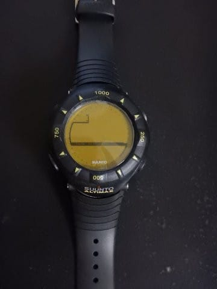

# 私のスキーの友，Sunnto Altimaxがぶっ壊れちゃったんですが…（涙）

📅 投稿日時: 2017-09-14 01:35:39

🏷️ カテゴリ: [日記](cc4b5682fb7b8b144980957a978653fb0.md)

ということで．

昨日はご無体な時間に帰りましたが．

今日もまだ，ご無体が続いていて（涙）．

はたして今日は，3日ぶりに布団で寝られるのだろうか…？？？

という今日この頃．

みなさまいかがお過ごしでしょうか．

とりあえず．

ご無体な中，昨日もまともに更新できなかったので．

今日は何とか記事を書くのだ！

偉い！偉いぞ！自分！←誰も誉めてくれないと，この状況で

記事を書くモチベーションが切れるので，自分で自分を全力で誉めておく

えー．

なんだか．

今シーズンから．

Yetiのナイター営業終了が1時間早くなり，

オールナイトの日以外，夜9時に終わってしまう

ということらしいのですが．

ええ．

ついに．

Yetiも営業時間短縮というわけで…（涙）．

あぁ…なんだか，最近．

スキー関係のいいニュース，全然ないなぁ…（泣）．

と，悲しんでいた今日この頃．

それに追い打ちをかけるような事態が…っ！！

私がスキーの時に愛用している腕時計，

SunntoのAltimax．

この時計，

一日の積算滑走標高差や…

一日何本滑ったかを記録する機能があり．

…これって．

まさに私のために作られた時計なのでは…！？？

と，スキーの時は肌身離さずにいる，

スキーには絶対に欠かせない相棒なわけですけど．

いや，それも．

スキー板やらグローブは1シーズンもたず．

スキーパンツも2シーズンで死亡…

という感じの，すさまじい勢いでスキーマテリアルを

次々と息絶えさせてしまうという特殊能力を持つ私にとって．

…15年間にわたる私の酷使に耐えた，このAltimaxは．

たぐいまれなる強靭な生命力を備えたマテリアルとして，

私の使っているスキー道具の中で，圧倒的最長老の座に

君臨していたわけですが．

＃普段の休みの日も身に着けてることが多いので，

＃純粋なスキー用具と言えないかもしれないけど…

先日．

ふと，腕に着けた時計を見ると…

あれ？なんかおかしい…

…って，ベゼルが！

ベゼルが外れてどこかへ行ってる！！

ベゼルを止めていたプラスチックが折れちゃってるよ！

…さすが，15年も使って，プラスチックが劣化していたか…

…まぁ，ベゼルが外れちゃっても，時計としての機能は

正しく動作してるんだし．

このまま使おうかな…？

とも思ったけど．

さすがにこのまま使うのは，ちょっと

みすぼらしいな…

うーむ．

15年も使ったし，そろそろ買い替えか…？

と，新しい時計を探してみたけど．

なんと．

新しい時計で，滑走本数が記録できる時計って

どこにも売ってないよ…！！

スマートウォッチみたいなのにアプリを入れれば

行けるのがあるのかもしれないけど…

安い腕時計で，滑走本数が記録できるものは

無いじゃないか…っ！！

もう，このAltimaxや，そのシリーズのVectorは

製造中止になり入手不可能．

どこのお店にも売ってない…（涙）

うーむ．

今後は，滑走標高差と本数，スマホのアプリで

記録しようか…

とも思ったけど．

スマホアプリ，かなり電池を食うので．

ただでさえ電池もちがヤバい私のスマホでは

使いたくない感じ…

うーむ．

どうしたものか…

滑走標高差＆本数が記録できる時計，

どこかに売ってないかなぁ…

と，ネットをつらつら探していると．

なんと！！

たまたま通販で，Altimaxを売っているところを発見！！！

うおおお！

これはすぐGetしないと！！！

…ということで．

無事，新品のAltimaxを，かなりお安く

Getできました～！

いやーーー．

良かった．

ヤバかった…

…

…ということで．

突然の破壊に正気を失って，慌てて買ってしまったけど．

これって，決して物欲に負けたわけじゃないはず．

ほら，腕時計って，普段も使うから…

15年使える時計が1万5000円でおつりが来れば安いものだし．

普段も使う，必要なものをしかたなく買ったのだ

と，自分に言い聞かせて．

この出費を正当なものとしようとしている，Skier_Sなのだった…

＃しかし，右の古いAltimax．15年の歴史（酷使）

＃がはっきりと刻み込まれてますね

## 💬 コメント一覧

### 💬 コメント by (しんちゃん)
**タイトル**: セーフ
**投稿日**: 2017-09-14 22:54:17

連日のご無体仕事ご苦労様です。

お体大切にしてくださいね。

時計って必需品ですし、壊れちゃって買ったので、これはいわば「事故」ですよ。物欲に負けたわけではないと思います(笑)判定はセーフ(^^)/

とおもいます。。。

### 💬 コメント by (Skier_S)
**タイトル**: しんちゃんさま
**投稿日**: 2017-09-15 01:11:12

セーフですか！

これ，セーフですか！！！

…良かった…

壊れちゃって買ったのがセーフなら，

板がヘタッた（≒壊れた）から買うのもセーフですねっ！！！←違うから

