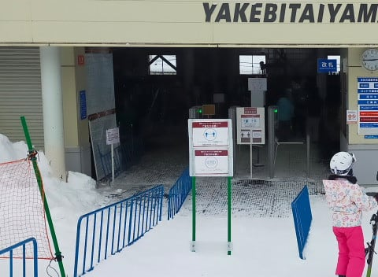

# 志賀高原は18日も雪が積もるけど，20日がすごく積もりそう！…そして2022/1/16(日)志賀高原焼額山スキー場追加レポート

📅 投稿日時: 2022-01-18 00:15:39

えー．

今日も志賀高原特派員から情報が

送られてきましたが．

本日の志賀高原，雪はぱらついたものの

朝までの積雪は3-4cm程度だったようで…

気温も激冷えではなく，最低で-10℃を

下回らなかったようですが…

でも，昼間も雪が降り続き，

昼間に10cmほど積もったようです！

で．

本日から雪降りの志賀高原．

この雪はこれからしばらく続きますが…

17日深夜現在，かなりの勢いで雪が

降ってます！

麓の上林でもこんな降りなので…

明日の朝までにはそこそこ

積もりそうです！

([北信建設事務所道路状況](http://hokushin.pref-nagano-roadcamera.jp/)ページより）

18日の火曜日の850hpa図を見ると．

水色の-12℃線がまた志賀に近づいて

いるので…

これは，朝は-15℃クラスの激冷えデー！！

そして，地上天気図を見ると…

見事な縦縞冬型で，志賀高原にも

降るパターン！

志賀高原，明日の朝は脛パフくらい．

もしかすると膝パフくらい行くかも？

ただ，500hpa気温図を見ると．

大雪の目安，赤い-30℃線は志賀高原に

かかっているものの．

前回14日の時のように，ドカ雪の目安の

-36℃線がかかっていないので，

道路の圧雪が間に合わないほどの

ドカ雪にはならないと思います…

あと，風もそこまで強くないので．

奥志賀ゴンドラとかは微妙だけど，

焼額ゴンドラは止まることは無いと

思います…

でも．

この18日の積雪は，たぶんかわいいものなのだ．

19日も雪は積もるけど，この日もたぶん

朝の積雪は20cmくらい．

それに続く20日が，すごいことに

なりそうな天気図なのだ…！

20日の500hpa図を見ると．

13日夜~14日のドカ雪の時と同様．

ドカ雪の目安，水色の-36℃線が志賀に

かかっているのだ！！

そして，この日の地上天気図も，見事な

縦縞で，日本海側に降水域がかかっている

冬型パターン！

それどころか．

また，能登半島より西側．

福井県のあたりにJPCZが突き刺さって

いるのが読み取れて…

これも，14日朝のドカ雪の時と同じ

パターンですね…！

だもんで．

降る．積もる．

20日は，またかなりの積雪になりそうです…！

とりあえず，

18日：朝は-15℃の激冷え．

　朝までに膝パフくらい．

　昼間も雪は降り続ける．

19日：朝は-12～13℃程度．寒い．

　朝までに20cmくらいかな？

　この日も昼間もひたすら雪が

　降り続ける

20日：朝は-12℃くらい？

　朝はドカ雪．太もも～腰パフ．

　この日も昼間もかなり積もる．

という感じで．

雪が積もる3連続デーとなり．

さらにラストの1日はすごいことになりそう…

で．

そのあとの週末，天気が回復しそうなので．

この週末もいいコンディションの予感…！

ここしばらく，週末に恵まれたコンディションが

続きますが…これはやはり．

私の日ごろの行いが神クラスに良かった

おかげです！！

皆さん，感謝してくださ…（トスっ）←読者からの刺客に背後から刺された音

ってなことで．

ここまでで普通のBlogの内容を超える

長さになってる気がするので．

普通のBlogならここで終わるところ…

しかし．内容が濃いこのBlog．

昨日速報レポートした16日日曜の志賀高原，

追加レポートに行くのだ！

…でも，記事が長すぎるので，

昨日の記事に写真を追加する程度の

追加レポートにてお送りします…

で．昨日レポートした通り，

すっきり晴天でスタートした日曜日．

あさイチのイチゴンから，見事な

シマシマバーンが見えます…

ぐぐぐ．早く滑りたいっ！！

あさイチの山頂気温は-8℃と，

水曜段階で予想した-6℃からは

2度ほど外しましたが…

この時期としては激冷えではなく，

ちょっと気温が高めくらいかな．

そして，ゲレンデは…

シマシマっ！！！

最高のシマシマ！！！

昨日は雪が降らなかったので，

夜の間に冷え込んだ雪がしっかり

圧雪されていて，

雪が軽いのに気持ちよく板が食い込む，

激烈な快楽バーン！！

すっきり晴天のもと，こんな最高級の

シマシマを滑れる日は，普通だと

シーズンそうそうないんですが…

今シーズンは，先週に引き続き

晴天最高シマシマが滑れるという

シアワセ！！

そして．

これだけ晴天の最高雪質なのに．

なぜか人が少なくて…

なんてシアワセなんでしょう…

昼前まではすっきり晴天だったのに，

写真を撮るタイミングによっては，

ゲレンデに誰もいないような

ガラガラ！

昼間は日差しもあったのに，雪は

終日緩まず，日が当たるバーンも

ずっと冷え冷え最高柔らか雪を

キープ！

さらにゴンドラ待ちも，午前中は

ゲートの外に出るか出ないかで．

午後は，1ゴン，2ゴンともせいぜい

搬器数台待ち程度のガラガラ具合！

今日って平日だったっけ？

と勘違いするレベル．

あぁ…

天気もいいし，ガラガラだし．

なんて恵まれてるんだろう…

と思っていたら．

　午後に向かって雲が増えていき，

　夕方は曇り空になる．

という，当たらなくて良い予想通り，

空にだんだん雲が増えていき…

午後2時頃には，朝の青空はどこへやら…

曇り空になってしまいました（涙）

うーむ．

昨日の「昼には晴れる！」という，

当たってほしい予想は外れたのに．

今日の「午後から曇る！」という

外れてほしい予想だけ，なぜ当たるのか…（泣）

とはいえ，

真っ暗になって雪面が見えないほどの

曇り空というよりは，空もちょっと

明るいうす曇りで…

雲の合間から時折日も射す

タイミングもあったりしたので，

まぁ，そこまで悪い天気ではなく．

そして．

人も少なかったのもあり．

夕方の最終リフトまで，ひたすら大回り

板で滑ってられる，気持ちよい大回りが

可能なフラットバーンで．

え…？？

もう営業が終わっちゃうの？？？

まだあと1時間…いや，4時間…

いや，10時間でも滑っていたい！！！

という中．

残念ながら，16時の営業終了と

なってしまったのでした…

あぁ…一日はなんて短いのか…

しかし．

今日は良かった…

ほぼ丸一日GS板を履いてられるガラガラ＆

フラットバーンが続く日なんて，

そうそうないよ…！

こんな日が毎日，365日続いて欲しい…

と思った，Skier_Sだったのでした…←だから，7月とか8月までそんな気象が続いたらヤバいから！！

## 💬 コメント一覧

### 💬 コメント by (ゆあの父)
**タイトル**: Unknown
**投稿日**: 2022-01-18 09:34:03

先日はご一緒させていただいて、ありがとうございました。

娘も皆さんと滑るのが楽しかったようで、とっても喜んでいました。

ジャイアントスラロームコースも普段はあまり滑らないのに、めっちゃよかった！と言ってました。

Skier_Sさんのおかげです、ありがとうございました。

次は2月初めの予定です。シーズン終了までちょくちょくヤケビで滑っています。

もしもまたお会いした際は、是非よろしくお願いします！

### 💬 コメント by (スシネコ)
**タイトル**: Unknown
**投稿日**: 2022-01-18 12:34:45

この日はいろいろとお世話になり、ありがとうございました。

板を変えるだけで、別のスキー場に来たような世界が広がっていました。

世界が変わる、といえば、Ｍ大先生からいただいたご指導とお言葉の数々。「相田みつを」も超越したジワジワ感に陶酔してしまい、すっかり入信してしまいましたw

１ゴンレストランもパノラマビューでいいものですね。あれだけ滑るとアドレナリンが出まくって危険な道に入りそうですw

次回もよろしくお願いします。

p.s.ゆあの父さん

ご一緒させていただきありがとうございました。

ゆあさんともお話させていただき、とても楽しかったです。

またお会いした際には、よろしくお願いします。

### 💬 コメント by (レインボー74)
**タイトル**: Unknown
**投稿日**: 2022-01-18 15:37:29

火曜日の杉ノ原情報

ロングラン4kmの40cmパウダーづくめの反省記です。

今日は新雪滑りの何かを会得した気分で、と～っても気持ち良く滑っていました。

ところがそのうちにゴーグルが凍りだして視界不良に。ドライヤーもないし、最後の一本は、怖くなって止まると鉛直が分からずコテン。その繰り返しで辛いエンディングでした。

なぜ転んでもいない私だけに？

どうもゴーグルのベルトがゆるゆるだったせいみたい。中に雪が入ってくるし。妙高の雪だし。

どうも皆さんはもっときつくしめてるそうな。勉強になりました。

### 💬 コメント by (かず)
**タイトル**: Unknown
**投稿日**: 2022-01-18 21:06:28

ここってSさん限定にする方法ってあります？

### 💬 コメント by (さち)
**タイトル**: Unknown
**投稿日**: 2022-01-18 21:55:59

今週末生きてたら志賀高原参戦しまーす。

古巣泊まりです。

うちのこ登れなくなるのであまり冷えないで欲しいです…

### 💬 コメント by (Skier_S)
**タイトル**: 20日朝はそんなに積もらなさそう…
**投稿日**: 2022-01-19 03:40:49

＞ゆあの父さま

週末はお世話になりました~！

ヤケビオールスターズ爆走組にしっかり混ざってましたね（笑）．

次は2月にお会いしましょう！

…コロナの状況が悪くならないことを祈るばかり…

＞スシネコさま

危ない！

かなり危ない世界に足を突っ込んでます（笑）．

危ない人たちがいっぱいいるこっちの世界を除いてしまうと，

もう元の世界に戻れません…

一般人と滑るスピードや休憩のペースが合わせられなくなり，

他のスキーヤーと滑れなくなります…

＞レインボー74さま

今日はやっぱり杉ノ原だったんですね．

40cmパウダー，膝~太ももパフですか．うらやましい…！！

＞かずさま

ないんですよ…

今度連絡先交換しましょう！！

（なんで今まで連絡先交換してなかったんだろう…）

＞さちさま

おっと．今週末参戦ですか！

土日は降らないと思いますが，金曜は結構降るので路面は本格積雪ですよ～！

### 💬 コメント by (ゆあの父)
**タイトル**: Unknown
**投稿日**: 2022-01-19 11:22:04

次は2月の予定ですが、今週末も行きたくてうずうずしてます(笑)

スシネコさま、こちらこそご一緒頂いてありがとうございました。尾瀬岩鞍のお話なつかしかったです！

またお会いできるの楽しみにしています！

### 💬 コメント by (Skier_S)
**タイトル**: ＞ゆあの父さま
**投稿日**: 2022-01-20 00:48:30

今週末もぜひ来てください～！

コンディション良さそうですよ！

