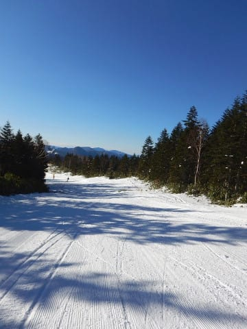
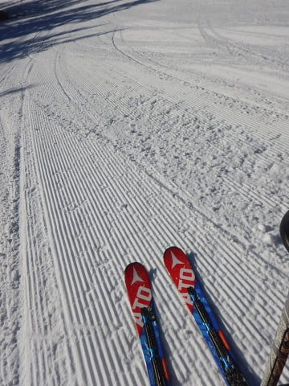
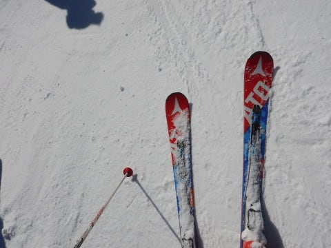
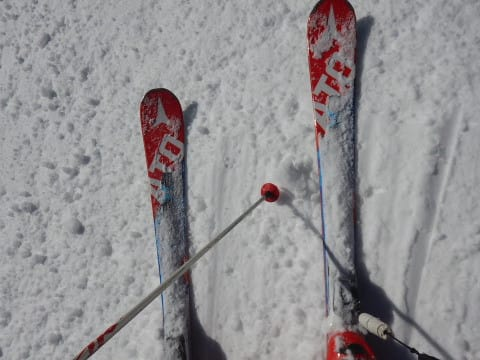
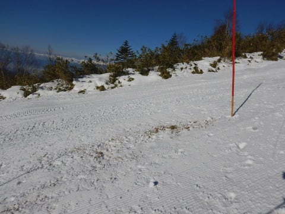
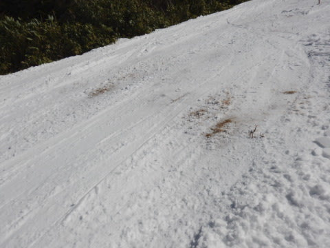
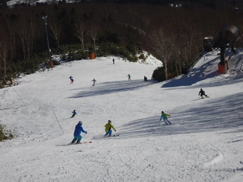

# 12月3日（日）の焼額速報モード…終日晴天！でもコース上にかなりブッシュが増えたよ（涙）

📅 投稿日時: 2017-12-04 00:32:37

ということで．

本日も焼額を滑ってきたわけですが．

…今日もいつも通り，帰宅は深夜ですね（涙）

だもんで．

日曜深夜定番，速報モードにて…

えー．

まず．

今日は朝から，すっきり晴天っ！！

そして，ゴンドラ山頂に登ると…

朝イチはシマシマ！

…なれど．

人工雪が打ってある部分は，ところどころ

ちょっと硬めのゲレンデに…

で．

今日は終日晴天で．

そのうえ，昼間の気温はプラスにまで上がったので．

人工雪でない部分は，ちょっとしっとりした

感じの雪になってきました…

だもんで．

人工雪が打ってない部分，

第2ゴンドラ側コースの上部，

パノラマコース部分は…

ありゃ？？

ありゃりゃ～！！！

うーん．

今週はしばらく雪が降ってなかったので，

ちょっと雪が足りなくなってきたか…？？？

もう一降り無いと，ゴンドラ山頂付近は

ちょっと厳しい状況になってきた感じ…

まぁ，コース自体はそれほどひどく混まず．

ゴンドラ待ちもほとんどなかったので．

絶好のスキー日和の晴天の中，結構楽しめたんだけど…

この，山頂近くのコースのブッシュエリアがかなり

危険な状態になってきたのが残念…

とりあえず．

明日また詳細レポートやります～！！

今日は眠いので，おやすみなさい…

## 💬 コメント一覧

### 💬 コメント by (かず)
**タイトル**: 今週雪予報ですけど
**投稿日**: 2017-12-04 12:29:47

ゲレンデ復活しそうですかね？

### 💬 コメント by (ノムノム)
**タイトル**: 凄い体力に敬服します
**投稿日**: 2017-12-04 22:08:18

はじめまして。昨シーズンよりオフシーズンも含めブログ拝見させて頂いてます。スキーとクルマが大好きなノムノムと申します。

2日続けての志賀高原さすがですね。睡眠時間も削られているようですが大丈夫ですか？泊まりは車中泊でしょうか。

当方は正月休みを利用して焼額デビュー予定です！幸先の良いシーズンイン期待できそうですね～。

### 💬 コメント by (Skier_S)
**タイトル**: 今週末は日曜日帰り
**投稿日**: 2017-12-05 01:24:29

＞かずさま

冷えて雪は降りますが…

ドサドサとは降らなさそうです（残念）

志賀高原では，パウダーは望み薄です．

でも，ブッシュが隠れる程度には

積もってくれるのではないかと…

＞ノムノムさま

初コメントありがとうございます～！！！

私はスキーの時はちゃんと宿に泊ります．

ただでさえ平日は睡眠時間が短いので，

土日は布団でしっかり寝ないと…

ナイターをやってる時は，必ずナイターまで

滑ってしまうので，車中泊は厳しいです…．

正月に志賀高原ですか！

私は焼額第1ゴンドラをグルグルしているので，

焼額第1ゴンドラ前で15分待てば

かなり高い確率でSkier_Sを確保できます（笑）

この正月が初滑りですか？？

また，志賀高原でお会いしましょう～！！

