# 4月6，7日の週末の志賀高原の天気は…土曜は曇りのち晴れで，意外と冷えて良さそう．日曜は晴れて暖かい春スキーの一日

📅 投稿日時: 2019-04-04 01:38:06

🏷️ カテゴリ: [スキー天気予想](c6554f5c3c106093b511a8daae23757e8.md)

えー，

もう，4月に入ってしまい．

志賀高原も完全春営業モードに入ったわけで．

リフト料金も，春料金で安くなったり

するわけですが．

焼額山の，春営業の情報を見てみると…

うーむ．

焼額山第2ゴンドラ．

今週日曜で営業終了ですね（涙）

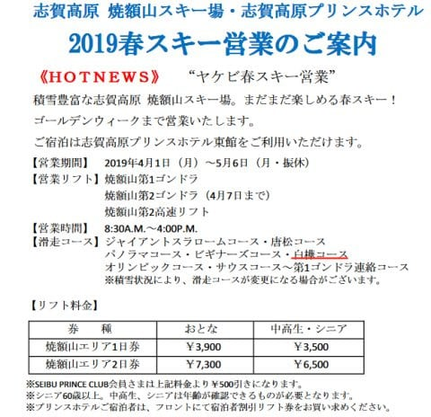

（焼額山HPより）

この案内では，白樺コースが春営業でも

オープンしているように書かれていますが．

でも，4月になってから，

こんな案内が…

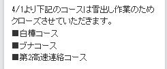

雪出しのため，白樺＆ブナコースは，

4/1よりクローズですか！！！（泣）

…残念…

そして．

レストラン営業は…

えええ！？？

これからGWまでの期間は，

東館レストランのみ！？？

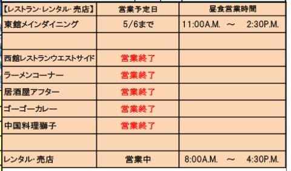

他のレストランは，西館レストランも，

ラーメンコーナーも．

全部終了しちゃってるみたいです…（涙）

うーむ．

東館のみだと，お値段も高いし．

席数も少ないし．

ちょいとイマイチな感じがするのは，

気のせいか…

まぁ，私はあんまりゲレンデで昼ご飯を食べないから

いいんですけどね．

ってなことで．

水曜恒例．

第2ゴンドラ営業が最終となる，この週末の

志賀高原の天気予想！

えー．

まず．

週末の前．

4日木曜日の850hpa気温ですが．

うむ．まだ0℃線は志賀より南で．

志賀には，水色の-3℃線がかかるくらいなので．

この日も朝は冷え込みが続きそう！

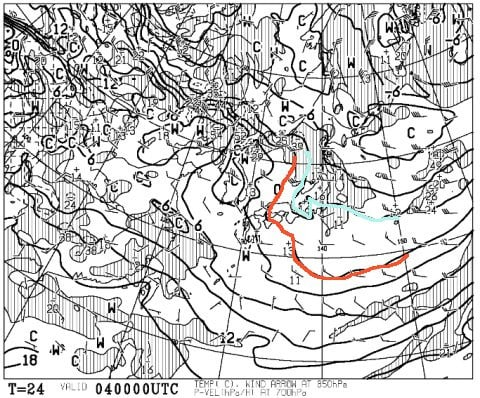

天気は晴れそうなので…

昼間はちょっと晴れて気温が上がり，

雪が緩みそうなので．

この日の午前中までは，絶好のスキー日和かな！

そして．5日金曜の，850hpa図は．

うーむ．

この日は，赤い0℃線は津軽海峡近辺．

かなり北まで上がっちゃいますね（涙）

志賀には水色の+6℃線が近づいてる

レベルなので…

金曜の志賀高原は，昼間は+5℃まで

上がりそう…（泣）．

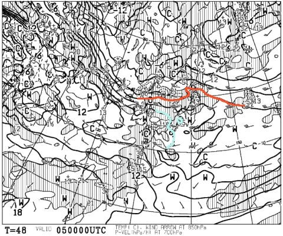

この日の地上天気図を見ると．

うーむ．日本海側に降水量が

予想されていますが．

降り始めは夕方ごろで．

標高は低いところは雨．

山頂付近はみぞれっぽい感じかな…

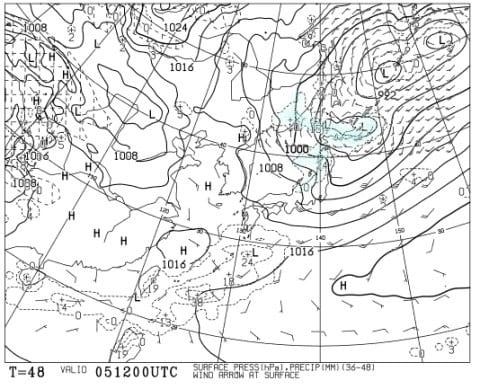

夜になると冷え込み，本格的な

雪になっていく感じでしょうか…

とはいえ，

あまり積雪量はなさそうですが…

あと，金曜はちょいと風が出て，

荒れ気味の天気になりそうなので．

奥志賀ゴンドラはヤバいかも．

そして肝心な週末．

6日土曜日の850hpa図ですが．

をを！！！

赤い0℃線が太平洋側まで南下してますよ！

それどころか，水色の-3℃線が志賀高原を

覆ってます！

この時期にしては，かなり恵まれた

今コンディションになりそう…

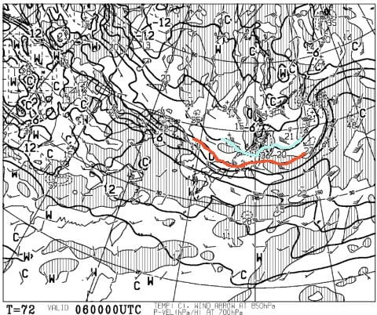

そして．

この日の地上天気図も，

微妙だけど，冬の縦縞っぽい

等圧線が志賀高原に入ってますね．．．

そして，降水域が日本海側にかかってます．

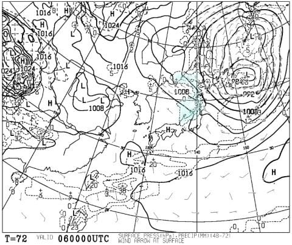

だもんで．

夜中～早朝にかけて，雪が降り積りそうですが．

昼間は止んで，いい天気になるんじゃないかな…

で．

次に，7日日曜の850hpa気温図を見ると．

うがぁ！残念！！

赤い0℃線は津軽海峡付近．

そして，志賀には水色の+6℃が

近づいてます…

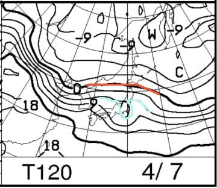

そして．

地上天気図も，降水域が志賀にかかっておらず．

晴れそうな感じですね…

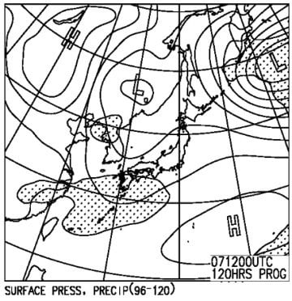

この時期に晴れると，日差しで雪が

一気に悪くなるので．

うーむ．

今日までと違って，この週末．

やっぱり春の雪になっちゃいそう

ですね…

とりあえず．

まとめると．

4/6（水）：朝は-5℃程度と，意外にもそこそこの

　冷えこみでスタート．

　朝イチは，曇か，雪がわずかに舞う程度の天気．

　前日夜から明け方にかけ，うっすら積もった

　雪が圧雪されていて，

　朝イチは硬めの下地にうっすら柔らかい圧雪が

　乗った感じで，まぁ滑り良いか．

　午前中から晴れていき，昼間の気温は

　+3℃近くまで上がるか…

　日中は日差しもあり，表面の雪はちょいと

　しっとりした感じの，春の雪になっちゃいそう．

4/7（日）：朝から晴れそう！

　ただ，朝から気温は-1～-2℃程度と高めで，

　早朝は多少締まったバーンコンディションだけど．

　昼間は+10℃近くまで気温が上がり，

　日差しと相まって，雪はかなり春っぽい感じに

　緩みそう…

　夕方になっても気温は高く，

　緩んだ雪が締まらないまま…

　

ってな感じで．

土曜はそこそこ冷えるけど，

日曜はぐんぐん気温が上がりそうで．

ちょっと残念な感じ…

ただ．

8日月曜，9日火曜の850hpa図を見ると…

ををを！！！

0℃線は関東より南にまで下がり．

また，月曜から冷え冷えになりそう！！

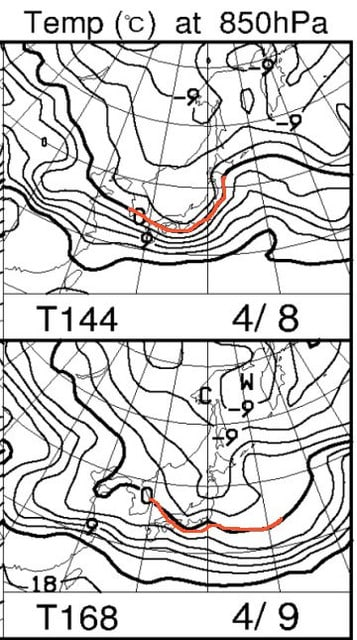

地上天気図を見ても．

月曜はちょっと雪が降りそうなので．

そこそこ滑り良いかな？

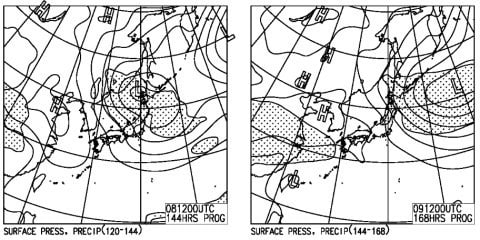

月曜夜から火曜朝にかけても，

運が良ければうっすら積雪が

ありそう…！！

次の月火も，冷え冷えですよ～！

…しかし．

なぜ．

今週も，来週も．

週末が終わってから，冷えて雪が降りそうな

天気になるんだろう…（涙）．

週末に冷え冷えだったらいいのに…

まぁ．

平日も暖かい日が続いて．

雪がガンガン消えていく…

というのに比べれば，まぁ

恵まれてるんだから．

許してやろうか…←だからなんでいつもそんな上から目線？

## 💬 コメント一覧

### 💬 コメント by (若杉勲71)
**タイトル**: Unknown
**投稿日**: 2019-04-04 09:02:13

志賀高原情報

盛期に負けない雪。最高ですよ。

パノラマ、オリンピック、ベスト。

いまから奥志賀に向かいます

### 💬 コメント by (若杉勲71)
**タイトル**: Unknown
**投稿日**: 2019-04-04 10:47:03

エキスパートうはうは。四本もやった。まさにベスト。ダウンヒルも気持ちいい。まあヤケビに戻ってきました。

恐るべし四月。山菜と渓流から戻ってきて良かった。皆さんの情報のおかげです。

### 💬 コメント by (若杉勲71)
**タイトル**: Unknown
**投稿日**: 2019-04-04 12:11:25

ファミリーもいいし、ここはまさに、天国？パラダイス？極楽？ユートピア？（ボキャブラリーがここで・・）

これでチウホテルのビーフシチューが

と思ってウハウハ向かうと、なんとたんねのリフトが・・

やむなくファミリーの蕎麦屋にしたら、木曜日は休みなんだよね。自販機のビールもないし、ジュースとカップヌードルどは・・。

全てが揃ってこそのパラダイス。世の中甘くないや。

### 💬 コメント by (若杉勲71)
**タイトル**: Unknown
**投稿日**: 2019-04-04 15:28:52

ファミリーもやめられなくて5本。その後ヤケビに戻ったら、M場ファミリーとばったり。そのあとお孫さんと滑った私の閉店が、なんと２時半！

なんということでしょう。レインボークラブの創始者たる者が・・

世間様にとても顔向けできたものではありません。

### 💬 コメント by (Skier_S)
**タイトル**: 若杉さま
**投稿日**: 2019-04-05 01:31:59

一週間ぶりの志賀復活でしょうか！？？

お帰りなさい～！

今日はコンディションよく，楽しめたようですね．

パラダイス＆極楽＆ユートピアですか…

うらやましいです．

金曜は気温が上がって，風が強くなりそうなので．

奥志賀はヤバいかも．

うーむ．

週末までこの雪質持ってほしかった…（涙）

### 💬 コメント by (ほっぽ)
**タイトル**: Unknown
**投稿日**: 2019-04-05 11:52:33

平日スキーサイコーです❗😃⤴️⤴️

11時までは締まった滑走性の良い雪でした。

### 💬 コメント by (musi)
**タイトル**: Unknown
**投稿日**: 2019-04-05 15:04:00

今日も午前中は良かったんですね。

昨日余りに楽しくて、延泊を子供にオファーしてみたんだけど、お母さんが居ないからと、断られて泣く泣く帰京。平日は渋滞も無く、長野県が近い事。満ち足りて

今日は、三菱のディーラーで奥に落ちた横滑り防止装置キャンセルボタンを直して来ました。

「はい、直りました」「優しく押して下さい」

うーん。押し方の問題なんだ。

### 💬 コメント by (はやと)
**タイトル**: Unknown
**投稿日**: 2019-04-05 22:47:21

昨日、日帰りでヤケビに行って来ました。

平日限定のミニファーストトラックに参加して一番搬器に乗車（たぶんＨさんご夫妻？と同乗）し、ＧＳコースのファーストトラック滑走しました、シマシマ柔らかバーン最高でした。

また、昼前にファミリーの蕎麦屋で休憩していたら、若杉さん？（若杉さんのコメントと一致しているのでたぶん）がいらっしゃってトイレで用足しご一緒しました。

Ｓさんの予想通り午前中は良かったのですが、手入れの悪さもあって板が滑らず昼すぎには撤収しました（レインボークラブに及ばずです）。

ＧＷまでにゲレンデ状況が良ければもう一度行きたいと思っていますので、天気予想よろしくお願いします。

＊Ｈさんご夫妻・若杉さん、今度お会いしましたらお声がけさせて下さい。

### 💬 コメント by (Skier_S)
**タイトル**: 週末は春スキーの陽気
**投稿日**: 2019-04-06 00:19:42

＞musiさま

金曜も，朝イチは良かったようです．

まぁ，昼前には緩んじゃったようですが…

でも，木曜楽しめてよかったですね．

ボタンはすぐ直ったんですね（笑）．

＞はやとさま

今日日帰りですか！

もう一日早ければ，雪が貼りつくこともなく，

コンディションいい雪だったんですけど，

ちょっと惜しかったですね．

Hさんは先週末でシーズン終了したので，今日のゴンドラ1番は

違う方かと思います…

もしかしたら，yumiさん夫妻かな？？

若杉さんは今日滑ってらしたようなので，ご本人かもしれません．

GWまでまだまだ滑れるので，また志賀高原にお越しください～！

### 💬 コメント by (yumi)
**タイトル**: Unknown
**投稿日**: 2019-04-06 05:14:12

ピンポーン☺️

### 💬 コメント by (Skier_S)
**タイトル**: ＞yumiさま
**投稿日**: 2019-04-08 01:49:27

やっぱりそうだったんですね（笑）

