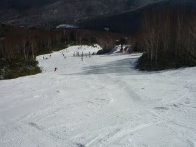
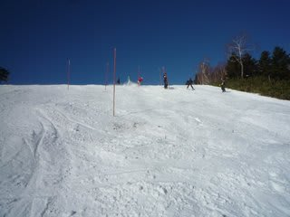
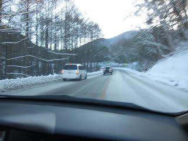
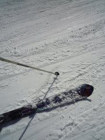
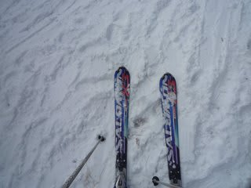
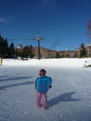
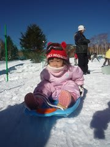
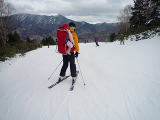
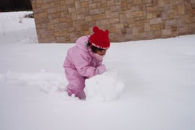
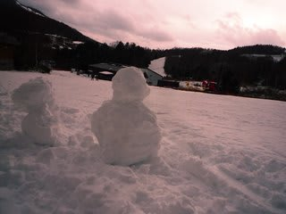

# 焼額レポート

📅 投稿日時: 2010-12-14 00:46:31

12月11，12日　志賀高原焼額山

気温：11日は最高プラス5度．あったかい．12日は最高マイナス3度．

天気：晴れ．日曜午後は曇り

雪質：朝は良かったけど…昼は3月ごろの雪質．

積雪：ゴンドラコースは20cm弱？？薄いよ！4ロマ沿いは十分．

リフト混雑：ゴンドラ15分（涙）

路面状況：11日朝は，雪道っつーより氷道．すべるよっ！！！！！ 

というわけで．

この週末，わがホームゲレンデ焼額へ行ってきたのですが．

はっきり言って，積雪的には

「もう一声！」って感じですね～．

人工雪をつけてある第4ロマンス沿いコースは

幅の広さもコースいっぱい，積雪も土が出る心配なく文句なし

なのですが，

第2高速沿いは人工雪がついているのがまだコース幅半分．

ちょっと雪が荒れ気味で，ごろごろした感じで快適度はちょっと

低いですね…

ゴンドラは，滑れるものの昼過ぎにはかなりブッシュが顔を出す

コンディション…

混雑的には，第2高速は終日リフト待ちがなかったので，

まだましなほうでしょう．

しかし，土曜はゴンドラが動かなかったので第4ロマンスが10分待ち，

日曜はゴンドラが朝イチから10分ほど待ち時間があり，

10時には15分以上の待ち時間．

10時半過ぎに緊急で第4ロマンスを動かしてからは，

5分待ちほどに短縮．

昼には待ち時間0．

って感じ．

道路は…

土曜の朝は．

積雪路面じゃなく，凍結路面．

ところどころブラックアイス．

登れなくなってる車が数台ありましたね～．

日曜の午後には，普通の溶けかけの積雪路面に

なってました．

土日とも，気温は結構高く，

土曜はプラス5度近くと，この時期の志賀高原では

「ちょっとまずいんじゃない？」という感じ．

日曜はそこそこ冷え込みましたが，日差しがあったので

マイナス3度という気温よりはあったかい感じ．

朝は雪質が良かったのですが…

どちらも，昼ごろには南向きの第2高速のコースの雪は

ちょっと重めの3月ごろの雪質になっちゃいましたね～．

しかし．

今回．

晴天であったかかったので．

娘はゴキゲンで遊んでましたね…

という感じで．

今シーズン，こんな風に子供を背負って滑っている

人を見たら，それは多分私です…

（娘製作の雪だるま）
