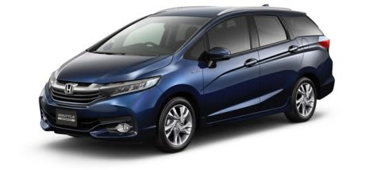

# ホンダ　シャトルに乗ってみた…試乗レポート

📅 投稿日時: 2015-07-10 02:03:12

🏷️ カテゴリ: [車試乗](c07dec5709d34bd74e1f6cb9c8291061b.md)

えー．

いつもながら．

スキーシーズンが終わって．

この時期は，車の試乗をガンガンするわけですが．

今度は，ホンダのFITベースのワゴン．

シャトルに乗ってみました．

（ホンダHPより）

今度のモデルから，FIT Shuttleではなく，FITがとれて

単なるシャトルになった，この車．

今回試乗したのは，ハイブリッドのモデルです．

エンジンや足回りは基本的にFITベースにみえますが…

内装の造りは，ちょっとFITより高級な感じ．

…荷室は当然，FITよりかなり広い．

…ってか，このクラスのワゴンとしては，

もう十分に広いでしょう！

リヤシートの広さは…オリジナルのFITと

変わらんかな．あんまり．

リヤシートは比較的高めに座らせるシートだけど．

ちょいと座面が固めかな．

とりあえず．

ドライバーズシートに乗って，走り出してみましょうか…

ステアリングフィールは，FITよりもしっとり感があり，

電動パワステのできは結構良さそう．

でも，ブレーキは回生が強烈に効くのか．

慣れていないといきなりのカックンブレーキ気味に

なるのでご注意．

…慣れれば大丈夫ですが…

で．

加速感は．

まぁ，街乗り領域では十分かな．

加速時に適度なモーターアシストでするする

加速する感があり．

CVTではない，DCTの変速感も全く感じず，

かなり滑らかに走ります．

FITもマイナーチェンジして良くなったのかもしれませんが．

街乗り領域での走りの滑らかさ，エンジンの静かさ，

変速ショックの無さ，エンジンOn/Offのスムースさは

なかなか良い感じ．

…ただ．

全力加速時には，エンジンパワーを思いっきり使うためか．

割と低いギアでエンジンが一生懸命回転数を上げていくので．

モーターアシストが効いて，余裕トルクで加速していく…

というより．

「1.5Lのエンジンが頑張ってます！頑張ってます！」

という感じで．

まぁ，速いんですけど，エンジン回転数がガンガン

上がっていくのが，速さ感をちとスポイル．

いや，実際は，そこそこ速いんですが．

あとは，エンジンOFFの減速時，フロントからの回生発電の

モーター音が目立つのも，

「ああ，ちょっと惜しいな」

という感じ．

＃全然致命的ではなく，許容範囲です…．

…今回の試乗は，街中だったので．

コーナーを攻めた時の挙動なんかはわかりませんでしたが．

とりあえず．

まぁ，街中を走るには．

これで十分なんじゃないかな？？？

って感じで．

あと，ハイブリッドでも4WDがあり，燃費もかなりいいし．

トランクは見た目のコンパクトさから想像するより，

かなり広いし．

これで，高速道路を長距離走って疲れないようなら．

まぁ，燃費のいいスキー車を求めている人には，

一つの解かも…！？？

と思いました．

…ただし．

FITと共通のドアを使ったことからくる，

このデザイン．

…うーん．もう少しなんとかならんかったのか…

## 💬 コメント一覧

### 💬 コメント by (M)
**タイトル**: Unknown
**投稿日**: 2015-07-10 10:01:53

リヤシートの座面、FITと同様に立てられますよ。

### 💬 コメント by (Skier_S)
**タイトル**: Mさま
**投稿日**: 2015-07-11 01:43:59

ああ！

そうなんですね！

リヤシート，立てられるんですね…

カタログ確認したら，確かにチップアップ＆

ダイブダウンリアシートと書いてありました．

記事の当該部分は削除しました．

ご指摘ありがとうございました～！！！！

