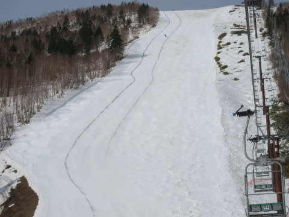
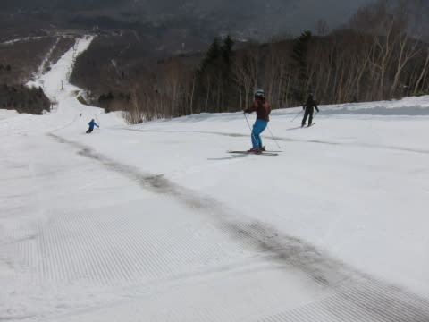
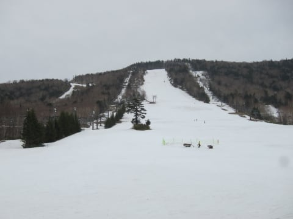
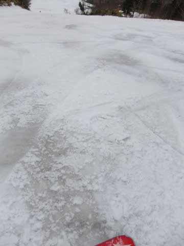

# やっぱり1泊2日！4月10日の志賀高原速報モード…気温は高めで，なんだか終わりげな感じ（涙）．

📅 投稿日時: 2016-04-11 00:48:22

🏷️ カテゴリ: [2016スキー滑走日記](c70c67ed5248e9432b899dcd5747048bb.md)

えー．

そうです．

その通りです．

引っ越しのドタバタが落ち着いていないというのに．

バカな私は，多くの方の予想通り．

1泊2日で志賀高原へ行ってましたよ．

ええ．

バカですから．否定しません．バカですよ～！←開き直っている

でも．引っ越しのドタバタがあるから．

今日は早く帰ろう…

と思っていたのですが．

かなり想定外なことに，ラストリフトまで滑ってしまい．←…いや，多くの人の予想の範囲内だから

さらに帰宅途中．

中野市街のホームセンターで，

引っ越し後に必要になったものを大量に買い込んで，

帰宅後にそれらを設置していたら．

…やっぱり，今日も深夜になっちゃったので（涙）．

今日も速報モードにて…

えー．

本日ですが．

昨日の朝，すごい良かったから，

今日も奥志賀スタートだ！

と，奥志賀高原スタートにしたわけですが…

うむ？

「圧雪車の故障でコース半分のみ圧雪」

だと？？

コース半分ってより，この左側，

圧雪車2台の幅だけしか圧雪されてないんですが…（涙）．

それも．

圧雪跡には，圧雪車がオイルを撒きながら走ったのか．

黒い筋状の汚れが…（悲）．

圧雪車の幅2本だけでは，全然楽しくない…（残念）．

人も多めで，コースはすぐに荒れ始め，

昼ごろには，エキスパートコースはなんだかヤバげな

雰囲気に…

午後は一の瀬ファミリーへ移動しましたが…

夕方には，正面バーン上部もマズそうな雰囲気に…（泣）．

…これは，ヤバい．

正面バーン上部は，もって来週までか…（激涙）．

ってことで．

なんだかヤバそうな感じになってきた志賀高原ですが．

また明日，詳細レポートします～！

## 💬 コメント一覧

### 💬 コメント by (Goku)
**タイトル**: Unknown
**投稿日**: 2016-04-11 03:58:13

うわわわわわー!

これはひどい

悲しすぎる。

### 💬 コメント by (マルハバ)
**タイトル**: 本日、かぐら　に行ってきました
**投稿日**: 2016-04-11 18:36:42

3月末で終了させたはずのシーズンでしたが

Sさんの天気予報記事を見て1日限定で急遽復活！

今日のかぐらは朝から午後3時の撤収まで

間断なく雪が降り続いていました。

さすがにメインバーンは新雪とアイスバーンの

まだら模様でしたが、緩斜面のゴンドラコースや

田代エリアはアイスバーンが隠れるくらいまで

積もりましたよ。

雪質はハイシーズン並みの良さでした、

ゆえにかなり寒く

個人的には今シーズンで一番寒かったスキーでした。

もしかすると志賀も降ったんじゃないでしょうか？

### 💬 コメント by (Skier_S)
**タイトル**: 志賀も雪
**投稿日**: 2016-04-12 02:04:29

＞Gokuさま

いや…

ひどい．

ひどいです．

でも，今日は雪が積もったようです…

＞マルハバさま

お！

かぐら，行ってきましたか．

アイスバーンと新雪のまだら，ちょっと

滑りにくかったかもしれませんが…

ここしばらくのひどい雪の状態から考えれば，

結構良かったのかと…

志賀も雪が降ったようです．

これで，今週末の足しになればいいんですが…

