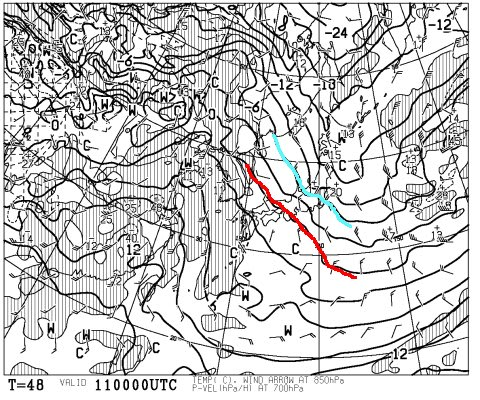
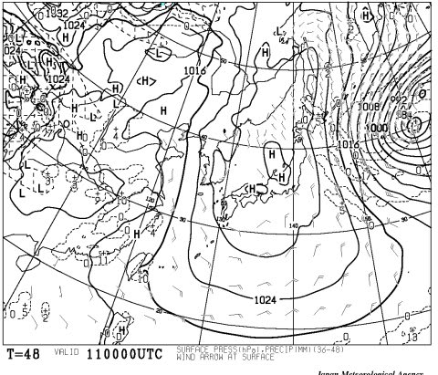
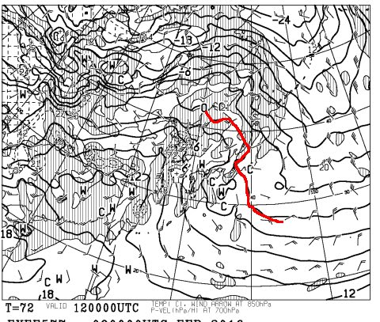
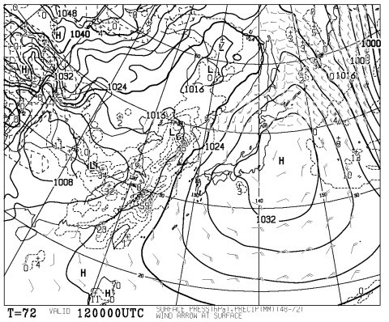
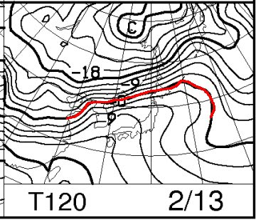
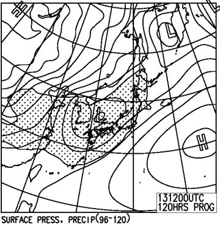
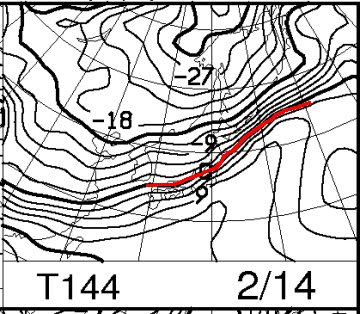
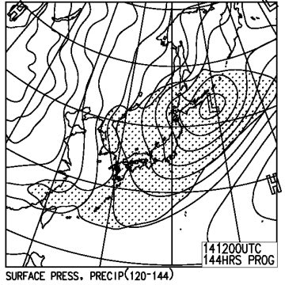
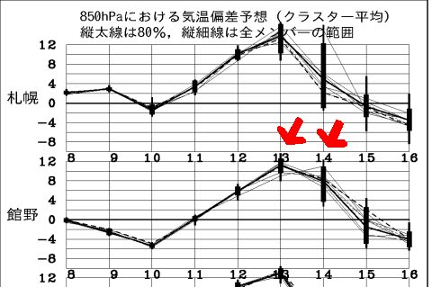

# 2月11日祭日＆2月13，14日の週末の志賀高原の天気は…11日はまぁまぁだけど，土日はダメっぽい…（涙）

📅 投稿日時: 2016-02-10 00:44:21

ということで．

昨日予告した通り．

本日は，みなさんの願いが詰まったハイパー冷え冷え踊りの効果が出たのかどうか．

週末の天気図を見てみましょう…

その前に．

本日の志賀高原ですが．

冷え込んで，夕方から雪が降ってるようですね…

ってか，現時点でかなり降ってるようで．

…明日の朝は，パウダーが楽しめそうですね…

…平日の，明日は…．

今日降ったこのペースで明日も降り続けてくれれば．

明後日の祭日も，パウダーだっ！！！

…となるところですが．

…残念ながら，木曜の朝は，積雪がなさそうです…（泣）．

なぜ，祭日前の明日じゃなくて，今日に降るかな～（涙）．

ってことで．

祭日の11日，朝9時の850hpa気温図を見てみると．

こんな感じで，志賀高原には水色で書いた-6℃線がかかってます．

まぁ，11日の朝はそこそこの冷え込みで

スタートしそうですが…

うーむ．

赤で書いた0℃線が，西から迫ってますので．

気温は上がっていく方向ですね…

そして，11日の朝9時の地上天気図を見ると．

…見事に，高気圧に覆われてますね．

で．

降水域が本州上空にほとんど予想されていないので．

11日祭日の朝は，平年並みに冷え込むものの，

積雪は無し（涙）．

基本的に晴れの一日になりそう…

午後に向かって気温は上がっていくかな？

まぁ．

でも．

この日は天気も良く．

朝は冷え込んで雪質もそこそこいいので．

いい感じのスキー日和でしょう．

で．翌12日の850hpa気温図を見ると…

うううう～む…

やばい感じ…

0℃線は志賀より東へ行き．

朝から志賀高原の気温は高め．

昼間にはプラス気温になってしまいそう…

そして，12日の地上天気図は．

この日もすっぽり高気圧に覆われて，全く降らなさそう…

…ただ．

西から，ひたひたと．

危険な感じの低気圧が近づいてきてます…

それで，だ．

問題の13日，土曜日だ．

この日の850hpa気温は…

はうぁっ！！

ダメだっ！

やはり，志賀高原に+9℃線が…

そして，地上天気図は…

どかーーーん！！

ダメだ…

降水域の網掛けが…っ！！

…このままの天気図なら．

土曜は間違いなく雨です．

どうあがいても雨です．

転がっても飛び跳ねても雨です．

雪にはなりません…（涙）．

そして，14日の日曜の850hpa気温を見てみると…

うーむ．

夜9時の850hpa図で，何とかぎりぎり志賀高原に0℃線が

かかってますが．

昼間は，0℃を上回る感じですね…

で．地上天気図は．

…この日も日本全域に降水域が…

で，850hpa気温から考えると．

この日も，昼間は雨です…（激烈な涙）．

なんてこった…

このままの天気図では．

足が遅い低気圧が通過する土日の2日間．

ずっと雨になりそうじゃないかっ！！！！（止まらない涙）

なぜ，今日はすごく冷え冷えのいい雪が積もっているというのに．

週末狙ったかのように，土日とも雨になるのか…（泣）．

一体，何の報いか．

土日の13，14日の気温傾向はこんな感じで．

見事に土日の2日間狙ったように，平年比+10～12℃という

レベルの超高温が予想されています（泣・泣・泣）

…ってことで．

大変悲しいことに．

ハイパー冷え冷え踊りの効果は，全く出ていないようです…（涙）．

とりあえず．

簡単にまとめると．

木曜（祭日）：朝はそこそこ冷えた，いい感じの柔らかい圧雪．

　朝イチは最高！天気は一日晴れ．午後はちょっと気温が上がるか…

　でも，終日そこそこの雪質をキープ．いい感じのスキー日和．

金曜：朝イチはしっかり締まった圧雪．

　午前中から気温は高め．昼間はプラス気温で暑いくらいになり，

　雪が2月中旬と思えない感じにしっとりと重くなっていくかも．

土曜：朝から気温は高め．朝は曇り．どのくらいの時間から

　降り出すかわからないけど…おそらく午後は雨．

　気温は+10℃近くと，とても2月の志賀高原と思えないレベルになり．

　最悪の終末週末を迎えるでしょう．

日曜：土曜から雨が降り続く．朝から雨．雪はすごい勢いで溶けていく．

　朝からドボドボした雪．午後に雨から雪に変わる．

　現時点では雨から雪に変わるタイミングは正確に読めないけど…

　運が悪ければ夕方まで雨．午後は風も強く荒れ気味かも．

…って感じで．

2月としては，わが人生最悪の天気予想です…

…

…ダメだ―っ！！

だめだっ！！！

こんな天気になるとは，信じないぞっ！！

土日2日間雨なんて，許さないぞっ！！

みんなの力を合わせて，土日の天気を変えるのだっ！！

…これから，昼も夜も，寝る間も惜しんで．

休むことなく．

もっと激しく踊るのだ～っ！！

スーパーエキストラハイグレードパワーアップ版ハイパー冷え冷え踊りをっ！！！！！←もう何が何だかわからない

## 💬 コメント一覧

### 💬 コメント by (はなげ親分)
**タイトル**: 強風が吹いてます
**投稿日**: 2016-02-10 14:02:18

昨日の夕方からの、吹雪が朝方迄続いたようで、積雪は30～50センチというところでしょうか。吹きだまりは胸近く迄ありそうです。

あまりの風の強さに負けて、西舘へ移動します。(今季最高の雪質なんですけど)

明日は

晴れたら、悶絶快適バーンが期待されます!!

### 💬 コメント by (びわ湖)
**タイトル**: Unknown
**投稿日**: 2016-02-10 17:37:20

S様 お疲れ様です。天気図を見ますと私の

ホームは明日で最後の気がします。年一回来ます

スキーヤーで一杯になる予感がします・・・

明日はラスト？楽しみます。

### 💬 コメント by (いか)
**タイトル**: Unknown
**投稿日**: 2016-02-10 20:58:56

私は予定になかったのですが、1日八方のアルペンより上が運休の報を聞いて、急遽出動です。センター122、リバースキャンバーの2日目の出番です(^^)

ちなみに日曜日に小回りをしていたら、14AXのほうがSXよりもやりやすかったです…大回りの傾きもAXのほうが出しやすく…(物欲選手権の予感)

### 💬 コメント by (Skier_S)
**タイトル**: 明日は最高のはず！
**投稿日**: 2016-02-10 22:24:38

＞はなげ親分さま

今朝は最高のパウダーだったんじゃないでしょうか？？

どうやら，明日が悶絶最高デーになりそうですね．

…しかし，その最高も明日まで…

この土曜日からは…（涙）．

＞びわこさま

日曜以降はまた冷え込みそうなんですけど…

でも，終わりそうなんですね…

今シーズンはかなり残念な天気が続きます（泣）．

＞いかさま

明日出動ですか？？

今日一日のパウダーが残っていたら，

最高のパウダーが満喫できそうですね～！

＃ウインドクラストになってなければ…

ちなみに，14AXは誰かから借りたんですか？？？

私は16SXにゾッコンです．

もう，病みつきです．新品のSXって

こんなに面白かったんだ～！！！

って思いました．

やっぱりSXが一番好きだということが

よく分かりました…

### 💬 コメント by (いか)
**タイトル**: Unknown
**投稿日**: 2016-02-10 22:36:38

はい、出動です、いま小川村オリンピック道路です(^^)

14AX(174cm)も私のですよー ロング、ショートともに14Atomicです。操作感がほぼ同じなのですごく楽しいです！

エッジを研ぎ直して、今シーズン中は14SXが持ってくれるとうれしいのですが…、きっと3月には後継機種になってそうな…笑

### 💬 コメント by (Skier_S)
**タイトル**: いかさま
**投稿日**: 2016-02-11 20:29:14

今日はいかがでしたか？？

朝は最高だったのでは？？

…ただ，昼間の日差しがちょっと強すぎて，

雪が重くなっていったのでは…

でも．

明日以降は．

もっとひどい雪になりますので（涙）

私の14SX，エッジをどれだけ研いでももうだめです（＾＾；

ぜひ，物欲選手権に敗れてください（笑）

### 💬 コメント by (いか)
**タイトル**: Unknown
**投稿日**: 2016-02-11 21:46:09

本日は午前中ファットでかっ飛んでいたので、午前中で満足してしまいました（笑）

雪質ですが、パノラマまでは締まったいい雪のままでした。名木山、白樺はさすがにすこし張り付く感じになっていましたが…

とりあえずこの週末にまた見に行ってみます！

### 💬 コメント by (Skier_S)
**タイトル**: いかさま
**投稿日**: 2016-02-12 22:38:58

志賀の本日は，ちょっと重い雪になっちゃいました…

ナイターの間もプラス気温（涙）

土曜日の八方はかなり重い雪かと．

うーん．

またしばらく，ファットスキーの出番はなさそうな

感じです（泣）．

