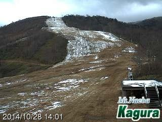
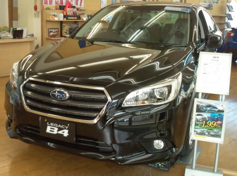
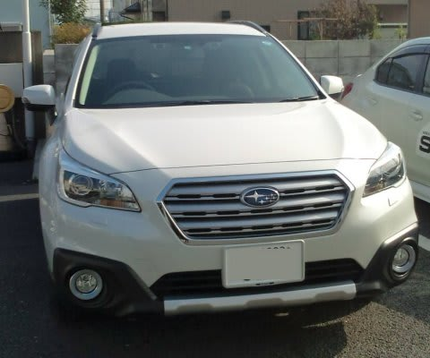
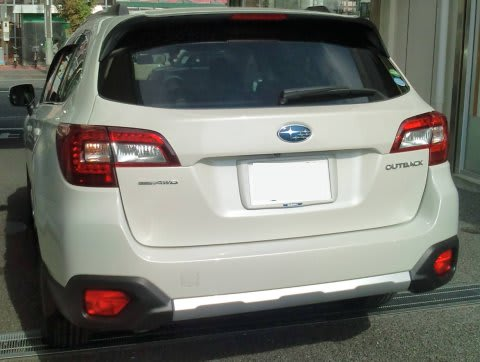

# BSレガシィ アウトバックに乗ってみた…試乗インプレッション

📅 投稿日時: 2014-10-29 02:54:20

えー．

予想通り．

本日，かなりのスキー場で

初積雪になったようで…

[焼額でもうっすら雪が降った](http://blog.princehotels.co.jp/yakebi/2014/10/28/)みたいだし．

[熊の湯](http://ameblo.jp/kumakumanoyu/entry-11945020850.html)もわずかに白くなったみたいだし．

かぐらも雪が積もってますね…

予想通り，[北海道はすごい](http://blog.princehotels.co.jp/ski/furano/2014/10/28/index.html)みたいですね～．

…明日からまた例年通りの気温に戻っちゃいますが…

今年も，早いシーズンインになることを願うばかりっ！！

ってことで．

本題へ行きますが．

…10月24日に発表になった，

新型レガシィ．

B4が「BN9」，アウトバックが「BS9」という型式らしいので．

BN/BSレガシィ，となりますか．

先日レポートしたように．

第1号で試乗してきたので．

さっそく，そのレポートをば…

まず．見た目ですが．

…確かに，デカくなった．

先代のBRレガシィに比べ．

幅で6cm，長さで4cmほどデカくなってますけど．

それほどびっくりするほど「デカい！」って

感じじゃないですね～．

まぁ，ツーリングワゴンに乗ってる身にとっては，

アウトバックの背の高さ，フロアの高さで

ちょっとデカさを感じましたけど…

で．

室内を見てみると．

ふむ．

ふむ．

運転席に乗った感じは．

スバル車らしからぬ，高級車感が漂っているじゃないか！

…古いスバルファンは，「こんなのスバル車じゃない！」

とか言いかねないかも（笑）．

とりあえず，BRレガシィから，間違いなく内装の

車格間は1グレード以上上がってます．

＃これでやっと他社同等レベルになってきたのかも…

シートも良くなってる感じで．

前席・後席ともにシートヒーターが標準装備だったりします．

そうそう，アイサイト付き車でも，ルーフに

サングラスポケットがついていたのが驚き（笑）．

…後ろ座席の広さは．

うーむ．

先代レガシィと，ほとんど変わらない感じかな？

トランクは，アウトバックってこともあり．

かなり床面が高く，荷物を積むのが辛そうな感じ…

さてさて．

内装チェックはこのくらいにして．

肝心な走りを．

今回のレガシィ．

エンジンはFB25の2.5L NA一種類で．

グレードは，2種類のみ．

高いほうは，

「スタブレックス・ライド」

とかいう，ピストン速度感応式ダンパーを

足回りに使っているのが一番大きな差．

そして，この高いグレードは．

内装は本革が標準になるようで…

今回試乗したのは，スタブレックスライド付きの

高いほうのグレードです．

エンジンをかけて，走り出してみると…

あれ？？

今までのスバル車と，明らかに傾向が違う．

ブッシュの硬さを感じない！

段差の乗り越えが，今までのスバル車に

ありえないほど柔らかい！

…柔らかいけど，ブヨブヨ感はなく．

しっかりダンピングが効いた柔らかさ．

サスのストロークが大きいアウトバックだからか．

ばねレートも，結構低めに感じるかな．

けど，ダンパーは強め．

高周波には柔らかくストロークするけど．

低周波はガッチリダンピングする感じで．

段差の突き上げなど早い動きには柔らかく，

スピードを出していった際にはしっかり

車体を抑え込む，そんな感じ．

…これが，スタブレックスライドの効果なのかな？

…安いほうのグレードと乗り比べてみたい…

何にしろ，これまでのスバル車には，

どの車にも多少なりとも残っていた．

しっかりしたブッシュがもたらす，

ちょっとガタガタした揺すられ感が

なくなった！

それなのに，スピードを出していった時の路面の

うねりとかに対するダンピングはすごく強く

効いていて，高速でのユサユサ感は全く無し．

なんだか，乗り心地も高級車っぽくなっちゃった！

もし，これがスタブレックスライドの効果だとすると．

…絶対こっちがお勧めだな．

エンジンは…

必要十分かな．

大きくなった割に，BRレガシィとそれほど

変わらない車重なので，同じくらいのパワー感．

…あー．でも．

アクセルに対するリニアリティはかなり高まりましたね．

このあたり，熟成がより進んだ感．

高速をクルーズするには，静かだし．

これで十分．

で．

今回．

残念ながら，試乗の順番待ちが詰まっていたので．

いつものように山道を攻められず．

大きな横Gをかけた領域や，コーナーが続く

道でのフィーリングはわからなかったですが．

おお！？と思ったのは，

ステアリングフィールがBRより格段と

良くなりましたね～

BRレガシィは，ちょっとステアリング系に

コンプライアンス要素があって，なんだか，ブッシュが

つぶれながらステアリングが切れ始める…

というような手ごたえがありましたが．

このアウトバック，このステアリングの

「ぐにゅ」感がないのに．

かといって，敏感すぎて，

まっすぐ走りたいのにガシガシ入ってくる外乱に

ステアリングを取られ続ける…ということがなく．

手を添えているだけで，まっすぐ走り．

そこから指1本分，ステアリングを切っていく時の

フィーリングがすごくいい．

とりあえず．

高速でまっすぐ走るには．

足も滑らかで，ステアリングも疲れず．

アイサイト3と相まって，たぶん

最高の長距離ツアラーだという予感．

…あとは，コーナーをガシガシ攻めた時に

どんな感じか，ってところが気になるところ．

まぁ，ここは次回の宿題ですかね．

という感じで．

走っているときのステアリングの反力，

切った時の手ごたえ．

アクセルを踏んだ時の反応量，ペダルの重さ．

各種スイッチやレバー類の操作感…

これまでのスバル車に比べ，このあたりが

格段と進化していて．

これまでのスバル車らしからぬ．

車の走りというより．

「人間のタッチ＆フィールにこだわった」

という設計思想がかなり明確に透けて見える

この，新型レガシィ．

ガシガシ走るというより，大人がロングツーリング

する車だなぁ…

ってことで．

キビキビLEVORGと，ゆったりLEGACY．

明確に両車の性格を分けて作ってきたことが

感じられる，今回の試乗でした～！
