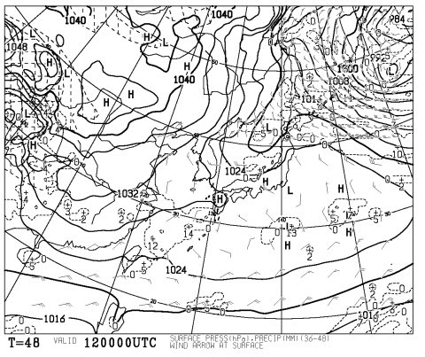

# あれ？この3連休の天気，もしかすると11，12日は晴れるか？？

📅 投稿日時: 2014-01-10 23:12:30

🏷️ カテゴリ: [スキー天気予想](c6554f5c3c106093b511a8daae23757e8.md)

えー．

前回の天気予想では．

3日とも雪で，ぼちぼち積もるようなことを書いてましたが…

今の天気図を見ると．

なんだか．

風が西向きに回ってしまったので．

11，12日は晴れ間が覗きそうな予感！

12日の予想天気図は

こんな感じで，冬型ではなくなってしまったので．

12日は晴れそう…！！

まぁ，12日夜から13日にかけては，前回と変わらず，

雪が降りそうですが…

ということで．

11日

朝は10cm程度だけど，積雪があるかな．

朝早いうちは雪も残るが，一日晴れたり曇ったり．時折雪がさーっと

降るタイミングもあるかも…．

12日

朝の積雪はほぼ0．

おそらく，晴れそう．

夕方～夜ぐらいから雪が降り始める．

って感じに訂正…

ということで．

また明日から3日間，志賀高原へ行ってきます～←志賀に行くのではなく，帰るのでは？(自己突っ込み)
