# 2月18，19日の週末の志賀高原スキー場の天気は…土曜は晴れのち曇りで気温激高，日曜は荒れた天気で液体が降る可能性も！？？

📅 投稿日時: 2023-02-16 02:36:29

🏷️ カテゴリ: [スキー天気予想](c6554f5c3c106093b511a8daae23757e8.md)

本日も志賀高原特派員から写真が届いて

いるのですが…

昨日の段階では，

　明日の朝までに，また冷え冷え雪が

　10～15cmくらい積もってるかな．

と予想したんですが．

…なんだか．

予想以上に積もったようで…

40~50cmくらい積もってますよ！！

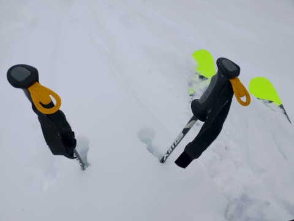

そして，あさイチの気温は-16℃と

冷え冷え！

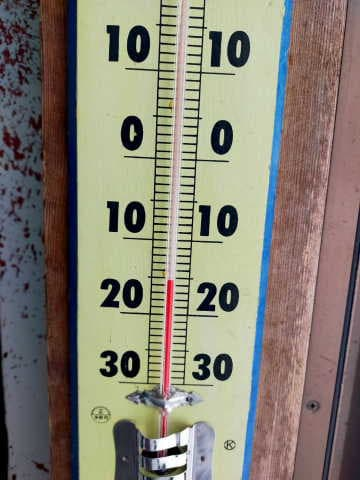

圧雪コースでも，圧雪の上に5cm程度の

雪が乗っていたようで…

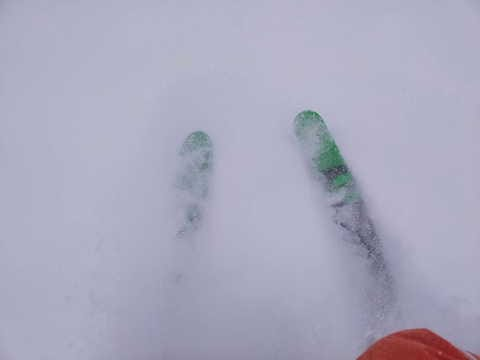

当然，コース脇や非圧雪はパフパフ！！

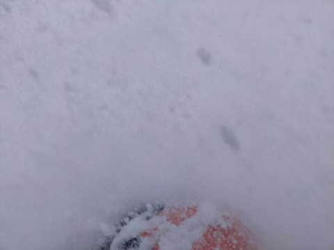

いや…

めっちゃ気持ちよさそうですね…

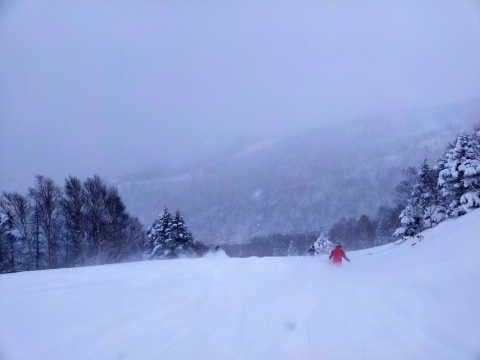

でも，気温は冷えたわりにちょいと

重めの新雪だったようですが．

焼額のSGSコースは楽しかったと

レポートが入ってます…

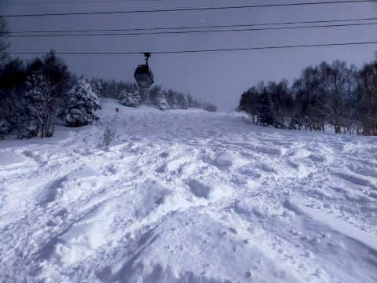

天気は終日雪降り．

時折一瞬雲が薄くなる時もあったようですが…

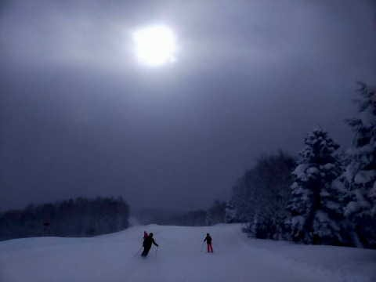

基本的には終日雪が降り続け．

かなり強く降るときもあり…

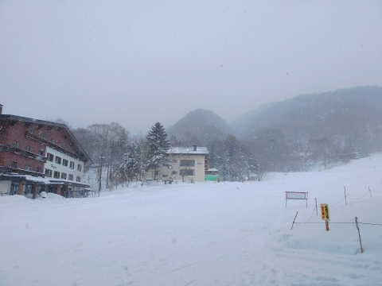

午前中だけでゲレンデに5cm程度積もり．

午後もかなりの勢いで積もり続けた

みたいです…

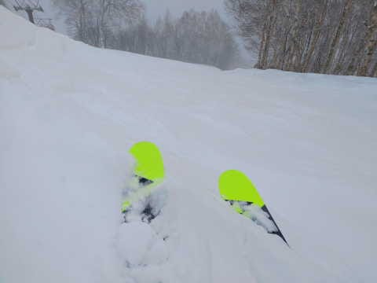

焼額の公式発表では，昨晩からの積雪は

49cmみたいなので．

志賀高原全域で，ちょっとは雪が

積み増されたのかな～…

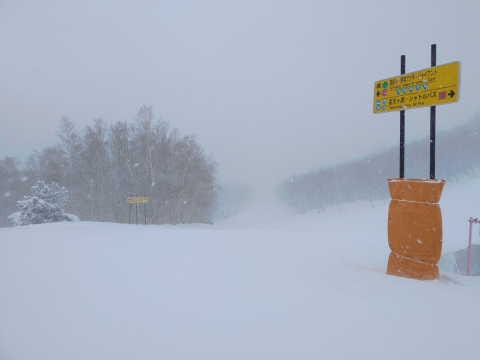

ってなことで．

この雪でゲレンデ状況は一気に回復

わけですが…

果たして，週末にかけてもっと積もるのか？

週末は冷えるのか？？

水曜深夜恒例，週末の天気予想です！

まずは，16日(木)の850hpa気温ですが…

うむ．志賀高原には水色の-12℃線が

かかっていて．

この日も朝イチは-15℃程度でスタートの，

冷え冷えの一日！！

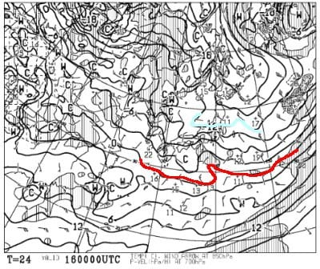

この日の地上天気図を見ると．

全国的に高気圧に覆われるので．

早朝は雲が残るかもしれないけど…

基本的に冷え冷え晴れの一日！

雪も最高で，柔らかいトップシーズン

雪の，最高の一日じゃないかな？

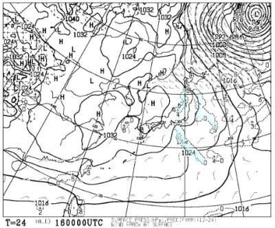

そして，17日(金)の850hpa図を見ると…

この日は志賀にかかるのは水色の-6℃線．

16日よりはかなり気温が上がるけど，

それでも昼間もマイナスキープの

そこそこ冷えた一日！

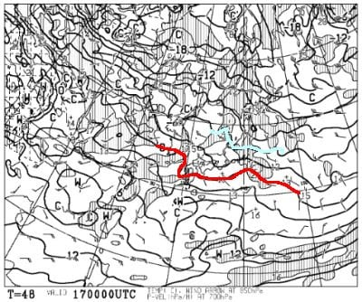

地上天気図は，この日も高気圧に覆われる

ので…

終日晴れそうですね！！

この金曜も，晴れて雪も良く，暖かさも

感じる，絶好のスキー日和になりそうな

感じ…！！いいね！！

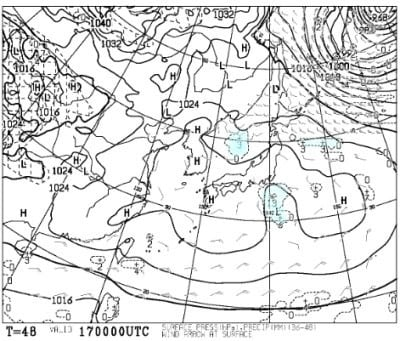

で．このままいい感じで週末に突入だ！

と，肝心な18日の土曜の週末の850hpa

を見ると…

うぎゃーーーー！！

なんだこりゃ？？

赤い0℃線が志賀高原にかかってる…(涙)

これは，昼間は間違いなくプラス気温

まで上がりますね…(泣)

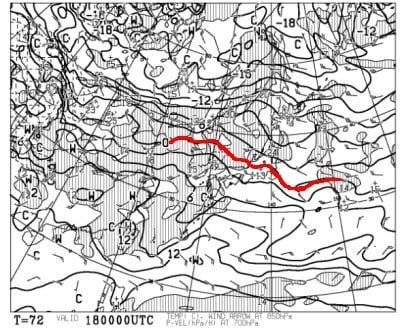

で．

地上天気図を見ると…

朝は高気圧に覆われて晴れそう

だけど．

午後に向かって高気圧が東に

離れていくので，曇っていきそう…

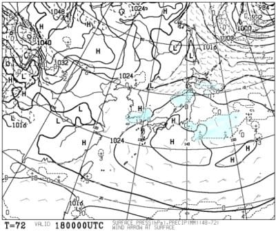

そして．

19日の日曜の850hpa図を見ると…

うむ．

この日は志賀高原には水色の-6℃線が

近づいていて冷えそうに見えるけど…

これは，夜9時の天気図．

朝のうちは昨日から引き続き

高温になりそうな予感だし…

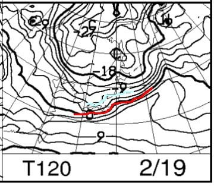

そして，地上には降水域が予想

されてるし…

19日のど早朝から朝にかけては

かなり湿った雪…

というか，液体に近いものが

降るかも！！？？

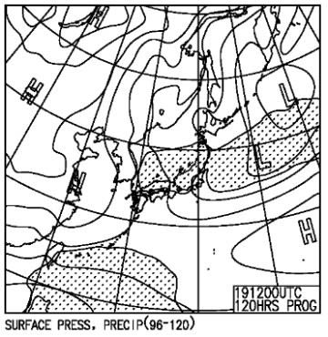

なぜ…

なぜ，週末の直前の17日まで冷え冷えの

いい日なのに．

週末の18，19日を狙ったように高温に

なるかなぁ…(涙)

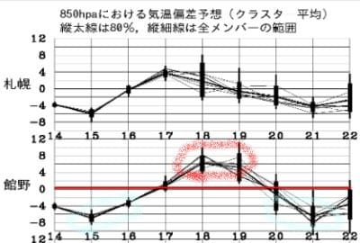

ちなみに，週末が終わってからの

20，21日はまた冷えそうです…

あぁ…

とりあえず．

まとめると．

16日(木)：朝早くは雲が残るかもしれないけど…

　基本的に晴れ！！

　気温は冷え冷え．昼間もしっかりマイナス

　キープの晴れ．

　あさイチは前日の積雪が圧雪された

　トップシーズンの柔らか圧雪バーン．

　絶好のスキー日和．

17日(金)：この日も朝から晴れ！

　あさイチの気温は-9℃程度と，

　これまでに比べれば暖かい．

　昼間はギリギリ0℃近くまで

　上がるか？

　標高の低いところはちょっと雪が

　緩み気味になるかも．

　でも，標高が高いところは

　いい雪質をキープ．

　晴れて雪も良く，暖かさも感じる

　いい感じのスキー日和

18日(土)：朝から-5℃程度と気温は高め．

　朝は晴れ．

　あさイチはいい感じのシマシマ！

　でも，日差しも強く，気温も上がって

　行くので南斜面は雪が緩みそう．

　午後になると雲が増えて，風が強まる．

　夜中は強い南風で気温が志賀でも

　+3℃くらいまでに上がりそう…

19日(日)：まだわからないけど…

　早朝から降る．

　何かが降る．

　液体か，限りなく液体に近い個体．

　ただ，そんなに強く降らず，

　パラパラと降る程度かな…

　あさイチの気温は0℃からプラス．

　南風が強く…焼額2ゴンはヤバいかも？

　午後に向かって風が収まり，

　気温も冷えて，降るのは湿った雪から

　冷えた雪になっていく．

　夕方は気温が冷えてバーンが硬く

　固まっていくかも…

ってな感じで．

日曜はまだ詳細は分からないけど，

ヤバいです．

ホントに狙ったように，週末のみ

気温が上がってヤバい天気に

なりそう…

私が3週間ぶりに土日ともスキーに

行ける週末になりそうなのに…

なぜこんな週末に限って，

週末だけ狙ったように…

誰だ！！

日ごろの行いが悪いのは！！←3週間ぶりにあなたが行くとこうなるから，あなたなのでは？？？

…とりあえず．

日曜に空から降るのが液体にならないよう，

久しぶりに冷え冷え踊りを全力で

踊っておきます…

## 💬 コメント一覧

### 💬 コメント by (レインボー75)
**タイトル**: Unknown
**投稿日**: 2023-02-16 14:40:38

木曜日の志賀高原情報

朝の上林-5℃　蓮池-10℃。曇りで時折日が射すスキー日和。ニゴンパークは2cm新雪。

団体様の恩恵で、今日はニゴンだけ８時運行。パノラマは新雪5cm快適。サウスも思わず声が出ちゃう好条件。白樺も10cmうはうはバーン。唐松も然り。オリンピックは20cmですでにぼこぼこ。GSサイドは引き続きフラット極楽バーン。

あまりに気持ちよかったので、奥志賀に着いた頃には足が売り切れに。

三高で時間を潰してからエキスパ(オリンピックより断然良かった)経由でバス。

高天の銀嶺昼食のあと西舘へ。雪質はいいけど売り切れた足には負担で挫折。

やけびに戻って唐松を少し。やっぱりやけび！あの足でも何とかなる。何が違うんでしょうかねえ？

### 💬 コメント by (Skier_S)
**タイトル**: ＞レインボー75さま
**投稿日**: 2023-02-17 02:26:08

今日も良かったみたいですね…

明日も朝から晴れて，最高雪の圧雪でトップシーズンらしいいい日になりますよ！！！

ただ，日曜は残念な天気になりそうです…（涙）

