# 今週末も志賀高原で滑ってます！…が，土日とも日差しが強く高温で雪はすごいことになりそう（涙）日曜朝だけちょっと締まるかな

📅 投稿日時: 2023-04-01 00:17:23

今週末も，なんとかスキーに行けることに

なりました～！！！

良かった…

昨日3時間半睡眠で頑張った甲斐はあった…

いや．

まだ実は月曜までの宿題が終わってないけど．

2時間あればやっつけられるから，日曜帰宅後に

なんとかなるはず…

そして，今晩帰宅がこんな時間で．

これから朝3:30出発できるように起きられるのかな？

…また睡眠時間2時間だな…（泣）←ホントに土日でスキーに行ってて大丈夫なのか？？

それでも，スキーに行けるだけシアワセ！！

…だけど．

今日の特派員からの写真を見ると…

まぁ，あさイチはシマシマなんですが．

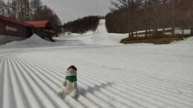

昼間は最高気温が10℃を越えるほどの

高温で…GW並みですね（泣）

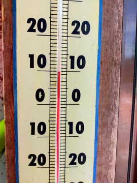

だもんで，雪は朝早くからザブザブになり…

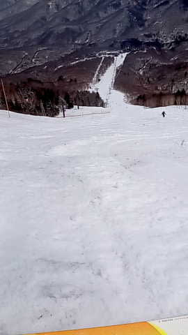

焼額も，白樺コースは雪が薄くなり，

ブッシュがでてきてポールで注意を

促してるところがあったり…

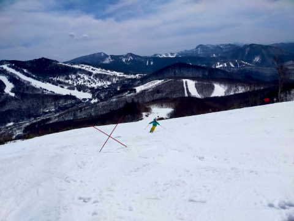

第2高速沿いの唐松コースも，真ん中付近に

なんかポールが立ってるよ？？？

と，思ったら…

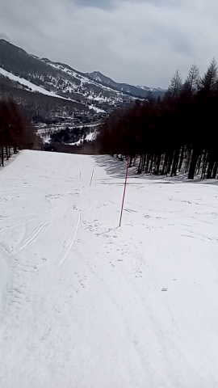

その右側…

というか，下の写真では左側になるところ．

地面が出ちゃってます（激泣）

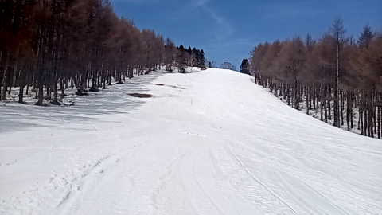

まぁ，白樺コースも唐松コースも，

明後日の日曜で終了のコースなので，

まぁあと2日もてばいいんですが．

もうクローズになったGSコースの

下部とか…

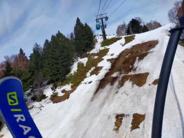

こちらもすでに閉鎖になったオリンピックコースは，

もう凄いことになってますね（涙）

普段なら4月中旬くらいの雪の量．

平年より2週間以上減りが早い感じ…（泣）

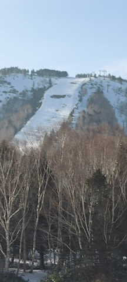

だけど．まだGSコースのメイン部分は

雪が残ってます！！

…とはいえ，今日は高温と日差しで

もう荒れ荒れのガタガタになっちゃった

みたいですね…（泣）

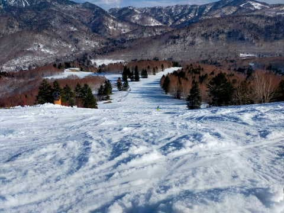

うーん．

この土日も晴れて気温が高そうだから．

こんなになっちゃうんだろうなぁ…

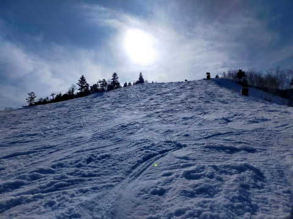

まぁ，まだ一の瀬も．

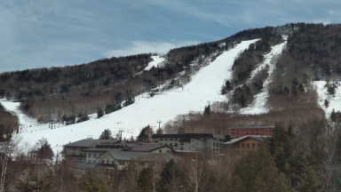

高天ヶ原も，一応全面に雪がついているので．

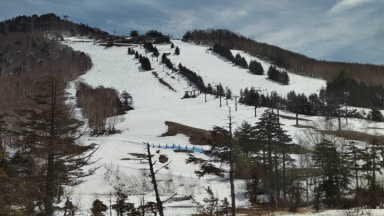

例年より雪が少ないとはいえ，まだあと数週間は

滑れますが．

うーん．

GWまでは厳しいかな…

とりあえず．

この週末，土日とも晴れ．

日曜は時々曇るかもしれないけど，

土曜は朝から気温が高く雪は終日ユルユル．

日曜は早朝は硬いバーンになるかもしれないけど，

8時から9時ごろには緩み始め，

やっぱり午後は荒れそう…

って感じでしょうか．

…いいコンディションとは言えないけど．

雨が降るよりマシだ！！！

と，信じて．←明日になったら，雨が降った方が板が滑って良かったと言ってそう

睡眠2時間で出発です…

志賀高原でお会いしましょう！
