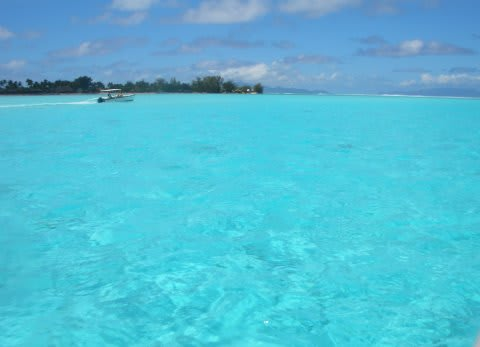
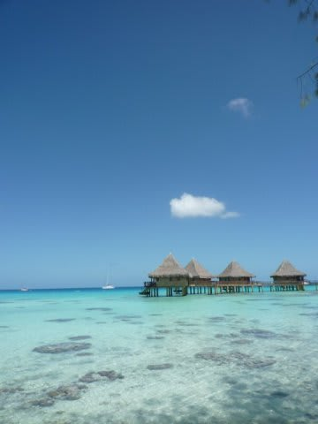
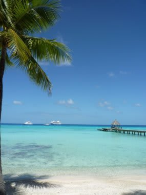

# 2009年　初の海外子連れダイビング旅行記　プロローグ1

📅 投稿日時: 2012-08-22 00:29:41

えー．

子供が1歳になった7月に．

初子連れダイビングとして，[沖縄に行ってみた](eab244263cdb3384bf8eec280a0787fbc.md)わけですが．

…無事，ミッションコンプリート．

実は，この沖縄での初子連れダイビング．

子連れ海外ダイビングにいけるかどうか…？

ってのの予行練習を兼ねていたわけで．

2歳から国際線は有料になる．

1歳のうちはタダ．

…タダのうちに，一度海外へ行っておきたいけど．

いきなり海外というのもあれなので，

一度沖縄に行ってみて，OKなら海外に…

というもくろみもあったけど．

この予行練習，見事に成功．

ってことで．

子連れ海外ダイビング計画，実行！

…となると．

まず最初の課題は．

どこに行くか，だ．

ここで．

今から考えると，当時はかなり無謀と思える思考で．

「子供がタダのうちに，有料になったらいけないような場所へ…」

と考えてしまったわけで．

なんと．

なんと．

超高級リゾート地の

「タヒチ」

を選んだのでした…

いや．

かつて一度，タヒチに行って．

そのあまりの海のきれいさ，リゾートとしての完成度，

客層の良さ，ダイビングの良さにすっかり惚れ込んでしまい．

それ以来，妻は「タヒチ…タヒチ…」

とつぶやく日々．

ただ，ツアーフィーがあまりにも高すぎるので．

「一生2度と行くことはないっ…！」

と思っていたけど．

今回．

「子供がタダの今のうちに行っておかないと，絶対ぜったいゼッタイ，

　今後行くことはできない！！！」

という，強迫観念というか．

わけの分からない理由付けにより．

子連れに対するホスピタリティの有無やら子連れダイビング受け入れ実績の有無．

その他の理由をまったく考慮することなく．

いきなりの初海外として，航空機移動時間12時間以上という，

無謀な場所を目的地としてしまったのだった…

