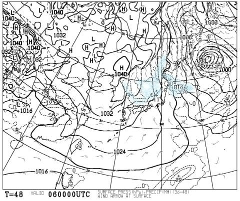
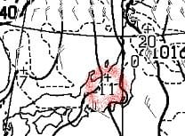
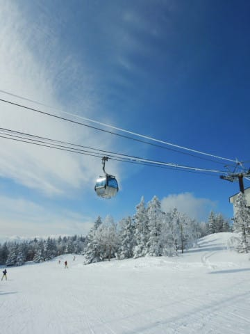

# なんという事か…この週末，腰を痛めてしまったらしい…ついに腰痛もちに仲間入り！？？

📅 投稿日時: 2020-02-05 00:53:51

うーむ．

最新の6日の予想天気図を見ると．

昨日段階の予想より，ちょっと

積雪量が少なくなりそうな感じに

なってきてる気が…（涙）

日本海側の吹き出しの雲，離岸距離も

離れちゃったし．

降水量も，新潟付近に+11という数字が

見えるように．

5日夜9時から6日朝9時までの12時間

降水量がせいぜい11mmってことなので．

積雪11cm程度ってことですね…

うーん．もっとドサドサ降るかと

思ったけど．

6日朝イチの積雪は，志賀高原でせいぜい

10～20cmというところでしょうか…

腰パフを期待したいところですが，

これだとブーツパフ程度ですね（涙）

まぁ，5日も昼頃から結構な勢いで

降りそうなので．

5日も夜までに10～20cm，

6日も午前中くらいは積もりそうなので．

5日から6日の2日間では，トータル

40～50cmの積雪になってくれることを

期待しているのですが…

とりあえず．

これから6日まで，激烈に冷えるし．

雪は確実に積もるので．

この週末も，ゲレンデ状況は冷え冷えの

いい感じになるはず…っ！！

また明日，この週末の詳細天気予想を

やります…

という，長い前フリの後は，本題へ．

…

…それは．

この週末，晴天の志賀高原を滑っていた

土曜日のこと．

夕方のオリンピックコース．

結構な不整地になっていたわけですが．

でも，天気も良くて，凸凹が

よく見えるし．

さらに雪も柔らかくて．

いやーーー．

絶好の不整地練習バーンだわ…！

…と．

楽しくコブを不整地中回り気味に

攻めていたところ．

山回りの仕上げで大きくひねりを作って，

次のターンの谷回りを作っていこうとした，

その時．

ガツンと下から突き上げを食らって．

…普通なら十分いなせる突き上げだったのですが．

なぜかその時に限って．

「ピーーン」

と，わき腹から腰に走る痛み！

え？？

何？？

何があったの？？

と，その場に立ち止まり．

ちょっと痛かったけど，なんだったんだろう…？

と，再び滑り出すと…

「…いてて…」

滑ると，腰に走る痛み！

激痛というほどではないけど．

背筋に強い力がかかった時や，

衝撃を受けた時に，

腰に鈍い痛みが走るように…（涙）

ただ，痛みが走るところ外から抑えても，

痛みは全く無く．

特定の角度に体を動かした時に痛みが

走るので．

…これは，骨や神経じゃなくて，

筋肉をやっちゃったみたい（涙）

あぁ…

腰と膝をやっちゃうとスキーヤーとして

致命的なので．

絶対に膝と腰は傷めないように，

荷物をもつときの体制とか，

仕事する時や車の運転の時の座り方とか，

すごい気を付けていたのに．

まさか，腰をやっちゃうとは…っ！？？

それも，無理な体制で滑ったとか，

転んだとかじゃなく．

いつもなら，普通にやり過ごせるだろうという

体制と衝撃でやっちゃったってのが．

ショック．

かなりのショック…っ！！

とりあえず．

痛めたのがほぼラストで良かった…

そして．

普通に立ってたり歩いたりするくらいじゃ

痛くなく．

普通の生活は問題なくできそうってのが，

不幸中の幸い…

と．

まだ営業時間がギリギリリフト1本乗れるだけ

残っていたので．

さらにそこから，ラストの第3高速リフトに

1本乗って滑ってみて，どのくらい痛めてるのか，

確認しようとしてみたわけですが…←良い子はすぐにスキーをやめて帰りましょう

うむ．

板を傾けて，横Gをかける滑りは

背筋に負荷をかけるので，

すごい痛いですね（涙）

さらに．

ひねると痛いので．

小回りは無理ですね（泣）

でも．

スピードを出さずに，ゆっくり滑って．

あんまり傾かないようにすれば，

突き上げを食らったりすると

「痛てっ！！」

となるときもあるけど．

それさえ我慢すれば，滑れなくはないな…！！←確認するところはそこか！！

ということで．

おとなしく滑れば，確認できたので．

こんな最高の雪質の日は．

圧雪かけたてのシマシマ最高ナイターを

楽しまねば！

…と．

土曜のレポートに書いたように，ナイターに

繰り出したわけですが…

せっかくの傾きたい放題の最高柔らか雪の

シマシマなのに．

痛くて傾けなかったのが残念…←いや，普通は滑っちゃダメだから

そして．

ナイターが終わったあと．

ブーツを脱ぐ体勢が，激烈に

痛かったのがつらかった…←そこまでして滑るか！？？

で．

一晩明けて，日曜日の朝．

すっきり痛みが取れていることを期待したわけですが…

全然治ってない（涙）

ということで．

痛いのを我慢して，すげー苦労してブーツを履いて．

（滑ってるより，ブーツをはくのが痛い…）

痛くない範囲で，あまりスピードを出さずに

おとなしく滑ってました…

…おそらく，この日の私の滑りを見た人の

多くが．

「あれ？Skier_Sに似てるけど，あんな滑り

するわけないから別人か？？」

と思ったかと…

せっかくの晴天の最高雪質で，

思う存分かっ飛ばして傾きまくれなかったのは

すごい残念だけど…

でも．

いつもは快楽に任せて自由落下しまくるだけの私．

こんな機会じゃないと，低速の基礎練習すること

ないよな…

いいチャンスだ！

と．

じっくり基礎練習したり．

ポジション確認したりして過ごしました…

そして．

一緒に滑っている焼額メンバーに．

「どうも，腰を痛めたみたいで…」

と，状況を説明すると．

全員が口をそろえて．

「…それはもう，若くないってことだよ…」

と，判で押したような答えが返って

来たことに，かなりのショックを受けた

のでした…

ええ．

若くないですよ．

もう，若くないですよ～！！！

しかし．

今まですごい気を付けていたので，

腰痛とは無縁の人生を送ってきたのですが．

ここにきて．

ついに腰痛を経験してしまいました…

まだ，特定の姿勢や前かがみなどで，

「いててて…」

って感じです．

うーむ．

今週末までに直ってくれるといいんだけどなぁ…

## 💬 コメント一覧

### 💬 コメント by (しんちゃん)
**タイトル**: お大事に
**投稿日**: 2020-02-05 00:59:04

いい感じの柔らかこぶ斜面で痛めてしまったんですね。

それは、もう若くないって事ですね。（判を押したかのようですが(笑)）

とにかく無理なさらずに、お大事になさってください。

今しっかり完治しないと、ずっと滑れなくなってしまうかもしれませんしね。完治してみんなで一緒に傾きまくりましょう。

### 💬 コメント by (komu)
**タイトル**: Unknown
**投稿日**: 2020-02-05 06:08:44

ナイターのラスト、一緒に滑らせてもらった息子が、腰が痛いとは思えない有り得ないスピードだったと言っておりました。お大事に。

### 💬 コメント by (まーくん)
**タイトル**: Unknown
**投稿日**: 2020-02-05 07:19:30

お大事にしてください...

整形外科とか行ったほうがいいのでは？

私はコブで腰痛になったときはロキソニンが劇的に効きました。

対症療法ですが^_^;

### 💬 コメント by (Hide)
**タイトル**: 仲間入り・・・
**投稿日**: 2020-02-05 07:46:38

S 様

なか～まです！

ギックリ腰2回経験者です。

2回目は確か一昨年、私も志賀高原でチウーでランチの際でした。

痛みも少なかったので、その後はやさし～く（笑）滑っていたのですが、翌朝は見事に起き上がれませんでした。

ええ、見事に月曜日から3日程仕事休みましたよ（笑）

無理は禁物です。絶対安静ですよ。

一回やっちゃうと癖になるので、まずは安静にして動けるようになるまでご無理なさらずです。

お大事に。

### 💬 コメント by (Northfox)
**タイトル**: ロキソニン効きます
**投稿日**: 2020-02-05 07:51:38

ロキソニン効きますよ！

腰痛や膝痛とかの痛みが嘘のように抑えれれます。

でもやはり対症療法なので整形外科や整体に行かれた方が良いかと。

私が以前腰痛になったとき整体で治療してもらったら一発で回復しましたよ。

### 💬 コメント by (おおすぎ)
**タイトル**: 仲間デ～ス　Part2
**投稿日**: 2020-02-05 11:18:41

わたしは、２０代後半に、膝と腰をやりまして・・・

それ以降は、常に時限爆弾を抱えながら滑っています！

やはり、日常生活でも気を抜くと「ギクっ！！」や「

ビシぅ！！」が来ますね！！

安静と患部の冷やし（前の方もおっしゃっていますがロキソニン入り超薄シップ効きますよ）、良くなったら今度は温めての筋肉マッサージが効きました（と言っても、マッサージに行く時間も無さそうななＳ様・・・）

どうぞお身体ご自愛ください。

### 💬 コメント by (kon suke)
**タイトル**: 痛い・・・
**投稿日**: 2020-02-05 13:34:05

Ｓさんも仲間入りですか。

腰痛にはベルトですよ。

私は斜面が固いときは、ＣＷＸ＋ザムストの二重で、

柔らかい場合は、ザムスト＋ＣＷＸ＋ザムストの３重です。

膝も左はサポーター１枚ですが、右は２重です。

昨シーズン、右を３重にしたら血行が悪くなり腫れてしまったので２重で我慢しています。

もちろん、痛み止めのボルタレンと月に２回打つヒアルロン酸の注射も欠かせません。

去年は毎週注射を打っていたのですが、今年は痛みも少なく１週間間隔なので楽です。

２００００メートルクラブのスキーは痛みとの戦いです。

### 💬 コメント by (副院長)
**タイトル**: 疼痛サイクル
**投稿日**: 2020-02-05 14:41:23

S様、腰痛は多分、筋肉　筋膜でしょう。急性期は安静です。無理かもしれませんが。。。ロキソニンで痛みを我慢せずに過ごして、10日目ぐらいからストレッチしましょう。原因は、皆さんおっしゃる通り、年でしょう。そろそろインナーマッスル意識して鍛えてください。年齢とともに腰椎、股関節の可動域が狭くなってるはずです。

どうぞご自愛くださいね

### 💬 コメント by (新米パパさん)
**タイトル**: Unknown
**投稿日**: 2020-02-05 14:56:41

お疲れ様です。

腰痛をこらえながら本日も雪ふれふれ踊りを続けていらっしゃるS様に頭が下がります。

えっ？

踊ってない？？

、、、

腰痛をこらえながらも本日も雪ふれふれ踊りを続けていらっしゃるS様に頭が下がります。

ご自愛なさって下さい。

### 💬 コメント by (Goku)
**タイトル**: お大事に
**投稿日**: 2020-02-05 17:23:23

その後、調子はいかがでしょうか？

私は子供の頃からの筋金入りの腰痛持ちなので、仕草でどれだけ痛いのかおおよそ察しがつきます。

あの様子からして、ほんとなら滑れるレベルではなかったんじゃないかな～って思っていました。

と言っても、滑らず帰る人ではないことも分かっています。

皆さんがおっしゃる通り、ロキソニンは効きますよ～。

ロキソニン湿布と併用すると尚更効果的です。

今週末、元気な姿でお会いできることを祈っています。

お大事に。

### 💬 コメント by (mae)
**タイトル**: Unknown
**投稿日**: 2020-02-05 18:24:56

コルセットでは効果はなかったのですか？

実は私も昨シーズンから右膝が痛むようになりました。

それはもう，若くない........きっとその通りなのでしょう。

某氏のように、痛み止めの薬とか、ヒアルロン酸の注射を打つとか、ついに自分にも来るべきものがきたかと思うと、先行きが不安になります。

### 💬 コメント by (yumi)
**タイトル**: Unknown
**投稿日**: 2020-02-05 20:04:07

Ｓさぁ～ん😫😓😭

膝、腰、痛いチームへ ようこそ‼️

Konさんのヤクチュウ😓は 有名ですが、

（Ｓさんから 聞いてます😅）

gokuさんも腰痛持ち だったのですね😢

maeさんも ヤバい😵💧のですかぁ～😢

自然治癒が 可能な 箇所なら、ちゃんと治してくださいね☺️

私は毎日、痛いが勝つか、楽しいが勝つか の勝負です😅

### 💬 コメント by (西館)
**タイトル**: 凄い！皆さんロキソニン推奨ですね
**投稿日**: 2020-02-05 20:59:58

や、本当によく効くんですよ。

ロキソニン（ロキソプロフェン）は鎮痛作用だけでは無く、消炎作用でも優れているので絶対に飲んでいただきたいです。

> kon suke様

Skilineでずーっとお名前見ていました。

20000ｍクラブのステッカー格好良いですね。

実は、3年くらい前に１ゴンで見たことがあって、お店のじゃ無さそうだし、どんなクラブなんだろと思っていましたが、やっと分かりました。

２００００メートルクラブのスキーは痛みとの戦い･･･

凄い、凄過ぎます、噂には聞いていましたがやっぱり人間じゃなＰ－－－（あぁピー音入りましたー）

### 💬 コメント by (レインボー)
**タイトル**: Unknown
**投稿日**: 2020-02-05 22:10:13

72年間の経験から一つ。４0台には、腰が伸びない状態が続きました。いろいろなアドバイスを頂いた結果、背筋を鍛えるためにクロールがいいということで、隣に泳ぐおばちゃんに負けながらも頑張り、以降、腰痛知らずになりました。

いろいろな薬も大切ですが、身体作りかも。

### 💬 コメント by (Goku)
**タイトル**: 二度目のコメント
**投稿日**: 2020-02-05 22:45:25

実は私も先週、先々週と、コルセット巻いて、湿布し、ロキソニン飲みながら滑っていました。

もちろん膝にはサポーターも・・・

土曜日まで痛かったのが、日曜日起きたら治っていました。

私の腰痛はいつもそんな感じです。

腰痛と言っても様々で、良く聞くヘルニアから、私のような『分離すべり症』とか色々ですから、長引くようならしっかり見てもらった方が良いですね。

### 💬 コメント by (Skier_S)
**タイトル**: 暖かいコメントありがとうございます～！
**投稿日**: 2020-02-06 02:18:21

＞しんちゃんさま

雪もコンディションも良かったのに痛めちゃいました…（涙）

とりあえず，週末までに，ちゃんと滑れるレベルに回復してくれることを

祈るばかりです…

＞komuさま

いや…

結構痛くて，傾くことができず，弧が浅くなったので

スピードが出ただけです（汗）

＞まーくんさま

あら．

その若さで腰痛経験者なんですね…

整形外科に行く暇が無くて困ってます（涙）

＞Hideさま

意外と，腰痛仲間多いですね．

ぎっくり腰2回やりましたか…

私は幸い，痛めた翌日も普通に滑れ，月曜も問題なく

会社に行けるレベルでしたので，それほどひどくなかったのが

不幸中の幸いでした…

とりあえず，普通に仕事に行ってます．

＞Northfoxさま

すごい…ロキソニン，そんなに効くんですね！

整体って，行ったことないんですよ…

っていうか，うちの近くにあるのかな…

しかし．残念ながら行っている暇がない…（涙）

＞おおすぎさま

をを！

仲間ですか！

ロキソニン入りシップは無かったので，ボルタレンシップ貼ってました．

しかし，20代後半で腰痛って，そんな若さでもやっちゃう人がいるってことは．

私も別に，歳だからやっちゃったのではないのでは…？

と思ってしまいます（笑）．

＞KonSukeさま

をを！腰痛の大先輩が！

私も幸いに，Gokuさんにベルトをお借りできたので，

日曜はベルトを巻いて滑り，今も昼間の生活ではつけっぱなしにしています…

…しかし．

自分がいうのもなんですが．

KonSukeさんの話を聞くと，そこまでして滑るのか…と，

驚きを禁じえません（笑）．

＞副院長さま

急性期は安静なんですか…

受傷直後にナイター滑って，翌日もゴンドラ＆リフト30本以上

滑ってしまいました…

これだけ滑っているので，インナーマッスルはハンパなく

鍛えられているという自信があったのですが，

まだ鍛えないとダメなようですね…（涙）

＞新米パパさま

とりあえず，今週末は踊らなくても十分冷えてくれそうなので，

踊らずに安静にしています（笑）．

＞Gokuさま

コルセットありがとうございます～！

おかげさまで助かってます．

でも，歩いたり走ったり，重いものもち上げても

そんなに痛くないんですよ．

ひねったり，前屈したり，背筋に衝撃が伝わったりすると痛い感じです…

だもんで，無理しない範囲なら滑れました…

滑れないレベルではなかったです．

しかし，Gokuさんも先週，先々週とロキソニン飲みながら

滑っていたとは．

＞maeさま

コルセット，ちょっとは効いたのかと思いますが，

滑っているときはあまり効果が分かりませんでした…

でも，maeさんも膝を痛めていたとは！

…しかし，あの滑りで，体のどこも痛めてない方が不思議でしたが…

無理をせずに滑ってください…

＞yumiさま

ついに痛いチームに仲間入りです（涙）

出来れば，入らずに済ませたかったです…

とりあえず，スキーで滑って治します←違うでしょ

＞西館さま

皆さん，ロキソニン推しですね（笑）．

皆さんの助言をもとに，ロキソニン買ってしまいました．

さっそく飲んでみます…

しかし．

20000mな人たちはおかしな人ばかりなので，

この人たちとお付き合いしていると，一般常識からかなりずれていきます…

＞レインボーさま

腹筋，背筋を鍛えるのがいいようですね．

しかし，プールで泳ぐ時間がないので，何か他に

良い鍛え方が

あるといいのですが…

…そうか！スキーで鍛えればいいんじゃないでしょうか？？

