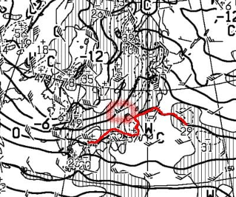

# この土日の志賀高原，風が強そう…そして日曜は吹雪．ふるい落とし機能全開だな（涙）

📅 投稿日時: 2022-03-05 00:03:30

🏷️ カテゴリ: [日記](cc4b5682fb7b8b144980957a978653fb0.md)

えー．

今日も，志賀高原特派員から写真が

送られてきましたが…

…

…

…う，うぎゃーーーー！！

目の毒だーーーっ！！！

何だかすごいいい天気だったようですね．

良いですね．

人が仕事しているというのに，

うらやましいですね（感情を失った声で）

そして．

朝の気温は意外と予想より低かったようで．

そのせいで，昼間が晴天だったにも

関わらず．

意外と雪は緩まなかったようで…

終日いいコンディションだったようです．

ええ．

いいコンディションだったようですね…（失われた何かを追い求める目）

なぜ私はこんな日に，こんな時間まで家で

仕事しているんだろう…

とりあえず．

今日の天気予想も大体当てたようですが．

明日土曜，朝9時の850hpa天気図を見ると…

なんと！赤く括ったところ，風速55ノット？

…風速27mですよ…っ！！！

これはヤバい．ゴンドラ動かないかも…

まぁ，西風っぽいので，東向きの焼額

第1ゴンドラはギリギリ動いてくれるかも…？

そして，赤い0℃線が志賀高原より微妙に

北に上がってるので．

朝の気温はかなり高めになりそう…

ただ，昼に向かうにつれだんだん冷えていくので，

雪が緩むまでは行かないかな．

で．日曜ですが…

この日も風速40ノット！（涙）

風速20mなので…ゴンドラはこの日もちょっと

ヤバいかも．

ただ，この日の志賀高原

今度は逆に水色の-9℃線が近づくくらいなので…

激烈に冷えます．寒いです．吹雪です！！

ってなことで．この土日の天気ですが．

5日（土）：朝から強風．ゴンドラヤバそう．

　焼額第1ゴンドラは動いてくれそうかな．

　朝の気温は焼額山頂で-3℃程度．

　一の瀬エリア以下だと，朝はプラスまで

　気温が上がりそう．

　あさイチは結構いい感じの

　しっかりしたシマシマバーン．

　天気は午前中は曇り．時折薄日も

　射すかも．

　ゴンドラさえ動けば，午前中は悪く

　なさそう．

　時間が経つにつれ気温が冷えて行き，

　午後遅くに雪が強く降るタイミングも．

　

6日（日）：朝までの積雪は5~10cmあるかな？

　この日も風は強め．焼額のゴンドラは減速でも

　動くと信じたいけど…

　朝の気温は-12℃程度と激冷え．

　朝から雪降り…というより，吹雪気味．

　強い風で吹き付ける雪．

　朝はしっかり締まった下地の上に

　柔らかい雪が乗ったバーン．

　昼間も雪が降り続け，昼間だけで

　5~10cmくらい積もるかも…

　根性の無いスキーヤーはふるい落とされる天気．

…って感じでしょうか．

あぁ…金曜はいい天気だったのに．

なんで土日を狙って荒れた天気になるかなぁ…（涙）

日曜，冷えた雪が降ってくれるのはいいけど．

出来れば夜に降って，昼間は降らないでほしい…

そして風も強まらないでほしい…

さらに，昼間の天気も良くなって欲しい…

そして雪質は最高シマシマになってほしいし，

ゲレンデは混まないでガラガラになってほしい…

さらに…（延々と欲求が続くので以下略）

とりあえず．

この土日も志賀高原で滑ってます．

あと3時間後に出発です…

また，3時間しか寝られない（涙）

## 💬 コメント一覧

### 💬 コメント by (アツシ)
**タイトル**: Unknown
**投稿日**: 2022-03-05 02:44:32

ご無沙汰してます。

いろいろあって、明日は1月半ぶりの志賀高原です！

また見つけたら声かけます！

### 💬 コメント by (初心者)
**タイトル**: Unknown
**投稿日**: 2022-03-05 11:12:35

お借りして申し訳ございません。

レインボーさんにこの前お声をかけた岐阜の者です。

月曜日 パウダーボードを持って行くか迷っています。

朝一 この寒波でパウダーになりそうですか？

日曜日の情報をお願いします♪

### 💬 コメント by (レインボー74)
**タイトル**: Unknown
**投稿日**: 2022-03-05 15:29:11

土曜日の志賀高原情報

朝の上林-1℃　蓮池+1℃(逆転してる！)

暖かい春日和。でも、イチゴン故障で、奥志賀とニゴンに人が集中。

いつものように白樺、オリンピックをとても気持ちよく滑ったあと、長岡のエキップさんの試乗会がある二高へ。知ってる顔にたくさん会えて楽しかった。

でも、魔が差してニゴンへ行ってみたら、な、なんという行列。すぐにバス時刻表を調べるも、出たばかり。結局30分待つことに。

イチゴンも同様のようで、仲間に連絡「ゴンドラには近づくな」

昼は前日同様、ダイヤで宴会。志賀高原サンド1620円を頼んだら、ローストビーフがたっぷりで美味しいんだけど、老人が食べきれる量ではない。お腹が破裂しそうで、夕食のメニューが頭に浮かばない。

明日はまたエキップさんの試乗会があるので、私は明日参加です。

明日から雪なので、岐阜の初心者様、月曜はまず太板の日かと。また明日報告させていただきます。

### 💬 コメント by (新米パパ)
**タイトル**: Unknown
**投稿日**: 2022-03-05 17:47:58

本日は奥志賀リフトからのスタート。午前は奥志賀回し。奥志賀は前リフト営業。

昼過ぎよりヤケビに来ましたが、最後にニゴンに捕まりました

笑

時より風が強い時もありましたが、終日楽しめました。

明日はファーストラック、頑張ってみようかしら。

いつも売り切れのサンクリフトフのアップルパイをようやく食べる事ができましたが、美味いっすね、なかなか。

### 💬 コメント by (Skier_S)
**タイトル**: 今日は意外と良かったよ
**投稿日**: 2022-03-05 22:55:06

＞アツシさま

あら！志賀高原復帰ですか！

明日は残念ながら天気はそれほど良くなさそうですが…

お待ちしています！

＞初心者さま

コメントありがとうございます~！！

月曜朝までの積雪は10~20㎝程度でしょうか．

そこまで深いパウダーにはならなさそうですが…

一応新雪は積もるので，それなりの準備はあった方が良いかと思います．

＞レインボー74さま

今日はお世話になりました～！

試乗会は楽しかったですよ！！

＞新米パパさま

混みそうなときは，2ゴンは避けた方が良いかと…

2ゴンには近づかず，1ゴンの方が正解です．

意外と終日楽しめましたね！

明日，ファーストトラックがあるかどうか微妙ですが，私は1ゴンが動けば

1ゴンスタートで滑ってます！

